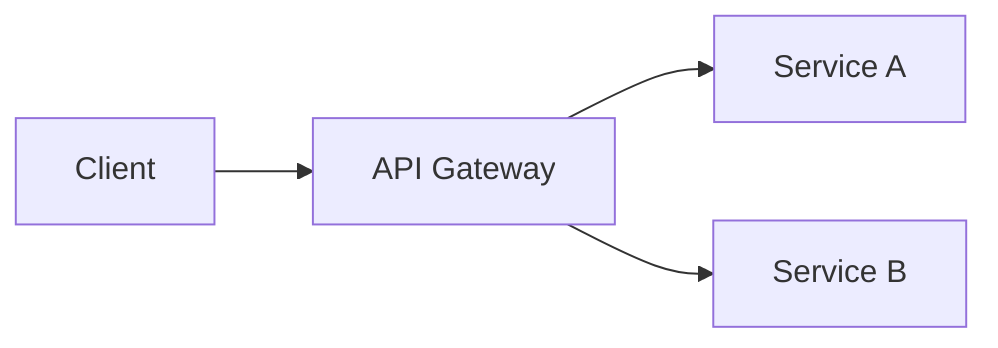

# AGENTS.md — Génération de cours Slidev pour le Master Ingénierie Informatique et Management

## Contexte du projet

Ce dépôt contient des présentations **Slidev** pour des cours dispensés à des étudiants en **Master Ingénierie Informatique et Management** (G4). Les étudiants ont un profil mixte : compétences techniques en informatique et sensibilité au management/gestion de projet.

### Public cible

- **Niveau** : Master (Bac+4/5)
- **Profil** : Double compétence informatique + management
- **Acquis attendus** : bases en programmation, algorithmique, gestion de projet, systèmes d'information
- **Contexte professionnel** : futurs chefs de projet IT, architectes SI, consultants, managers techniques

---

## Structure du projet

```
courses/
├── AGENTS.md              # Ce fichier — instructions pour les agents IA
├── CLAUDE.md              # Instructions spécifiques Claude Code
├── README.md              # Documentation du projet
├── package.json           # Dépendances partagées (Slidev CLI, thèmes)
├── _template/             # Template de référence pour un nouveau cours
│   ├── slides.md          # Squelette de présentation Slidev
│   ├── course.md          # Fiche descriptive du cours (plan, timing, objectifs)
│   └── package.json       # Scripts npm pour le cours
├── <nom-du-cours>/        # Un répertoire par cours
│   ├── slides.md          # Présentation Slidev (contenu principal)
│   ├── course.md          # Fiche descriptive du cours
│   ├── package.json       # Scripts npm
│   ├── components/        # Composants Vue personnalisés (optionnel)
│   ├── public/            # Images, assets statiques
│   └── snippets/          # Extraits de code utilisés dans les slides
```

### Conventions de nommage

- **Répertoire de cours** : `kebab-case`, court et descriptif (ex: `devops-ci-cd`, `archi-microservices`, `gestion-projet-agile`)
- **Fichiers markdown** : toujours `slides.md` pour la présentation, `course.md` pour la fiche cours
- **Assets** : dans `public/` avec noms descriptifs en kebab-case

---

## Règles de génération des présentations

### Langue

- **Slides** : tout le contenu visible doit être en **français**
- **Notes du présentateur** : en **français**
- **Code source** : commentaires en anglais (convention professionnelle), noms de variables/fonctions en anglais
- **Termes techniques** : conserver les termes anglais consacrés (API, CI/CD, DevOps, framework, etc.) avec explication en français si le terme est introduit pour la première fois

### Format Slidev

```markdown
---
theme: seriph
title: "Titre du cours"
info: |
  ## Titre du cours
  Master Ingénierie Informatique et Management — G4
class: text-center
drawings:
  persist: false
transition: slide-left
mdc: true
---
```

#### Séparateurs et layouts

- Séparer les slides avec `---` entouré de lignes vides
- Utiliser les layouts Slidev : `default`, `center`, `two-cols`, `image-right`, `image-left`, `section`, `statement`, `fact`, `quote`
- Première slide : titre du cours, sous-titre, contexte (layout `center` ou défaut)
- Deuxième slide : plan du cours avec `<Toc columns="2" maxDepth="1" />`
- Dernière slide : "Questions ?" avec layout `center`

#### Notes du présentateur

Utiliser les commentaires HTML en fin de slide :

```markdown
<!--
Notes pour le présentateur :
- Durée estimée : XX min
- Points clés à aborder
- Anecdote ou exemple concret à partager
- Transition vers la slide suivante
-->
```

**Chaque slide DOIT avoir des notes du présentateur** incluant :
1. La durée estimée pour cette slide
2. Les points essentiels à verbaliser (qui ne sont pas écrits sur la slide)
3. Des exemples concrets, anecdotes professionnelles, ou cas d'usage
4. La transition vers la slide suivante

#### Contenu des slides

- **Règle des 6x6** : max 6 points par slide, max 6 mots par point (guide, pas absolu)
- **Visuels** : privilégier schémas, diagrammes mermaid, tableaux comparatifs
- **Code** : blocs de code avec coloration syntaxique, lignes surlignées pour les points importants
- **Progressivité** : utiliser les clicks/animations (`v-click`, `v-clicks`) pour révéler progressivement

### Diagrammes Mermaid

Slidev supporte Mermaid nativement. Utiliser pour :
- Architectures système
- Flux de processus
- Diagrammes de séquence
- Graphiques de Gantt (planning)

```markdown

```

---

## Processus de création d'un cours

### Étape 1 — Comprendre le besoin

Avant de générer quoi que ce soit, l'agent DOIT collecter ces informations :

| Information | Obligatoire | Exemple |
|-------------|-------------|---------|
| Intitulé du cours | Oui | "DevOps et CI/CD" |
| Volume horaire total | Oui | 21h (7 séances de 3h) |
| Objectifs pédagogiques | Oui | 3-5 objectifs concrets |
| Prérequis spécifiques | Oui | "Connaît Git, bases Linux" |
| Niveau de profondeur | Oui | Introduction / Intermédiaire / Avancé |
| Équilibre théorie/pratique | Recommandé | 60% théorie / 40% pratique |
| Outils ou technos imposés | Si applicable | "Docker, GitHub Actions" |
| Mode d'évaluation | Recommandé | Projet, examen, QCM |

**Si ces informations ne sont pas fournies, les demander au formateur avant de commencer.**

### Étape 2 — Fiche cours (course.md)

Générer d'abord la fiche `course.md` avec :
- Les informations générales
- Les objectifs pédagogiques formulés avec des verbes d'action (taxonomie de Bloom)
- Le plan détaillé séance par séance avec minutage
- Les modalités d'évaluation
- Les ressources recommandées

**Faire valider la fiche cours avant de passer aux slides.**

### Étape 3 — Génération des slides

Pour chaque séance prévue dans le plan :
1. Créer les slides en suivant le minutage de la fiche cours
2. Respecter un rythme de ~2-3 minutes par slide
3. Alterner entre théorie, exemples, et exercices
4. Inclure des slides de transition entre les grandes sections
5. Prévoir des slides "pause" pour les séances longues (>2h)

### Étape 4 — Enrichissement

- Ajouter des diagrammes mermaid pour les concepts architecturaux
- Insérer des exemples de code réalistes et progressifs
- Créer des slides d'exercice avec consignes claires
- Ajouter des slides "récapitulatif" en fin de section

---

## Timing et rythme

### Règles de timing

| Type de slide | Durée moyenne | Usage |
|---------------|---------------|-------|
| Titre de section | 1-2 min | Introduction d'un nouveau thème |
| Contenu théorique | 2-3 min | Explication de concepts |
| Schéma/diagramme | 3-5 min | Analyse et discussion collective |
| Code/démo | 5-10 min | Démonstration ou explication pas à pas |
| Exercice | 10-30 min | Pratique individuelle ou en groupe |
| Quiz/questions | 5-10 min | Vérification de compréhension |
| Récapitulatif | 2-3 min | Synthèse de section |
| Pause | 10-15 min | Toutes les 1h30-2h |

### Structure type d'une séance de 3h

```
00:00 - 00:10  Accueil, rappels, plan de la séance
00:10 - 00:50  Bloc théorique 1 (~8-10 slides)
00:50 - 01:10  Exercice pratique 1
01:10 - 01:25  Correction et discussion
01:25 - 01:40  PAUSE (15 min)
01:40 - 02:20  Bloc théorique 2 (~8-10 slides)
02:20 - 02:45  Exercice pratique 2
02:45 - 02:55  Correction et synthèse
02:55 - 03:00  Questions, preview séance suivante
```

---

## Approche pédagogique

### Principes

1. **Du concret vers l'abstrait** : commencer par un cas d'usage réel, puis formaliser
2. **Apprentissage actif** : intercaler des exercices réguliers
3. **Progression spiralaire** : revenir sur les concepts en les approfondissant
4. **Lien avec le monde professionnel** : chaque concept doit être ancré dans un contexte métier réel
5. **Double compétence** : toujours faire le lien entre technique et management quand c'est pertinent

### Taxonomie de Bloom pour les objectifs

| Niveau | Verbes d'action | Exemple |
|--------|----------------|---------|
| Mémoriser | Lister, nommer, identifier | "Lister les principes SOLID" |
| Comprendre | Expliquer, décrire, résumer | "Expliquer le pattern MVC" |
| Appliquer | Implémenter, utiliser, exécuter | "Implémenter un pipeline CI/CD" |
| Analyser | Comparer, différencier, diagnostiquer | "Comparer monolithe vs microservices" |
| Évaluer | Justifier, recommander, critiquer | "Recommander une architecture pour un cas donné" |
| Créer | Concevoir, proposer, développer | "Concevoir une architecture cloud-native" |

### Adaptation au profil management

- Inclure des slides sur les **impacts business** des choix techniques
- Aborder les **aspects coût/délai/qualité** (triangle de gestion de projet)
- Mentionner les **compétences de communication** nécessaires (ex: expliquer une dette technique à un client)
- Proposer des **études de cas** mêlant technique et management

---

## Qualité et validation

### Checklist avant livraison

- [ ] `course.md` complet avec timing détaillé
- [ ] Toutes les slides ont des notes présentateur
- [ ] Le timing total correspond au volume horaire prévu
- [ ] Les objectifs pédagogiques sont couverts par le contenu
- [ ] Les exercices ont des consignes claires et un temps alloué
- [ ] Les diagrammes mermaid sont syntaxiquement corrects
- [ ] Les blocs de code sont syntaxiquement corrects et coloriés
- [ ] La présentation commence par le titre et le plan
- [ ] La présentation se termine par un récapitulatif et "Questions ?"
- [ ] L'équilibre théorie/pratique est respecté
- [ ] Le vocabulaire est adapté au niveau Master

### Cohérence inter-cours

- Vérifier que les prérequis d'un cours sont couverts par les autres cours du programme
- Éviter les redondances entre cours
- Maintenir un style et un ton cohérents entre les présentations
