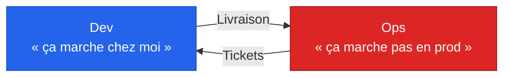
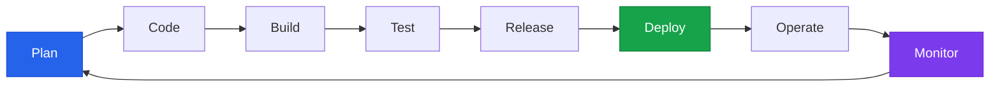
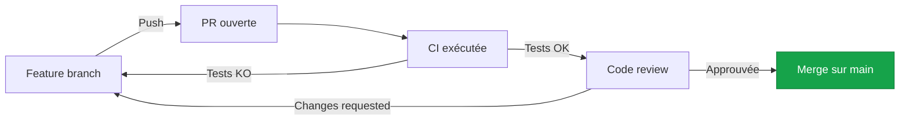
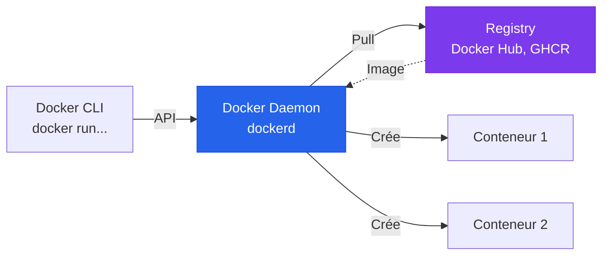
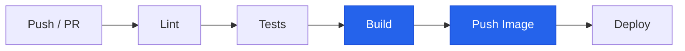
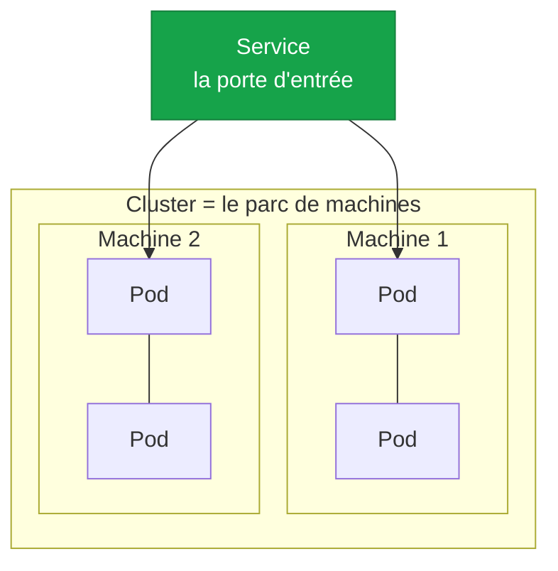
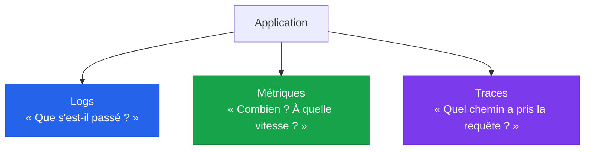

# DevOps

<!--
Présentation rapide : parcours, expérience terrain en automatisation, conteneurisation et CI/CD.

L'objectif central de ces 2 jours : comprendre la culture DevOps, savoir conteneuriser une app, et construire un pipeline CI/CD qui marche.

Format : on alterne théorie courte, démos live, et TPs guidés. Hésite pas à interrompre, à poser des questions, à partager des galères vécues sur des projets.

Je précise dès le début : on ne fera pas tout en profondeur. DevOps c'est un univers, on pose les fondations solides ici, vous en reverrez beaucoup en cours Tests et Déploiement et plus tard en stage.
-->

---

# Plan du cours

<v-clicks>

- **Jour 1 matin** - Culture DevOps & métriques
  <span class="text-sm opacity-70">CALMS, 3 voies, cycle de vie, DevSecOps, DORA</span>
- **Jour 1 après-midi** - Git avancé & collaboration
  <span class="text-sm opacity-70">Branching strategies, PR, hooks, SemVer, merge vs rebase</span>
- **Jour 1 après-midi (suite)** - Docker & images
  <span class="text-sm opacity-70">Architecture, Dockerfile, multi-stage, optimisation</span>
- **Jour 2 matin** - Docker Compose & bases CI/CD
  <span class="text-sm opacity-70">Stack locale, GitHub Actions, workflows YAML</span>
- **Jour 2 après-midi** - Pipeline complet & écosystème
  <span class="text-sm opacity-70">TP CI/CD, K8s, IaC, observabilité (survol)</span>

</v-clicks>

<!--
On a 2 jours espacés de 2 semaines. Entre J1 et J2, je te donnerai une consigne d'observation : regarder les pipelines de tes projets et identifier ce qui est versionné/auto vs cliqué à la main.

Le fil rouge : culture → outils de collaboration → conteneurisation → automatisation.

Tout est lié - tu ne fais pas du DevOps en faisant juste du Docker, ni juste du GitHub Actions. C'est un mindset autant qu'un toolset.
-->

---

# Objectifs pédagogiques

<v-clicks>

- Comprendre la culture DevOps et le mouvement CALMS
- Lire les métriques DORA et savoir où ton équipe se situe
- Collaborer en équipe avec Git (branching, PR, hooks, SemVer)
- Conteneuriser une application avec un Dockerfile optimisé
- Orchestrer une stack locale avec Docker Compose
- Construire un pipeline CI/CD GitHub Actions complet
- Reconnaître le vocabulaire de Kubernetes, IaC et observabilité

</v-clicks>

<!--
À la fin du cours tu sauras containeriser une app, automatiser son test et son build via un pipeline, et tu auras le vocabulaire pour discuter sereinement avec un Ops en stage.

L'objectif n'est pas de te transformer en SRE ou en architecte cloud - c'est de te donner les fondations pour que tu puisses construire dessus.

Le QCM final couvrira ces 7 objectifs, plus un TP noté sur le pipeline CI/CD.
-->

---
layout: section-cover
section: Session 1
---

# Culture et principes DevOps

Avant les outils, l'état d'esprit

<!--
On commence par la culture. Pourquoi ? Parce que DevOps n'est pas un poste, ni un outil - c'est une façon de bosser.

Si on plonge directement dans Docker sans poser le pourquoi, on rate l'essentiel.
-->

---

# DevOps, c'est quoi pour toi ?

<v-clicks>

- En 1 phrase : ta définition
- Un outil DevOps que tu connais déjà

</v-clicks>

<!--
Tour rapide pour casser la glace et voir où en est le groupe.

Réponses fréquentes : "Docker", "CI/CD", "automatisation", "déploiement". Toutes correctes mais incomplètes.

Le piège classique : penser que DevOps = un poste, ou que c'est juste "les Ops qui font un peu de dev". On va voir que c'est plus large.
-->

---

# Origine : les silos Dev vs Ops



<v-clicks>

- **Dev** : ajoute des features, change vite
- **Ops** : stabilise, refuse les changements
- **Conflit structurel** : objectifs opposés

</v-clicks>

<!--
Avant DevOps, deux mondes séparés.

Le dev veut livrer vite, l'ops veut un système stable. Ces objectifs s'opposent : chaque livraison nouvelle est un risque pour l'ops.

Le ticket de prod tombe le vendredi soir, le dev est rentré chez lui, l'ops doit réveiller le tech lead. Classique.

Le mouvement DevOps (Patrick Debois, 2009, premier "DevOpsDays") cherche à dissoudre ce silo.
-->

---

# Le mouvement CALMS

<KeyConcept title="CALMS" icon="🎯">
Cadre de référence du DevOps en 5 piliers : Culture, Automation, Lean, Measurement, Sharing.
</KeyConcept>

<v-clicks>

- **Culture** - collaboration, responsabilité partagée
- **Automation** - automatiser tout ce qui est répétitif
- **Lean** - flux continu, réduire le gaspillage
- **Measurement** - mesurer pour s'améliorer
- **Sharing** - partager connaissances et outils

</v-clicks>

<!--
CALMS, c'est l'acronyme à retenir. C'est le squelette philosophique du DevOps.

Important : la "Culture" est en premier, pas par hasard. Sans culture partagée, les outils ne servent à rien.

Anecdote : j'ai vu des boîtes acheter Jenkins, Docker, Kubernetes, et continuer à fonctionner en silos. Résultat : zéro gain, complexité en plus.
-->

---

# Les trois voies DevOps

<v-clicks>

- **1re voie - Le flux** : du code qui circule de Dev vers Ops sans friction
- **2e voie - Le feedback** : retour rapide depuis la prod vers Dev
- **3e voie - L'apprentissage continu** : expérimenter, mesurer, capitaliser

</v-clicks>

<Tip type="info">
Concept introduit par Gene Kim dans "The Phoenix Project" (roman fondateur, lecture recommandée).
</Tip>

<!--
Les 3 voies, c'est la formalisation du flux DevOps.

1re voie : on optimise le sens "gauche → droite" (du code à la prod). Outils : CI, CD, automatisation.

2e voie : on remonte les signaux de la prod vers le code. Outils : monitoring, alerting, post-mortems.

3e voie : on transforme les leçons apprises en améliorations systémiques. Culture du blameless, expérimentation.

Si tu lis un seul livre cette année : "The Phoenix Project". C'est un roman, ça se lit en 2 soirs.
-->

---

# Cycle de vie DevOps



<!--
Le cycle infini DevOps. Tu vas le voir partout, sur tous les sites de DevOps. C'est le visuel emblématique.

Important : c'est un cycle, pas une ligne. Le monitoring nourrit le plan suivant.

Chaque étape a son outillage : Plan → Jira/GitHub Projects, Build → Docker, Deploy → ArgoCD/GitHub Actions, Monitor → Prometheus/Grafana.

On va couvrir surtout Build, Test, Release, Deploy dans ces 2 jours.
-->

---

# DevSecOps

<KeyConcept title="DevSecOps" icon="🛡️">
Intégrer la sécurité dans chaque étape du cycle DevOps, plutôt qu'en fin de chaîne.
</KeyConcept>

<v-clicks>

- **Avant** : audit sécu en fin de projet → blocage tardif
- **Maintenant** : scan de dépendances à chaque PR
- **Outils** : Dependabot, Snyk, Trivy, secret scanning

</v-clicks>

<!--
Le sec dans DevSecOps, c'est l'évolution naturelle. La sécurité ne peut plus être une étape finale - c'est trop tard, trop cher.

Shift-left : on déplace la sécurité vers la gauche du cycle, vers le code.

On verra ça en DJ4 avec Dependabot et le secret scanning. Ce sont des outils gratuits, intégrés à GitHub, sans excuse pour ne pas les activer.
-->

---

# Les métriques DORA

<KeyConcept title="DORA" icon="📊">
Quatre métriques qui caractérisent la performance DevOps d'une équipe (DevOps Research and Assessment, Google).
</KeyConcept>

<v-clicks>

- **Deployment Frequency** - à quelle fréquence on déploie
- **Lead Time for Changes** - temps du commit au déploiement
- **Change Failure Rate** - % de déploiements qui causent un incident
- **Mean Time to Restore (MTTR)** - temps moyen de retour à la normale

</v-clicks>

<!--
DORA = DevOps Research and Assessment, c'est l'équipe Google qui produit le rapport "State of DevOps" chaque année.

Ces 4 métriques sont devenues le standard pour évaluer une équipe DevOps. Tu les verras citées en entretien, en mission, partout.

Astuce : les deux premières mesurent la vitesse, les deux dernières mesurent la stabilité. Une bonne équipe excelle aux 4 - pas de trade-off entre vitesse et qualité dans les top performers.
-->

---

# DORA - niveaux de performance

| Métrique | Elite | High | Medium | Low |
|---|---|---|---|---|
| Deployment frequency | Plusieurs par jour | 1/jour à 1/sem | 1/sem à 1/mois | < 1/mois |
| Lead time | < 1 heure | 1 jour à 1 sem | 1 sem à 1 mois | > 1 mois |
| Change failure rate | 0-15% | 16-30% | 16-30% | 16-30% |
| MTTR | < 1 heure | < 1 jour | < 1 sem | > 1 sem |

<Credit source="State of DevOps Report - DORA / Google Cloud" />

<!--
Tableau de référence DORA. Je te recommande de le mémoriser ou au moins de savoir où le retrouver.

L'écart "Elite" vs "Low" est gigantesque : 200x plus de déploiements, 2 600x plus rapide en lead time. Ce n'est pas un facteur 2, c'est un facteur 200 à 2600.

Question : où se situe ton équipe de stage ? Si tu n'as pas fait de stage, demande à un alternant autour de toi. Tu seras surpris.

La majorité des équipes en France sont en "Medium" ou "Low" - mais ce qui compte c'est la trajectoire, pas la position absolue.
-->

---

# Synthèse - culture DevOps

<Recap title="Ce qu'il faut retenir">

- DevOps casse les silos Dev/Ops par la culture **CALMS**
- 3 voies : flux, feedback, apprentissage
- Cycle de vie : Plan → ... → Monitor → Plan
- DevSecOps = sécu intégrée dès le code
- DORA mesure la performance en 4 axes (vitesse + stabilité)

</Recap>

<!--
Synthèse rapide avant de basculer sur Git.

Si tu retiens une chose : DevOps = culture + automatisation + mesure. Sans la culture, l'automatisation ne sert à rien. Sans la mesure, on ne sait pas si on s'améliore.

Pause de 20 minutes, ensuite on enchaîne sur Git en équipe.
-->

---
layout: pause
duration: 20 min
---

<!--
Pause de 20 min. J'en profite pour répondre aux questions individuelles si besoin.

Au retour, on attaque Git en équipe - branching, PR, hooks, SemVer.
-->

---

# Git en équipe : pourquoi ce bloc ?

<v-clicks>

- Tu connais `add` / `commit` / `push` - c'est acquis
- Mais en équipe, il faut des **conventions** partagées
- Branching, PR, code review, versioning - c'est le quotidien
- L'objectif : éviter les guerres de merge le vendredi soir

</v-clicks>

<!--
Tu as tous les bases Git, c'est un prérequis. Ce qu'on va voir maintenant, c'est ce qui distingue Git utilisé en solo de Git utilisé en équipe.

Anecdote : j'ai vu des équipes de 8 dev passer 1 jour par semaine à résoudre des conflits parce qu'ils n'avaient pas de stratégie de branching. C'est pas un problème de Git, c'est un problème de convention.
-->

---

# Branching strategies - 3 grandes familles

<Comparison left="Git Flow" right="GitHub Flow" leftColor="blue" rightColor="green">
  <template #left>

  - `main` + `develop` + features + release + hotfix
  - Cycle de release planifié
  - Adapté aux logiciels packagés (versions)
  - ⚠️ Lourd pour du web continu

  </template>
  <template #right>

  - `main` + branches features
  - Déploiement continu depuis `main`
  - Adapté aux SaaS modernes
  - ✅ Simple, rapide

  </template>
</Comparison>

<!--
Git Flow (Vincent Driessen, 2010) : 5 types de branches. Ça structure mais c'est lourd. Adapté aux logiciels avec des versions tagguées (logiciel client, mobile).

GitHub Flow : `main` + features, c'est tout. Adapté au SaaS où on déploie en continu. C'est ce que tu trouveras dans 80% des boîtes web modernes.

Et il existe une 3e voie encore plus radicale : Trunk Based Development.
-->

---

# Trunk Based Development

<KeyConcept title="Trunk Based Development" icon="🌲">
Toute l'équipe pousse sur `main` (le "trunk"), avec des feature flags pour cacher les fonctionnalités non finies.
</KeyConcept>

<v-clicks>

- Une seule branche longue durée : `main`
- Les feature flags activent/désactivent les fonctionnalités
- Demande une discipline forte (tests, CI rapide)
- Pratique chez Google, Facebook, Netflix

</v-clicks>

<!--
TBD c'est l'évolution ultime. On pousse tous sur main, avec des feature flags qui décident à runtime ce qui est activé.

Ça suppose une CI très rapide (< 10 min) et une couverture de tests solide. Sinon c'est le chaos.

Pour un débutant, je recommande GitHub Flow. Pour une boîte mature, TBD.

Les 3 sont des stratégies valides : ce qui compte c'est de **choisir** et que toute l'équipe **suive** la même.
-->

---

# Choisir sa stratégie

| Critère | Git Flow | GitHub Flow | TBD |
|---|---|---|---|
| Taille équipe | 5-50 | 1-20 | 10-100+ |
| Cadence release | Planifiée | Continue | Continue rapide |
| Maturité tests | Variable | Bonne | Excellente |
| Complexité | Élevée | Faible | Modérée |

<Tip type="info">
Pas de bonne réponse universelle. Le contexte (produit, équipe, maturité CI) dicte le choix.
</Tip>

<!--
Tableau récap. Le critère "maturité des tests" est sous-estimé.

TBD sans tests automatisés = catastrophe assurée. GitHub Flow sans tests = pareil.

En entretien, si on te demande quelle stratégie tu préfères : réponds "ça dépend du contexte" et explique tes critères.
-->

---

# Pull Requests - workflow



<!--
Workflow standard d'une PR : tu pousses sur ta branche, ouvres une PR, la CI tourne, un collègue review, tu corriges, et au bout c'est mergé.

Le CI bloque si les tests cassent - pas de discussion possible. C'est le rôle du gating, on en reparle en DJ3/DJ4.

Astuce : ne jamais forcer un merge avec CI rouge "parce que c'est urgent". Tu paies toujours la dette plus tard.
-->

---

# Code review - checklist

<v-clicks>

- ✅ **Le code répond-il à l'objectif** de la PR ?
- ✅ **Les tests** couvrent-ils le changement ?
- ✅ **Lisibilité** - un nouvel arrivant comprendrait-il ?
- ✅ **Sécurité** - secrets, injections, dépendances suspectes ?
- ✅ **Performance** - N+1, boucles inutiles, mémoire ?
- ❌ Pas de review pour le **style** (le linter le fait)

</v-clicks>

<!--
La review n'est pas du flicage. C'est :
- un filet de sécurité technique
- un transfert de connaissance
- un alignement d'équipe

Ce qui ne doit JAMAIS faire l'objet d'une review : le style. Si ton équipe débat sur les espaces vs tabs en PR, vous avez un problème de tooling, pas de code.

Outils pour automatiser le style : Prettier, ESLint, Black. On le verra dans les hooks.
-->

---

# Tailles de PR - la règle d'or

<v-clicks>

- **< 200 lignes** : PR idéale, review en 15 min
- **200-500 lignes** : acceptable, review en 30-45 min
- **> 500 lignes** : ❌ à éviter - la qualité de la review chute brutalement
- **> 1000 lignes** : 🚨 personne ne lit vraiment, le bug passe

</v-clicks>

<Tip type="warning">
Une PR trop grosse n'est pas reviewable. La découper est une compétence à part entière.
</Tip>

<!--
Étude célèbre : au-delà de 500 lignes modifiées, le taux de détection de bugs en review chute de 50%.

Conséquence : découper tes PR. Une feature = potentiellement 5-10 PRs cohérentes.

Comment découper ? Par couche (modèle, puis API, puis UI), par étape (squelette, puis logique, puis tests), ou par feature flag (PR mergée mais inactive).

C'est une compétence qui se travaille. Au début c'est dur, ensuite ça devient naturel.
-->

---

# Conventions de commits

```text
feat: add user authentication endpoint
fix: handle null pointer in payment service
docs: update README with new env vars
refactor: extract validation logic into separate module
test: add integration tests for /api/users
chore: bump dependencies
```

<v-clicks>

- Préfixe sémantique → automatisation possible
- Format : `<type>: <description courte>`
- Outil de référence : **Conventional Commits**

</v-clicks>

<!--
Conventional Commits : c'est un standard, pas une obligation. Mais une fois adopté, ça permet :
- de générer un changelog automatiquement
- de calculer la prochaine version SemVer (feat → minor, fix → patch, BREAKING → major)
- de filtrer les commits par type

Au début ça peut paraître pédant. Au bout d'une semaine c'est naturel et tu te demandes comment tu faisais avant.

Tooling associé : commitlint pour valider le format en hook pre-commit.
-->

---

# Hooks Git - pre-commit, pre-push

<KeyConcept title="Hook Git" icon="🪝">
Script exécuté automatiquement à un moment précis du cycle Git (avant commit, avant push, etc.).
</KeyConcept>

<v-clicks>

- **pre-commit** : lint, format, tests rapides → bloque les commits sales
- **pre-push** : tests complets → bloque les push cassés
- **commit-msg** : validation du format du message

</v-clicks>

<!--
Les hooks Git sont natifs (`.git/hooks/`) mais pas versionnés. Pour partager les hooks dans une équipe, on utilise un outil.

L'idée : déplacer les vérifications de la CI vers le poste du dev. Plus rapide, feedback immédiat, on n'attend pas que le pipeline rouge surgisse.

Attention : les hooks lourds (10s+) tuent le flux du dev. Garder le pre-commit < 5 secondes.
-->

---

# Husky + lint-staged en pratique

```json {all|2-7|9-14|all}
// package.json
{
  "scripts": {
    "prepare": "husky install",
    "lint": "eslint .",
    "format": "prettier --write ."
  },
  "lint-staged": {
    "*.{js,ts}": ["eslint --fix", "prettier --write"],
    "*.md": ["prettier --write"]
  }
}
```

```bash
# .husky/pre-commit
npx lint-staged
```

<!--
Husky : gestionnaire de hooks Git versionnés (dans le repo).

lint-staged : ne lance les outils que sur les fichiers stagés, pas sur tout le projet. Ça rend le hook très rapide.

Combo gagnant : 5 minutes de setup, des heures gagnées sur la durée du projet.

Démo rapide à faire si tu veux : faire un commit avec un fichier mal formatté, voir le hook le formatter automatiquement.
-->

---

# Tags et SemVer

<KeyConcept title="SemVer (Semantic Versioning)" icon="🏷️">
Format `MAJOR.MINOR.PATCH` - chaque chiffre a une signification précise.
</KeyConcept>

<v-clicks>

- **MAJOR** - breaking change (incompatibilité ascendante)
- **MINOR** - nouvelle fonctionnalité rétrocompatible
- **PATCH** - correction de bug rétrocompatible

</v-clicks>

```bash
v1.2.3
│ │ └── PATCH
│ └──── MINOR
└────── MAJOR
```

<!--
SemVer = standard de versioning depuis ~2010. Référence : semver.org.

La règle clé : un changement breaking force un MAJOR. C'est non négociable. Sinon tu casses tes utilisateurs sans prévenir.

En pratique tu tagges avec `git tag v1.2.3` puis `git push --tags`. C'est ça qui déclenche souvent une release dans la CI.
-->

---

# Quand bumper quoi ?

| Changement | Bump |
|---|---|
| Renommage d'un endpoint API | MAJOR |
| Ajout d'un endpoint | MINOR |
| Fix d'un bug existant | PATCH |
| Ajout d'un paramètre optionnel | MINOR |
| Suppression d'un paramètre | MAJOR |
| Refactoring interne sans impact API | PATCH |

<Tip type="warning">
La question à se poser : "Est-ce qu'un utilisateur de la version précédente va devoir changer son code ?"
</Tip>

<!--
Petit jeu pour vérifier la compréhension. Demander aux étudiants de classer 3-4 cas.

Piège classique : ajouter un champ obligatoire dans une réponse JSON → MAJOR (les clients qui validaient strictement le schéma cassent).

Autre piège : changer la valeur par défaut d'un paramètre → souvent MAJOR car comportement modifié sans changement de signature.
-->

---

# Merge vs Rebase

<Comparison left="Merge" right="Rebase" leftColor="blue" rightColor="purple">
  <template #left>

  - Conserve l'historique réel
  - Crée un commit de merge
  - Historique « branchu »
  - ✅ Sûr, pas de réécriture

  </template>
  <template #right>

  - Réécrit l'historique
  - Pas de commit de merge
  - Historique linéaire
  - ⚠️ Ne jamais rebase une branche partagée

  </template>
</Comparison>

<!--
Le débat éternel.

Merge : sûr, transparent, mais l'historique devient un plat de spaghettis sur les gros projets.

Rebase : historique propre, linéaire, plus facile à lire avec `git log`. Mais ça réécrit les commits - interdit sur une branche que d'autres ont récupérée.

La règle d'or : rebase tes branches **locales avant push**, jamais après. Merge sur main.

Côté outil : VS Code, GitHub Desktop, GitKraken te le font à la souris si la CLI te stresse.
-->

---

# Cherry-pick et undo

<v-clicks>

- **Cherry-pick** - récupérer un commit précis d'une autre branche
- **Revert** - créer un commit qui annule un autre commit (sûr, public)
- **Reset** - déplacer le pointeur de branche (dangereux, local)

</v-clicks>

<Tip type="danger">
`git reset --hard` perd des commits. Ne jamais l'utiliser sur une branche partagée. En cas de doute, `git revert` est plus sûr.
</Tip>

<!--
Cherry-pick : utile quand tu veux porter un fix sur une autre branche (un hotfix sur une release par ex).

Revert vs reset, c'est la nuance critique :
- Revert crée un nouveau commit "anti", l'historique reste honnête, c'est public-friendly
- Reset déplace le HEAD, c'est purement local, et destructif si tu as déjà push

Mon conseil pratique : 99% du temps, utilise revert. Reset ne sert qu'à rattraper une boulette locale.

Si tu galères : Pro Git book (gratuit, en français). Tape "Pro Git" sur Google, c'est le premier résultat.
-->

---
layout: recap
section: Demi-journée 1 - Culture & Git
---

# Ce qu'il faut retenir

- **DevOps** = culture (CALMS) + automation + mesure (DORA)
- **3 voies** - flux, feedback, apprentissage
- **Branching** : choisir entre Git Flow / GitHub Flow / TBD selon contexte
- **PR** : petites, reviewées, avec CI verte avant merge
- **Hooks** : pre-commit (lint) + pre-push (tests rapides)
- **SemVer** : MAJOR.MINOR.PATCH - breaking change = MAJOR
- **Merge vs Rebase** : rebase local, merge partagé

<!--
Synthèse de fin de DJ1.

Demain matin (DJ2) : on attaque Docker. Tu vas écrire ton premier Dockerfile, le tester, puis l'optimiser en multi-stage.

Pour ce soir : si tu n'as jamais lu "The Phoenix Project", essaie un chapitre. Ça change la vision du métier.
-->

---
layout: section-cover
section: Session 2
---

# Docker et conteneurisation

De « ça marche chez moi » à des images reproductibles

<!--
Deuxième demi-journée : Docker.

L'objectif : que tu puisses, à la fin de la DJ, écrire un Dockerfile fonctionnel et l'optimiser en multi-stage.

Si Docker est nouveau pour toi, ne t'inquiète pas : on commence par le pourquoi, puis l'architecture, puis on code.

Commencer, comprendre ce qu’est un conteneur.

Pour faire simple un conteneur c’est une sorte de machine virtuelle mais beaucoup plus légère et qui va embarquer le minimum vital pour pouvoir s’exécuter. Par exemple, l’image de l’OS Windows fais plusieurs gigas quand certains conteneurs pèsent à peine quelques megas, il suffisent pourtant à faire tourner des applications - et c’est là que cela devient intéressant pour nous.

Avant, pour développer un projet PHP par exemple, avions besoin d’installer un serveur PHP local sur notre machine, une base de données, etc.. afin de pouvoir faire tourner notre application. 
Pour le déployer, il fallait installer les mêmes logiciels sur un serveur, et chaque collaborateur avait également besoin de l’installer sur sa machine : vient aux problématiques liées aux OS, liées aux versions, et également aux autres applications tournant sur l’ordinateur/serveur.
-->

---

# Pourquoi conteneuriser ?

<v-clicks>

- ✅ **Reproductibilité** - même image, même comportement partout
- ✅ **Isolation** - les conteneurs ne se marchent pas dessus
- ✅ **Portabilité** - local, CI, prod : même artefact
- ✅ **Démarrage rapide** - secondes vs minutes pour une VM
- ✅ **Densité** - plus d'apps sur la même machine

</v-clicks>

<!--
Les 5 raisons principales d'utiliser Docker.

L'argument numéro 1 reste la reproductibilité. "Ça marche sur ma machine" était la blague des années 2000. Docker l'a tué.

L'argument densité : sur un serveur de 16 Go, tu peux faire tourner 50 conteneurs là où tu n'aurais fait tourner que 4-5 VMs. Économie d'infrastructure massive.
-->

---

# VM vs Conteneur

<Comparison left="Machine virtuelle" right="Conteneur" leftColor="blue" rightColor="purple">
  <template #left>

  - OS complet par VM
  - Démarrage : minutes
  - Taille : Go
  - Hyperviseur (VMware, KVM)
  - Forte isolation
  - Lourde sur ressources

  </template>
  <template #right>

  - Partage le kernel hôte
  - Démarrage : secondes
  - Taille : Mo
  - Moteur Docker / containerd
  - Isolation namespaces/cgroups
  - Légère

  </template>
</Comparison>

<!--
Le truc à comprendre : un conteneur n'embarque pas un OS complet. Il partage le kernel de l'hôte.

Conséquence : un conteneur Linux ne tourne pas nativement sur Windows. Il faut une VM Linux dessous (Docker Desktop fait ça pour toi).

Pour la plupart des usages applicatifs (API, microservices, jobs batch), le conteneur a tout gagné. La VM reste pour des cas avec forte isolation requise (multi-tenant strict).
-->

---

# Architecture Docker



<!--
Docker, comment ça fonctionne ? 

Composé de plusieurs briques, docker engine permet de faire tourner tout simplement système docker, et va avoir 2 services satellites afin de pouvoir communiquer avec ce système, le daemon, et finalement le client qu’on utilise tout le temps lorsque l’on requête Docker, via terminal par exemple

3 acteurs principaux :
- CLI (docker) : ce que tu tapes dans ton terminal
- Daemon (dockerd) : le démon qui fait le boulot
- Registry : le stockage distant des images (Docker Hub, GitHub Container Registry, AWS ECR...)

Quand tu fais `docker run nginx` :
1. CLI appelle daemon
2. Daemon vérifie si l'image nginx existe localement
3. Sinon il la pull du registry
4. Il crée et démarre un conteneur basé sur l'image

C'est tout. Le reste c'est de la sophistication par-dessus.
-->

---

# Image vs Conteneur

<KeyConcept title="Image vs Conteneur" icon="📦">
L'image est un <b>template figé</b> (lecture seule). Le conteneur est une <b>instance vivante</b> d'une image.
</KeyConcept>

<v-clicks>

- **Image** ≈ classe en POO
- **Conteneur** ≈ instance/objet en POO
- 1 image → N conteneurs simultanés
- Une image ne change pas, un conteneur a un état runtime

</v-clicks>

<!--
Analogie POO classique mais qui fonctionne.

Une image, c'est un fichier (en réalité plusieurs layers, on va y venir). Un conteneur, c'est un processus qui tourne basé sur cette image.

Tu peux lancer 10 conteneurs basés sur la même image - ils ont chacun leur état mémoire propre, leurs logs, etc.

À l'arrêt du conteneur, son état est perdu (sauf volumes). C'est pour ça que les conteneurs doivent être stateless.
-->

---

# Layers - la pile de l'image

<div class="grid grid-cols-2 gap-8 items-center">

<div class="text-sm font-mono">

<div class="rounded px-3 py-2 mb-1 text-white" style="background:#16a34a">Layer R/W - Conteneur</div>
<div class="text-center text-xs opacity-60">▲</div>
<div class="rounded px-3 py-2 mb-1 bg-gray-200 dark:bg-gray-700">Layer 4 - CMD</div>
<div class="rounded px-3 py-2 mb-1 bg-gray-200 dark:bg-gray-700">Layer 3 - COPY package.json</div>
<div class="rounded px-3 py-2 mb-1 bg-gray-200 dark:bg-gray-700">Layer 2 - RUN apt update</div>
<div class="rounded px-3 py-2 text-white" style="background:#2563eb">Layer 1 - FROM node:20</div>

</div>

<div>

<v-clicks>

- Chaque instruction `Dockerfile` = un layer
- Layers immuables, **mis en cache**, **partagés** entre images
- Le conteneur ajoute un layer R/W au-dessus

</v-clicks>

</div>

</div>

<!--
Concept central. Une image = empilement de layers.

Quand tu modifies une instruction dans le Dockerfile, seuls les layers à partir de cette instruction sont reconstruits. Les layers en-dessous sont récupérés du cache.

D'où l'importance de l'ordre des instructions : on met les choses qui changent rarement au début, ce qui change souvent à la fin.

Conséquence pratique : ta première construction prend 5 minutes, les suivantes prennent 10 secondes si tu n'as touché qu'au code.
-->

---

# Anatomie d'un Dockerfile

```dockerfile {all|1|3-4|6-7|9-10|12-13|all}
FROM node:20-alpine

WORKDIR /app

COPY package*.json ./
RUN npm ci --omit=dev

COPY . .
EXPOSE 3000

CMD ["node", "server.js"]
```

<!--
Dockerfile minimal pour une app Node.

FROM : image de base (Alpine = Linux ultra léger, ~5 Mo)
WORKDIR : répertoire de travail dans le conteneur
COPY package*.json : on copie d'abord les fichiers de dépendances
RUN npm ci : installation des dépendances
COPY . . : copie du reste du code
EXPOSE : documentation du port (informatif, n'ouvre rien)
CMD : commande lancée au démarrage

Pourquoi copier package.json **avant** le code ? Pour profiter du cache : si tu changes ton code mais pas tes dépendances, le `npm ci` ne se rejoue pas.
-->

---

# Instructions Dockerfile clés

| Instruction | Rôle | Exemple |
|---|---|---|
| `FROM` | Image de base | `FROM node:20-alpine` |
| `WORKDIR` | Répertoire de travail | `WORKDIR /app` |
| `COPY` | Copie hôte → conteneur | `COPY src ./src` |
| `RUN` | Exécute au build | `RUN npm install` |
| `ENV` | Variable d'environnement | `ENV PORT=3000` |
| `EXPOSE` | Doc du port (informatif) | `EXPOSE 3000` |
| `CMD` | Commande au démarrage | `CMD ["node", "server.js"]` |
| `USER` | User non-root | `USER node` |

<!--
Référence rapide. À avoir sous la main au début.

Quelques pièges :
- EXPOSE n'ouvre PAS de port. C'est juste de la doc. L'ouverture se fait avec `docker run -p`.
- CMD vs ENTRYPOINT : on en parle juste après.
- USER : par défaut un conteneur tourne en root. C'est mal. Il faut basculer sur un utilisateur non-root.
-->

---

# CMD vs ENTRYPOINT

<v-clicks>

- **CMD** - commande par défaut, peut être surchargée
- **ENTRYPOINT** - commande fixe, les arguments en plus
- **Combo** - `ENTRYPOINT` + `CMD` pour fixer la commande, paramétrer les flags

</v-clicks>

```dockerfile
# Souvent suffisant
CMD ["node", "server.js"]

# Pattern avancé : binaire fixe + flags par défaut
ENTRYPOINT ["node"]
CMD ["server.js"]
```

<!--
Distinction subtile mais importante.

CMD seul : `docker run mon-image autre-commande` remplace le CMD.

ENTRYPOINT seul : la commande est figée, `docker run mon-image arg1 arg2` ajoute des arguments.

Dans 90% des cas, CMD seul suffit. ENTRYPOINT est utile pour des conteneurs qui jouent le rôle d'un binaire (ex: image curl, image kubectl).
-->

---

# Bonnes pratiques d'ordre des couches

<KeyConcept title="Règle d'or" icon="🎯">
Les instructions les **moins susceptibles de changer** doivent être **en haut** du Dockerfile.
</KeyConcept>

```dockerfile
# ❌ MAUVAIS - tout invalidé au moindre changement de code
COPY . .
RUN npm ci

# ✅ BON - npm ci ne se rejoue que si package.json change
COPY package*.json ./
RUN npm ci
COPY . .
```

<!--
LE pattern à retenir.

Conséquence : tu changes une virgule dans `server.js`, le rebuild prend 2 secondes au lieu de 2 minutes. Sur la durée d'un projet, c'est des heures gagnées.

Petit défi en CI : faire de même côté Docker layer cache. On verra ça en DJ4.
-->

---

# Gestion des conteneurs

```bash
# Lancer
docker run -d -p 3000:3000 --name mon-app mon-image

# Lister
docker ps              # actifs
docker ps -a           # tous (y compris arrêtés)

# Logs
docker logs -f mon-app

# Entrer dans un conteneur
docker exec -it mon-app sh

# Arrêter et nettoyer
docker stop mon-app
docker rm mon-app
```

<!--
Les commandes du quotidien.

`-d` (detached) : tourne en arrière-plan, sinon tu bloques ton terminal.
`-p` (publish) : mappe un port hôte vers un port conteneur.
`--name` : nom lisible pour ton conteneur, sinon Docker en génère un random rigolo.
`docker exec -it ... sh` : ouvrir un shell dans le conteneur, super utile pour debugger.

`docker ps -a` te montre les conteneurs morts qui traînent. Si tu vois 30 entrées, fais le ménage : `docker container prune`.
-->

---

# Volumes et persistance

```bash
# Bind mount - synchronise un dossier hôte
docker run -v $(pwd)/data:/app/data mon-image

# Volume nommé - géré par Docker
docker volume create mes-donnees
docker run -v mes-donnees:/app/data mon-image
```

<v-clicks>

- **Bind mount** - pratique en dev (hot-reload du code)
- **Volume nommé** - recommandé en prod (gestion par Docker)

</v-clicks>

<!--
Sans volume, l'écriture dans un conteneur disparaît à son arrêt.

Bind mount : tu mappes un dossier local. Pratique en dev pour avoir le hot-reload.

Volume nommé : Docker gère le stockage. C'est la prod-way. Tu peux le sauvegarder, le déplacer, le partager entre conteneurs.

Anti-pattern : stocker des données critiques uniquement dans le conteneur. Si le conteneur crash, données perdues.
-->

---

# Réseaux Docker

```bash
# Créer un réseau
docker network create mon-reseau

# Lancer 2 conteneurs sur le même réseau
docker run -d --network mon-reseau --name api mon-api
docker run -d --network mon-reseau --name db postgres

# api peut joindre db via le hostname "db"
```

<v-clicks>

- Réseau bridge par défaut (peu utile)
- Réseau custom = DNS automatique entre conteneurs
- Compose crée automatiquement un réseau dédié

</v-clicks>

<!--
Le réseau, c'est ce qui permet à tes conteneurs de se parler.

Le réseau "bridge" par défaut n'a pas de DNS - galère pour faire communiquer 2 conteneurs.

Crée un réseau custom et place tes conteneurs dedans : ils se voient par leur nom.

Bonne nouvelle : avec Docker Compose (qu'on voit en DJ3), tu n'as plus à gérer ça à la main.
-->

---
layout: exercise
duration: 25 min
type: solo
---

# TP - Étape 1 : Dockerfile naïf

**Contexte** - repo avec une app Node/TS (API simple), sans Dockerfile.

**Mission** :

1. Écris un `Dockerfile` : base `node:20`, copie le code, install + build TS, lance `node dist/server.js`
2. Build : `docker build -t mon-api:v1 .`
3. Run sur le port 3000 et teste l'endpoint
4. Note la taille : `docker images mon-api`

<!--
Premier TP : 25 min de boulot, plus 20 min de pause derrière pendant laquelle tu peux finir si besoin. La correction est juste après.

Le but : build + run + ressentir la taille. Pas d'optimisation à ce stade.

Erreurs fréquentes à surveiller dans la salle :
- Oublier de compiler le TS (pas de step `npm run build`)
- Mauvais CMD (script qui n'existe pas)
- COPY . . avant package.json (cache cassé)
- Oublier d'EXPOSE / mauvais port mapping

Snippets pré-écrits prêts pour ceux qui décrochent - on ne laisse personne bloqué 20 min sur un install.

Note les tailles que tu vois passer dans la salle, on les ressort à la correction.
-->

---
layout: pause
duration: 20 min
---

<!--
Pause de 20 min. Ceux qui n'ont pas fini le TP peuvent continuer. Reste dispo pour les questions individuelles.

Au retour : correction collective du TP, puis on attaque le multi-stage pour diviser la taille par 5 ou 10.
-->

---

# Correction TP1 - Dockerfile attendu

```dockerfile
FROM node:20

WORKDIR /app

COPY package*.json ./
RUN npm ci

COPY . .
RUN npm run build

EXPOSE 3000
CMD ["node", "dist/server.js"]
```

<v-clicks>

- Taille typique : **~1.1 Go** 😱
- Contient compilateur TS, devDependencies, sources, `.git` éventuel...
- On va tailler dans le gras avec **multi-stage + .dockerignore**

</v-clicks>

<!--
Correction collective. Je passe ce Dockerfile à l'écran et on commente.

Points à appuyer :
- Ordre des COPY : package.json AVANT le code source → cache npm ci préservé
- `npm ci` plutôt que `npm install` → reproductible, plus rapide en CI
- EXPOSE est documentaire (ne publie pas le port, c'est `-p` qui le fait), mais c'est une bonne pratique
- CMD en exec form (tableau JSON), pas en shell form, pour bien gérer les signaux

Demande qui a quelle taille. La majorité tourne autour de 1-1.5 Go. Quelqu'un avec node:20-alpine sera déjà à 400 Mo - c'est un bon teaser pour le multi-stage.

Transition : "Vous voyez le problème ? On embarque tout l'arsenal dev en prod. Multi-stage va régler ça."
-->

---

# Multi-stage build - concept

<KeyConcept title="Multi-stage build" icon="🏗️">
Plusieurs `FROM` dans un même Dockerfile - on construit dans un stage « gros », on copie le résultat dans un stage « léger ».
</KeyConcept>

<v-clicks>

- **Stage 1 (builder)** - image lourde avec compilateurs, devDependencies
- **Stage 2 (runtime)** - image minimale, on copie uniquement les artefacts compilés
- Résultat final = uniquement le **dernier stage**

</v-clicks>

<!--
L'idée géniale du multi-stage : tu n'as pas besoin de Node + TypeScript + ESLint en prod, tu as juste besoin du JS compilé.

Stage 1 : tu installes tout ce qu'il faut pour compiler
Stage 2 : tu pars d'une image minimale et tu copies juste les fichiers compilés du stage 1

L'image finale ne contient pas le compilateur, pas les devDependencies, pas le code source TypeScript. Juste l'essentiel.

Gain typique : x5 à x10 en taille.
-->

---

# Multi-stage - syntaxe

```dockerfile {all|1-7|9-15|all}
# --- Stage 1 : builder ---
FROM node:20 AS builder
WORKDIR /app
COPY package*.json ./
RUN npm ci
COPY . .
RUN npm run build

# --- Stage 2 : runtime ---
FROM node:20-alpine
WORKDIR /app
COPY --from=builder /app/dist ./dist
COPY package*.json ./
RUN npm ci --omit=dev
CMD ["node", "dist/server.js"]
```

<!--
Le pattern à mémoriser. 

Stage 1 nommé `builder` (mot-clé `AS`). Image lourde (`node:20` standard, ~1 Go).

Stage 2 : on repart de zéro (`node:20-alpine`, ~150 Mo), on copie juste le dist du stage builder.

`COPY --from=builder` : la magie. On pioche dans le stage précédent.

Note : on réinstalle juste les deps de prod ici (`--omit=dev`). On peut aussi copier le `node_modules` du builder si on a déjà fait l'élagage là-bas.
-->

---

# .dockerignore

```text
node_modules
.git
.env
.env.local
dist
coverage
*.log
.vscode
.idea
README.md
```

<v-clicks>

- Comme `.gitignore`, mais pour Docker
- **Évite** de copier des fichiers inutiles dans l'image
- **Accélère** le build (moins de contexte à envoyer au daemon)
- **Sécurise** (pas de `.env` dans l'image)

</v-clicks>

<!--
Souvent oublié, pourtant fondamental.

Sans `.dockerignore` :
- ton `node_modules` local est copié (catastrophe si pas la même archi)
- ton `.git` est copié (~Mo inutiles)
- tes `.env` sont copiés (fuite de secrets)

Avec, tu envoies juste le minimum au daemon Docker. Build plus rapide, image plus saine.

Règle : tout ce qui n'est pas nécessaire au runtime → dans `.dockerignore`.
-->

---
layout: exercise
duration: 25 min
type: solo
---

# TP - Étape 2 : optimisation

## Mission

1. **Refactoriser** ton Dockerfile en multi-stage build
2. **Ajouter** un fichier `.dockerignore` pertinent
3. **Reconstruire** : `docker build -t mon-api:v2 .`
4. **Comparer** les tailles entre `v1` et `v2`

## Bonus

5. Passer le stage runtime sur `node:20-alpine`
6. Ajouter un `USER node` (sécurité non-root)
7. Comparer la taille finale

<!--
L'objectif : diviser la taille par 5 minimum. Les meilleurs feront x10.

Ce qui plombe en général :
- node_modules de dev embarqué
- Code source TypeScript embarqué
- Image base trop grosse (debian au lieu d'alpine)

Le bonus USER : sécurité - un conteneur en root, c'est root sur l'hôte si évasion.

Restitution collective dans 25 min : qui a la plus petite image ?
-->

---

# Restitution - comparatif des tailles

| Version | Image de base | Stages | `.dockerignore` | Taille |
|---|---|---|---|---|
| v1 (naïf) | node:20 | 1 | ❌ | ~1.2 Go |
| v2 (multi-stage) | node:20 → node:20 | 2 | ✅ | ~350 Mo |
| v3 (alpine) | node:20 → node:20-alpine | 2 | ✅ | ~180 Mo |
| v4 (distroless) | node:20 → distroless/nodejs | 2 | ✅ | ~120 Mo |

<Tip type="info">
Distroless (Google) = image sans shell, ultra réduite. Hors scope de ce TP, mais bon à connaître.
</Tip>

<!--
Tableau type qu'on va remplir collectivement avec leurs vraies mesures.

L'écart 1,2 Go → 180 Mo, c'est x6,5. C'est énorme :
- Pull plus rapide en CI/CD (économie de bande passante)
- Démarrage de conteneur plus rapide
- Surface d'attaque réduite (moins de binaires = moins de CVE)

Distroless : encore plus radical, pas de shell, pas de package manager. Sécurité maximale, mais debug plus dur.

Conclusion : multi-stage + alpine + dockerignore = combo gagnant pour 95% des cas.
-->

---

# Bonnes pratiques d'optimisation

<v-clicks>

- ✅ Multi-stage build pour séparer build et runtime
- ✅ Image de base **alpine** ou **slim** quand possible
- ✅ `.dockerignore` strict
- ✅ Combiner les `RUN` (un seul layer pour `apt update && apt install && rm`)
- ✅ Épingler les versions (`node:20.10` plutôt que `node:latest`)
- ✅ User non-root pour la sécurité
- ❌ Ne **jamais** copier des secrets dans l'image

</v-clicks>

<!--
Checklist à garder en tête.

Combiner les RUN : `RUN apt update && apt install -y curl && rm -rf /var/lib/apt/lists/*` au lieu de 3 RUN séparés. Sinon chaque step crée un layer permanent.

Épingler les versions : `node:latest` aujourd'hui peut être différent demain. Reproductibilité = épingler.

Secrets dans l'image : ils restent dans les layers, même si tu les supprimes ensuite. Toujours utiliser des variables d'environnement à runtime ou des secret managers.
-->

---
layout: recap
section: Demi-journée 2 - Docker
---

# Ce qu'il faut retenir

- **Conteneur ≠ VM** : kernel partagé, démarrage en secondes
- **Image vs conteneur** : template figé vs instance vivante
- **Layers** : ordonner du moins changeant au plus changeant
- **Multi-stage** : build lourd, runtime léger
- **.dockerignore** : sécurité + perf de build
- **Optim** : alpine + multi-stage + USER non-root → image x5-10 plus petite

<!--
Fin du Jour 1. Bravo, vous avez tenu jusqu'ici.

Consigne pour les 2 semaines :
- Sur ton projet (alternance, perso, cours), regarde s'il y a un Dockerfile. Si oui, est-il multi-stage ? Y a-t-il un .dockerignore ?
- Note les pipelines GitHub Actions ou autre que tu rencontres.
- On en discute en ouverture du Jour 2.

Questions ?
-->

---
layout: section-cover
section: Session 3
---

# Docker Compose et bases CI/CD

Orchestrer en local, automatiser en distant

<!--
Bienvenue au Jour 2. On a vu Docker en isolation - un conteneur. Mais une vraie app c'est plusieurs services.

D'où Docker Compose : orchestrer plusieurs conteneurs ensemble.

Et l'après-midi : automatiser tout ça via GitHub Actions.
-->

---

# Retour Jour 1 - qu'as-tu observé ?

<v-clicks>

- **Sur tes projets** : Dockerfile présent ? multi-stage ?
- **Pipelines** : automatique ou clic-clic ?
- **Surprises** ou points de blocage ?

</v-clicks>

<!--
Tour de table - 5-10 min.

Ce que je veux entendre : "j'ai vu un Dockerfile sans dockerignore", "j'ai trouvé un node_modules dans une image", etc. Bref, ce qu'ils ont identifié comme antipatterns.

Sinon, ce qui les a frustré, ce qu'ils n'ont pas compris.

C'est aussi le moment pour répondre aux questions qui ont mûri pendant 2 semaines.
-->

---

# Pourquoi Docker Compose ?

<v-clicks>

- Une vraie app = **plusieurs services** (API + DB + cache + reverse proxy)
- Lancer 4 `docker run` à la main : pénible, source d'erreurs
- Compose = **un fichier YAML** qui décrit toute la stack
- `docker compose up` lance tout. `docker compose down` arrête tout.

</v-clicks>

<Tip type="info">
Compose est devenu un sous-commande Docker (`docker compose`). L'ancien binaire `docker-compose` est encore courant mais déprécié.
</Tip>

<!--
Compose résout un problème simple : décrire une stack multi-conteneurs de façon déclarative.

Sans Compose : 
docker network create mon-net
docker run -d --name db --network mon-net postgres
docker run -d --name api --network mon-net -p 3000:3000 mon-api
docker run -d --name proxy --network mon-net -p 80:80 nginx
... à taper à chaque fois.

Avec Compose : un seul fichier, un seul `up`. Reproductible, partagé, versionné.
-->

---

# Anatomie d'un docker-compose.yml

```yaml {all|1-1|2-11|13-19|all}
services:
  api:
    build: ./api
    ports:
      - "3000:3000"
    environment:
      DATABASE_URL: postgres://user:pass@db:5432/app
    depends_on:
      db:
        condition: service_healthy
    restart: unless-stopped
  db:
    image: postgres:16-alpine
    environment:
      POSTGRES_USER: user
      POSTGRES_PASSWORD: pass
      POSTGRES_DB: app
    volumes:
      - db-data:/var/lib/postgresql/data
    healthcheck:
      test: ["CMD-SHELL", "pg_isready -U user"]
      interval: 5s

volumes:
  db-data:
```

<style scoped>
.slidev-code { font-size: 0.66em !important; line-height: 1.3 !important; }
h1 { margin-bottom: 0.3rem; }
</style>

<!--
Le fichier minimum viable d'une stack moderne.

Top-level : `services` (les conteneurs), `volumes` (le stockage persistant), parfois `networks` (mais Compose en crée un par défaut).

Chaque service a au minimum : `build` (Dockerfile local) ou `image` (de Docker Hub).

Le reste : ports, environnement, dépendances, redémarrage automatique.

`depends_on` avec `condition: service_healthy` : attend que le healthcheck du service passe avant de démarrer celui-ci. Sans ça, l'API peut démarrer avant que la DB soit prête.
-->

---

# services, volumes, networks

| Top-level | Rôle |
|---|---|
| `services` | Les conteneurs (image, build, ports, env, deps) |
| `volumes` | Stockage persistant nommé |
| `networks` | Réseaux custom (souvent inutile, Compose en crée un) |
| `configs` / `secrets` | Configuration et secrets (Swarm/Compose v3+) |

<!--
4 sections principales. 95% du temps, tu écris uniquement `services` et `volumes`.

Networks : un réseau par défaut est créé pour tous les services du fichier. Ils peuvent se parler par leur nom de service (le DNS est intégré).

Configs/secrets : utiles à grande échelle. Pour ce cours, on s'en passe.
-->

---

# depends_on et healthchecks

```yaml
api:
  depends_on:
    db:
      condition: service_healthy
  # ...

db:
  image: postgres:16-alpine
  healthcheck:
    test: ["CMD-SHELL", "pg_isready -U user"]
    interval: 5s
    timeout: 3s
    retries: 5
```

<v-clicks>

- `depends_on` simple = ordre de **démarrage** uniquement
- + `condition: service_healthy` = attend que **healthcheck passe**
- Sans healthcheck, l'API peut crash car la DB n'est pas prête

</v-clicks>

<!--
Piège classique : "ça marche pas, l'API ne se connecte pas à la DB".

Pourquoi ? Parce que Compose démarre les conteneurs dans l'ordre, mais ne sait pas si la DB **accepte** réellement des connexions.

Le healthcheck résout ça : la DB est "saine" quand `pg_isready` répond OK.

Toujours définir un healthcheck pour les services avec dépendances réseau.
-->

---

# Variables d'environnement et .env

```yaml
# docker-compose.yml
services:
  api:
    image: mon-api:${TAG:-latest}
    environment:
      DATABASE_URL: ${DATABASE_URL}
      LOG_LEVEL: ${LOG_LEVEL:-info}
```

```bash
# .env (à la racine du projet, gitignoré)
TAG=v1.2.3
DATABASE_URL=postgres://user:pass@db:5432/app
LOG_LEVEL=debug
```

<!--
Les variables permettent de paramétrer la stack sans modifier le YAML.

Syntaxe `${VAR}` ou `${VAR:-default}` (valeur par défaut si non définie).

`.env` à la racine : Compose le charge automatiquement. À gitignorer obligatoirement.

Pattern : un `.env.example` versionné qui documente les variables, et chaque dev copie en `.env` localement.
-->

---

# Compose pour le dev

```yaml
services:
  api:
    build: ./api
    ports:
      - "3000:3000"
    volumes:
      - ./api/src:/app/src      # hot-reload
    command: npm run dev          # override CMD
    environment:
      NODE_ENV: development
```

<v-clicks>

- Bind mount du code source → hot-reload sans rebuild
- Override de `command` pour lancer en mode dev (`nodemon`, `tsx watch`)
- Variables d'env spécifiques (NODE_ENV=development)

</v-clicks>

<!--
Compose ne sert pas qu'à la prod. En dev, c'est encore plus précieux.

Bind mount du dossier src : tu modifies un fichier sur ton hôte → le conteneur le voit immédiatement → hot-reload.

Override de command : ton Dockerfile a `CMD ["node", "server.js"]` pour la prod, mais en dev tu veux `npm run dev`. Compose te laisse l'override.

Pratique courante : un `docker-compose.yml` de base + un `docker-compose.override.yml` qui ajoute le bind mount en dev.
-->

---

# Multi-environnements avec override

```bash
# Dev (défaut)
docker compose up

# Prod
docker compose -f docker-compose.yml -f docker-compose.prod.yml up

# Tests
docker compose -f docker-compose.yml -f docker-compose.test.yml up
```

<v-clicks>

- `docker-compose.yml` = base commune
- `docker-compose.override.yml` = override **automatique** en dev
- `docker-compose.prod.yml` = override explicite en prod

</v-clicks>

<!--
Pattern multi-environnements le plus simple.

Compose merge les fichiers dans l'ordre passé en `-f`. Le dernier gagne.

Exemple : ton `prod.yml` enlève les bind mounts, change la commande, ajoute des replicas.

Limite : ça reste local. Pour de la vraie multi-env (staging, prod cloud), on bascule vers Kubernetes ou des outils dédiés.
-->

---
layout: exercise
duration: 30 min
type: solo
---

# TP - Stack complète Compose

## Mission

1. **Créer** un `docker-compose.yml` qui orchestre :
   - Une **API Node** (build local depuis le repo fourni)
   - Une **base de données PostgreSQL**
   - Un **reverse proxy nginx** qui expose l'API sur le port 80
2. **Lancer** la stack : `docker compose up -d`
3. **Vérifier** que l'API répond en passant par nginx
4. **Stopper** : `docker compose down`

## Bonus

5. Ajouter un healthcheck à la DB et un `depends_on` strict
6. Persister les données de la DB via un volume nommé

<!--
TP de 30 min. Un repo est fourni avec :
- /api : le code Node + son Dockerfile
- /nginx/nginx.conf : la conf de proxy déjà écrite
- docker-compose.yml à trous (TODO balisés)

Ils n'ont qu'à composer le fichier YAML. Filet : fichier solution dispo, snippets de rattrapage projetés.

Travail en binôme conseillé (10 postes au lieu de 20) pour limiter les points de support.

Erreurs fréquentes :
- Oublier d'exposer le port nginx (80:80)
- Mauvais hostname dans la config nginx (api:3000 et pas localhost:3000)
- Oublier le healthcheck → API crash au premier démarrage

Restitution collective rapide en fin de TP.
-->

---
layout: pause
duration: 20 min
---

<!--
Pause. Au retour : CI/CD avec GitHub Actions.

C'est la partie la plus dense de la journée - prends bien la pause.
-->

---

# Rappel CI/CD — déjà vu en Tests & Déploiement

<div class="grid grid-cols-2 gap-4 mt-4">

<div>

**Les 3 sigles**
- **CI** — intégrer + valider souvent
- **CD** (Delivery) — prêt à déployer (clic manuel)
- **CD** (Deployment) — déploiement auto

</div>

<div>

**Anatomie d'un workflow**
- `name` · `on` · `jobs` · `steps` · `runs-on`
- Fichier dans `.github/workflows/`
- `uses:` = action marketplace · `run:` = shell

</div>

</div>



<!--
RAPPEL ASSUMÉ - ne pas réenseigner. Les élèves ont vu tout ça en Tests & Déploiement (DJ3) : CI vs CD, anatomie YAML, gating.

Dérouler vite (~10 min) : on revalide le vocabulaire, on rappelle le gating (si tests cassent, pas de build), et on annonce le cap : aujourd'hui, la valeur ajoutée c'est Docker dans la CI - build + push d'image vers un registry. C'est ça qui n'était PAS dans le cours Tests.

Si la salle connaît bien : poser 2-3 questions flash et passer directement à la suite (marketplace docker/build-push).
-->

---

# Déclencheurs (`on:`) — aide-mémoire

| Trigger | Quand ? |
|---|---|
| `push` | Sur push d'un commit (filtrable par branche) |
| `pull_request` | Sur ouverture/update d'une PR |
| `schedule` | À heure fixe (cron) |
| `workflow_dispatch` | Manuel (bouton dans l'UI) |
| `release` | Sur création d'une release |

```yaml
on:
  push:
    branches: [main]
  pull_request:
    branches: [main]
  schedule:
    - cron: '0 3 * * *'  # tous les jours à 3h
  workflow_dispatch:
```

<!--
Aide-mémoire combiné déclencheurs + jobs. Déjà vu en Tests & Déploiement, donc on ne s'attarde pas.

Déclencheurs : combinables. push+pull_request = pattern CI standard. schedule = nocturne. workflow_dispatch = bouton manuel.

Jobs : parallèles sauf `needs:`. `needs: lint` = ne lance test que si lint a passé (gating). Chaque job = machine fraîche → checkout/npm ci à refaire → le cache (slide suivante) règle la lenteur.

On enchaîne vite sur ce qui est NEUF : marketplace docker/* et cache.
-->

---

# Marketplace - actions réutilisables

```yaml
steps:
  - uses: actions/checkout@v4              # clone le repo

  - uses: actions/setup-node@v4            # install Node
    with:
      node-version: 20
      cache: 'npm'                         # cache les deps

  - uses: docker/setup-buildx-action@v3    # build Docker avancé

  - uses: docker/build-push-action@v5      # build + push image
    with:
      context: .
      push: true
      tags: user/app:latest
```

<Credit source="github.com/marketplace?type=actions" />

<!--
ICI commence la VRAIE valeur ajoutée DevOps (pas vue en Tests & Déploiement) : Docker dans la CI.

Les 2 actions à retenir aujourd'hui :
- `docker/setup-buildx-action` : active BuildKit (build moderne, cache de layers).
- `docker/build-push-action` : build + push d'image en une action. C'est le cœur du TP de cet après-midi.

Reste : actions officielles `actions/` (fiables) ; actions tierces `docker/`, `aws-actions/` (très utilisées, mais c'est du code qui tourne sur ton runner → épingler par version `@v4`/`@<sha>`).

Insister : ce qu'on construit aujourd'hui = un pipeline qui produit et publie une IMAGE. Le cours Tests faisait du gating de tests ; nous, on conteneurise la livraison.
-->

---

# Cache des dépendances

```yaml
- uses: actions/setup-node@v4
  with:
    node-version: 20
    cache: 'npm'   # auto-cache de node_modules

# OU manuel
- uses: actions/cache@v4
  with:
    path: node_modules
    key: ${{ runner.os }}-npm-${{ hashFiles('package-lock.json') }}
```

<v-clicks>

- Sans cache : `npm ci` à chaque run → ~1 min
- Avec cache : récupération en ~5 secondes
- Clé basée sur le **hash du lockfile**

</v-clicks>

<!--
Le cache te fait gagner des minutes par pipeline. Sur une équipe, c'est des heures par semaine.

setup-node a le cache intégré : `cache: 'npm'`. Plus simple.

Pour des cas custom (Docker layers, Maven, etc.), action/cache générique avec une `key` calculée sur le lockfile.

Astuce : la clé doit changer dès que les dépendances changent. Sinon tu travailles avec un cache obsolète.
-->

---
layout: recap
section: Demi-journée 3 - Compose et CI/CD bases
---

# Ce qu'il faut retenir

- **Compose** = orchestration locale, un YAML, un `up`
- **services + volumes + (networks)** = squelette du fichier
- **healthcheck + depends_on** = robustesse au démarrage
- **CI/CD + GitHub Actions** = rappel (vu en Tests & Déploiement)
- **La nouveauté DevOps** : `docker/build-push` → produire et publier une image
- **Cache** des deps + layers = pipeline rapide

<!--
Synthèse de la DJ3.

On a fait le neuf (Compose) et revu le connu (CI/CD). Le mini-TP "premier workflow" a été retiré : on le fait directement dans le TP pipeline de cet après-midi, qui démarre justement par lint + test.

DJ4 : on construit LE pipeline complet en une fois (lint → test → build → push bonus), puis survol K8s/IaC/observabilité en mode révision QCM, et QCM.
-->

---
layout: section-cover
section: Session 4
---

# Pipeline CI/CD complet et écosystème

Le grand œuvre + l'écosystème autour

<!--
Dernière demi-journée.

Programme : UN gros TP guidé pour construire un pipeline complet de zéro (lint → test → build Docker → push bonus), puis un survol culturel de K8s, IaC et observabilité en mode révision, et le QCM.

Le TP est le sommet du cours : on le fait étape par étape ensemble, repo fourni avec fichiers à trous et solution par étape.
-->

---

# Brief - TP pipeline final

## Objectif

Construire un workflow GitHub Actions de zéro, à chaque push sur `main` :

1. **Lint** le code
2. **Test** unitaires
3. **Build** une image Docker ← **objectif obligatoire** (`push: false`)
4. 🎁 **Bonus** — **Push** l'image vers ghcr.io
5. 🎁 **Bonus** — **Deploy** (simulé) - étape de notification

## Repo fourni

App TypeScript + Dockerfile multi-stage déjà écrits + workflow **à trous** + solution par étape. Tu te concentres sur le YAML.

<!--
LE TP central de la journée. Cible obligatoire ~60 min en TP guidé (jusqu'au build) ; le reste du créneau = bonus + micro-tâches élastiques pour les rapides (voir README du repo). On fait étape par étape, je projette en parallèle, ils suivent en binôme sur leur poste.

C'est ce TP qui absorbe l'ancien "mini-TP" : il DÉMARRE par lint + test, donc tout le monde construit le workflow de base ici. Pas de doublon.

Cible obligatoire = jusqu'à l'étape 3 (build l'image, push: false). Ça marche à coup sûr, sans credentials, sans config de fork. Tout le monde doit y arriver.

Étapes 4 (push ghcr) et 5 (deploy simulé) = BONUS pour ceux qui avancent. Le push réel vers ghcr.io demande des permissions sur le fork (Actions activées + packages: write) → on ne bloque pas la classe dessus.

Filet : fichiers à trous balisés, solution par étape (copier-coller de rattrapage), je projette en live.
-->

---

# Étape 1 - squelette

```yaml
name: CI/CD

on:
  push:
    branches: [main]

env:
  REGISTRY: ghcr.io
  IMAGE_NAME: ${{ github.repository }}

jobs:
  lint:
    runs-on: ubuntu-latest
    steps:
      - uses: actions/checkout@v4
      - uses: actions/setup-node@v4
        with: { node-version: 20, cache: 'npm' }
      - run: npm ci
      - run: npm run lint
```

<!--
On démarre simple : juste le lint qui tourne sur push main.

`env:` au top-level définit des variables réutilisables dans tous les jobs.

`${{ github.repository }}` est une variable de contexte fournie par GitHub : "owner/repo". Pratique pour nommer l'image.

Test rapide : push, regarde l'onglet Actions, vérifie que lint passe.
-->

---

# Étape 2 - ajouter les tests

```yaml
jobs:
  lint:
    # ... (inchangé)

  test:
    runs-on: ubuntu-latest
    needs: lint
    steps:
      - uses: actions/checkout@v4
      - uses: actions/setup-node@v4
        with: { node-version: 20, cache: 'npm' }
      - run: npm ci
      - run: npm test
```

<!--
On ajoute un job test, qui dépend de lint.

`needs: lint` : test ne démarre que si lint a passé. Gating.

Les jobs sont chacun sur un runner frais - d'où la duplication du checkout / setup-node / npm ci.

On verra avec le cache que les `npm ci` répétés sont rapides (5 sec).
-->

---

# Étape 3 - build Docker

```yaml
build:
  runs-on: ubuntu-latest
  needs: test
  steps:
    - uses: actions/checkout@v4
    - uses: docker/setup-buildx-action@v3
    - uses: docker/build-push-action@v5
      with:
        context: .
        push: false          # on BUILD, on ne pousse pas
        tags: ${{ env.IMAGE_NAME }}:${{ github.sha }}
        cache-from: type=gha
        cache-to: type=gha,mode=max
```

<!--
C'EST LA CIBLE OBLIGATOIRE DU TP. Tout le monde doit arriver ici.

On ajoute le build Docker.

`push: false` : on construit l'image, on ne pousse nulle part. Aucun credential, aucune config de fork nécessaire → ça marche pour les 20 élèves sans friction. C'est le palier "réussi" du TP.

`docker/setup-buildx-action` : active BuildKit, le moteur moderne (multi-arch, cache avancé).

`docker/build-push-action` : action standard pour build + push.

`push: false` à cette étape - on construit, on ne pousse pas encore. On le fera quand on aura les credentials.

`cache-from / cache-to: gha` : cache GitHub Actions. Magique pour les builds Docker répétés.

`${{ github.sha }}` : tag avec le SHA du commit, traçabilité parfaite.
-->

---

# Étape 4 - push vers GHCR _(bonus)_

```yaml
build:
  runs-on: ubuntu-latest
  needs: test
  permissions:
    contents: read
    packages: write
  steps:
    - uses: actions/checkout@v4
    - uses: docker/login-action@v3
      with:
        registry: ${{ env.REGISTRY }}
        username: ${{ github.actor }}
        password: ${{ secrets.GITHUB_TOKEN }}
    - uses: docker/build-push-action@v5
      with:
        context: .
        push: true
        tags: |
          ${{ env.REGISTRY }}/${{ env.IMAGE_NAME }}:${{ github.sha }}
          ${{ env.REGISTRY }}/${{ env.IMAGE_NAME }}:latest
```

<!--
BONUS - pour ceux qui ont fini l'étape 3. Ne pas bloquer la classe ici.

Pré-requis sur le fork de l'élève : Actions activées + permissions packages. Si ça coince, ce n'est pas grave : l'objectif obligatoire (build) est déjà atteint.

Maintenant on pousse vers ghcr.io (GitHub Container Registry, gratuit pour les repos publics).

`permissions: packages: write` : nécessaire pour pousser sur le registry du repo.

`docker/login-action` : login dans le registry. On utilise `GITHUB_TOKEN`, un secret automatique généré pour chaque run.

Tags multiples : SHA pour la traçabilité, `latest` pour pointer vers la dernière version.

Après ce push, ton image est visible dans l'onglet Packages du repo.
-->

---

# Étape 5 - déploiement (simulé) _(bonus)_

```yaml
deploy:
  runs-on: ubuntu-latest
  needs: build
  environment: production
  steps:
    - run: |
        echo "Déploiement de ${{ env.IMAGE_NAME }}:${{ github.sha }}"
        echo "Vers : ${{ vars.DEPLOY_TARGET }}"
        # Ici : SSH, kubectl apply, terraform apply, etc.
```

<v-clicks>

- `environment: production` = approbation manuelle possible
- Le vrai deploy = SSH + docker compose pull, ou `kubectl apply`, ou Terraform

</v-clicks>

<!--
On ne fait pas le vrai déploiement (c'est le sujet du cours suivant).

`environment: production` : permet de configurer une approbation manuelle, des secrets dédiés, des protections (qui peut déployer).

Le vrai job deploy varie énormément selon ton infra :
- VM SSH : `ssh server "docker compose pull && docker compose up -d"`
- Kubernetes : `kubectl apply -f` ou ArgoCD
- Cloud managé : `aws ecs update-service`, `gcloud run deploy`...

Pour ce cours, on s'arrête à l'étape "image dispo, prête à être déployée".
-->

---

# Secrets et environments

<KeyConcept title="Secret GitHub Actions" icon="🔐">
Variable chiffrée stockée dans GitHub, injectée dans le pipeline via `${{ secrets.NOM }}`.
</KeyConcept>

<v-clicks>

- **Secrets de repo** - disponibles partout dans le repo
- **Secrets d'environment** - limités à un environnement (prod, staging)
- **GITHUB_TOKEN** - secret automatique, scope lié au repo
- ❌ Ne **jamais** logger un secret (`echo $SECRET`)

</v-clicks>

<!--
Deux niveaux de secrets : repo-level et environment-level.

Pour des credentials de prod sensibles : environment-level + protections (ex: seul un repo admin peut déclencher prod).

GITHUB_TOKEN : généré automatiquement à chaque run, durée de vie limitée à ce run. Utilise-le quand tu peux plutôt que de créer des PAT.

Ne jamais `echo $SECRET` dans les logs : GitHub masque les secrets connus, mais pas si tu fais des transformations dessus.
-->

---

# Erreurs fréquentes en CI/CD

<v-clicks>

- ❌ **Permissions insuffisantes** → ajouter `permissions:` au job
- ❌ **Mauvais context Docker** (`.` vs `./api`)
- ❌ **Cache obsolète** quand le lockfile change (vérifier la clé)
- ❌ **Tests qui passent en local mais cassent en CI** → variables d'env manquantes
- ❌ **Pipeline qui ralentit** → trop de `needs` séquentiels, paralléliser

</v-clicks>

<!--
Les erreurs que tu vas rencontrer la première fois.

Permissions : le `GITHUB_TOKEN` a des perms par défaut limitées. Pour push une image, il faut explicitement `packages: write`.

Mauvais context : si ton Dockerfile est dans `./api`, il faut `context: ./api`.

Tests qui passent en local mais pas en CI : 99% du temps c'est une variable d'env manquante. Ajoute-la dans les secrets.

Pipeline lent : si tu enchaînes lint → test → build → deploy en série, tu cumules les temps. lint et test peuvent souvent être en parallèle.
-->

---
layout: recap
section: TP pipeline complet
---

# Ce que tu sais faire maintenant

- Écrire un workflow YAML avec triggers, jobs, steps
- Utiliser le marketplace (checkout, setup-node, docker/*)
- Cacher les dépendances + layers pour un pipeline rapide
- **Builder une image Docker** dans la CI (et la pousser vers ghcr.io en bonus)
- Comprendre secrets / `GITHUB_TOKEN` / environments
- Chaîner les jobs avec `needs:` et gates

<!--
À ce stade, ils ont un pipeline qui marche. C'est leur fierté de la journée.

Le sujet du cours suivant (Tests et Déploiement) reprendra GitHub Actions sous l'angle :
- gating des tests, rapports JUnit
- stratégies de déploiement (blue/green, canary)
- rollback automatique

Ils sont armés pour suivre.

Pause, puis survol K8s/IaC/monitoring.
-->

---
layout: pause
duration: 20 min
---

<!--
Dernière pause du cours. Au retour : survol culturel EN MODE RÉVISION QCM (~40 min), puis le QCM (~60 min).

Objectif des slides restantes : donner/réviser le vocabulaire K8s, IaC, observabilité, DevSecOps - juste ce qui tombe au QCM. Format interactif : on pose des questions à la salle, on fait lire les manifestes/tableaux, on ne déroule PAS un monologue. C'est de la révision active avant l'épreuve.

ATTENTION TIMING : garder 60 min pleines pour le QCM en fin de journée. Si on déborde, couper dans les stacks d'observabilité et le comparatif IaC, pas dans le vocabulaire K8s de base.
-->

---

# Kubernetes, c'est quoi ?

<v-clicks>

- Docker = **1 conteneur** sur **1 machine**
- Compose = **plusieurs conteneurs** sur **1 machine**
- Kubernetes = **plein de conteneurs** répartis sur **plusieurs machines**

</v-clicks>

<KeyConcept title="L'image à retenir" icon="🎻">
Kubernetes est un <strong>chef d'orchestre</strong> : tu lui donnes tes conteneurs et une consigne (« garde mon app en marche »), il s'occupe de les lancer, les surveiller et les répartir sur un parc de machines.
</KeyConcept>

<Tip type="info">
Pour la majorité des projets, Docker Compose suffit largement. K8s, c'est quand on grossit beaucoup.
</Tip>

<!--
RÉVISION / DÉCOUVERTE - public qui n'a jamais entendu parler de K8s. On reste très simple, imagé.

Le fil rouge : on monte en échelle. 1 conteneur (Docker) → plusieurs sur 1 machine (Compose) → plusieurs sur plusieurs machines (Kubernetes).

L'analogie du chef d'orchestre : tu ne diriges plus chaque musicien à la main, tu donnes la partition et le chef coordonne. Idem K8s : tu décris ce que tu veux, il s'arrange.

Message clé : ils n'ont PAS besoin de K8s tout de suite. C'est de la culture générale. Compose suffit pour leurs projets. K8s arrive quand une boîte a beaucoup de trafic, plusieurs équipes, du multi-machines.
-->

---

# Comment ça marche, en gros



---

# Comment ça marche, en gros

<div class="text-sm">

| Mot | En langage simple |
|---|---|
| **Cluster** | le parc de machines |
| **Node** | une machine du parc |
| **Pod** | ton conteneur qui tourne (la plus petite unité) |
| **Service** | la porte d'entrée vers ton app |
| **Namespace** | des « dossiers » pour ranger/isoler |

</div>

<!--
On garde le schéma (le visuel aide les novices) mais on parle en français simple, pas en jargon.

Les mots, expliqués comme à un débutant :
- Cluster = le parc de machines mises en commun.
- Node = une de ces machines.
- Pod = l'endroit où tourne ton conteneur (la brique de base).
- Service = l'adresse stable par laquelle on joint ton app, même si les pods bougent.
- Namespace = des dossiers pour séparer (prod/test, équipes). Dans la fiche → peut tomber au QCM.

Ne pas réciter une définition académique : montrer le schéma, pointer chaque mot dessus. 5 mots suffisent pour suivre une conversation K8s.
-->

---

# Ce que Kubernetes t'apporte

<div class="grid grid-cols-2 gap-6">

<div>

<v-clicks>

- 🔁 **Auto-réparation** — un conteneur plante ? il le relance tout seul
- 📈 **Montée en charge** — plus de trafic ? il ajoute des copies
- 🚀 **Mise à jour sans coupure** — déploiement progressif
- ⚖️ **Répartition de charge** entre les copies

</v-clicks>

</div>

<div>

<v-clicks>

**Quand basculer ?**


✅ **Reste sur Compose** si 1-3 serveurs, petite équipe, trafic stable

🟣 **Passe à K8s** si plusieurs machines, gros trafic à absorber, beaucoup de services
</v-clicks>
</div>

</div>

<Tip type="info">
On décrit tout ça dans des fichiers texte (les « manifestes » YAML) et on pilote avec un outil en ligne de commande, <code>kubectl</code>.
</Tip>

<!--
LE message de la séquence K8s : ce que ça APPORTE concrètement. C'est ça qui parle à des débutants, pas la syntaxe.

- Auto-réparation : le pod meurt, K8s en recrée un. Tu dors la nuit.
- Montée en charge : pic de trafic (Black Friday), K8s ajoute des copies, puis les retire après.
- Mise à jour sans coupure (rolling update) : il remplace les anciennes versions progressivement, sans éteindre le service.
- Répartition de charge : le trafic est distribué entre les copies.

C'est exactement ce qu'on devrait faire À LA MAIN avec Compose + scripts. K8s l'automatise.

Quand basculer : pas de techno-fétichisme. Compose pour leurs projets/PME/startup. K8s = gros trafic, multi-machines, plusieurs équipes.

Le Tip "manifestes + kubectl" : juste pour qu'ils reconnaissent les mots s'ils les croisent. On NE fait PAS de démo kubectl - hors scope, niveau vocabulaire (cf. fiche).
-->

---

# Infrastructure as Code (IaC)

<KeyConcept title="IaC" icon="📐">
Décrire son infrastructure (serveurs, réseaux, bases) dans du code versionné, plutôt qu'en cliquant dans une console.
</KeyConcept>

<div class="grid grid-cols-2 gap-4 mt-3 text-sm">

<div>

**Pourquoi ?** Le clic-clic en console = pas reproductible, pas d'historique, pas de review.
- ✅ Reproductibilité · Versioning
- ✅ Code review (PR) · Automatisation

</div>

<div>

| Outil | Cible |
|---|---|
| **Terraform** | Provisionne le cloud (déclaratif, standard) |
| **Ansible** | Configure des serveurs (SSH, sans agent) |
| CloudFormation / Pulumi | AWS natif / code TS-Python |

</div>

</div>

<Tip type="info">
Souvent ensemble : Terraform crée la VM, Ansible la configure. Pour ce cours : vocabulaire seulement.
</Tip>

<!--
2 slides fusionnées. Mode survol, on ne s'attarde pas.

Concept clé QCM : l'infra-as-code = infra décrite en code versionné (vs clic dans la console). Bénéfices = reproductibilité, versioning, review, automatisation.

Outils : Terraform (provisionne du cloud), Ansible (configure des serveurs existants), souvent les deux ensemble. CloudFormation = AWS natif, Pulumi = en vrai langage.

Disclaimer assumé : on ne fait pas d'IaC en profondeur ici. Si une mission y touche, voir un référent.
-->

---

# Observabilité - les 3 piliers



<v-clicks>

- **Logs** - événements horodatés, riches en contexte
- **Métriques** - chiffres agrégés (CPU, latence, taux d'erreur)
- **Traces** - parcours d'une requête à travers les services

</v-clicks>

<!--
LES 3 PILIERS = question QCM quasi-certaine. Faire répéter à la salle.

Les 3 piliers de l'observabilité (terminologie standard).

Logs : "user X a tenté de se logger à 10h32, échec, mauvais mot de passe".

Métriques : "taux d'erreur 2% sur les 5 dernières minutes". Légères, agrégeables, alertables.

Traces : "la requête /api/order a passé 50 ms dans le service auth, 200 ms dans le service paiement, 30 ms en DB". Indispensable en microservices.

Les 3 sont complémentaires. Une stack obs moderne combine les trois.
-->

---

# Stacks d'observabilité + alerting

<div class="grid grid-cols-2 gap-4 text-sm">

<div>

**Stacks courantes**
| Stack | Forte sur |
|---|---|
| **ELK** | Logs |
| **Prometheus + Grafana** | Métriques (K8s-native) |
| Jaeger / Tempo | Traces |
| Datadog / Sentry | Tout-en-un / erreurs |

</div>

<div>

**Alerting — bonnes pratiques**
- 🎯 Alerter sur les **symptômes** (taux d'erreur, latence), pas les causes
- 🔕 Chaque alerte doit être **actionnable**
- 📞 Astreinte (nuit) = critique seulement
- 📧 Email/Slack = info

</div>

</div>

<Tip type="warning">
Une alerte jamais actionnée doit être supprimée. La fatigue d'alerte tue les vraies urgences.
</Tip>

<!--
2 slides fusionnées, survol rapide.

Stacks : Prometheus+Grafana = LA stack métriques moderne (open source, K8s). ELK = logs historique. Le reste à connaître de nom.

Alerting : symptôme vs cause (alerter sur "5% de 500", pas "CPU 80%"). Fatigue d'alerte = anti-pattern SRE. Astreinte réservée à ce qui doit être réglé la nuit.

On ne s'attarde pas - c'est du vocabulaire.
-->

---

# DevSecOps en pratique

<v-clicks>

- 🤖 **Dependabot** - alertes + PR automatiques sur dépendances vulnérables
- 🔍 **Snyk / Trivy** - scan de vulnérabilités dans le code et les images Docker
- 🔐 **Secret scanning** - détection de credentials commitées
- 📝 **Signed commits** - auth des commits via GPG/SSH

</v-clicks>

<Tip type="info">
GitHub propose Dependabot, secret scanning et code scanning gratuits sur les repos publics.
</Tip>

<!--
Les outils sécu de base, gratuits, intégrés à GitHub.

Dependabot : ouvre des PR auto quand une de tes deps a une CVE. Tu mergues, c'est patché.

Snyk / Trivy : scan plus poussé. Trivy gratuit, à intégrer dans le pipeline.

Secret scanning : si quelqu'un commit une clé AWS, GitHub la détecte et tu peux configurer une révocation auto.

Signed commits : prouve que c'est bien toi qui as commit. Anti-spoofing. À configurer si tu travailles sur du code sensible.
-->

---
layout: recap
section: Synthèse globale des 2 jours
---

# Récap des 2 jours

- **Culture DevOps** - CALMS, 3 voies, métriques DORA
- **Git en équipe** - branching, PR, hooks, SemVer
- **Docker** - Dockerfile, multi-stage, optim image
- **Compose** - orchestration locale multi-services
- **GitHub Actions** - pipeline lint → test → build → push → deploy
- **Écosystème** - K8s, IaC, observabilité (vocabulaire)

<!--
Synthèse globale.

Tu as parcouru un large territoire. Personne ne devient expert en 2 jours, mais tu as les fondations pour creuser n'importe lequel de ces sujets.

Mon conseil : ne te disperse pas. Choisis 1 sujet qui t'attire (ex: Docker), creuse-le pendant un mois, puis bascule sur le suivant.
-->

---

# Lien avec le cours « Tests et Déploiement »

<v-clicks>

- En **Tests & Déploiement**, vous aviez vu : CI/CD, gating, JUnit, stratégies (blue/green, canary, rollback)
- **Ici en DevOps**, on a ajouté la couche qui manquait : **conteneuriser** la livraison — build + push d'**image Docker** dans la CI
- Les deux se complètent : Tests = *fiabiliser et déployer* · DevOps = *empaqueter et publier*
- Vous avez maintenant la chaîne complète : du code testé à l'image publiée

</v-clicks>

<!--
Les deux cours se recoupent volontairement sur GitHub Actions, mais sous des angles différents.

Cours Tests = comment rendre le pipeline fiable et déployer en sécurité (gating, stratégies).
Cours DevOps = comment conteneuriser et publier (Docker dans la CI, registry).

C'est pour ça qu'on a traité CI/CD en rappel aujourd'hui : vous l'aviez déjà vu. La vraie nouveauté DevOps, c'est l'image Docker dans le pipeline.
-->

---

# Ressources pour aller plus loin

- 📕 **The Phoenix Project** - Gene Kim (roman DevOps)
- 📕 **Accelerate** - Forsgren, Humble, Kim (métriques DORA)
- 🌐 **Docker docs** - https://docs.docker.com
- 🌐 **GitHub Actions docs** - https://docs.github.com/actions
- 🌐 **12-Factor App** - https://12factor.net
- 📺 **Conférences DevOpsDays** - chaîne YouTube officielle
- 🎓 **Pro Git** (gratuit, en français) - https://git-scm.com/book

<!--
Liste à garder.

Mon conseil de lecture absolu : Phoenix Project si tu n'as jamais lu, Accelerate si tu veux la rigueur des données.

Pour Docker / GitHub Actions : la doc officielle est excellente. Pas besoin de chercher ailleurs au début.

12-factor : 12 principes pour faire des apps cloud-native. À lire en 30 min, ça change la vision.
-->

---

# Évaluation - QCM

<!--
DERNIÈRE SLIDE AVANT LE QCM. On enchaîne directement sur l'épreuve (~60 min).

Le survol écosystème qu'on vient de faire était la révision : K8s (pod/node/service/deployment/namespace), 3 piliers obs, IaC, DevSecOps.

QCM : compréhension de concepts + lecture de YAML/Dockerfile. Ceux qui ont suivi n'ont rien à craindre.

TP noté : presque ce qu'on a fait au TP pipeline, sur une autre app. Modalités précises annoncées à part.

Distribuer le QCM maintenant. Le "Merci" vient après l'épreuve.
-->

---
layout: end
---

# Merci !

Des questions ?

<!--
Mot de fin.

10-15 min de questions ouvertes. Si pas de questions, je propose un retour rapide :
- Qu'est-ce que tu retiens le plus ?
- Qu'est-ce qui t'a paru le plus dur ?
- Qu'est-ce que tu vas essayer cette semaine ?

Bonne continuation pour la suite du cycle, et à très bientôt en cours Tests et Déploiement.
-->
