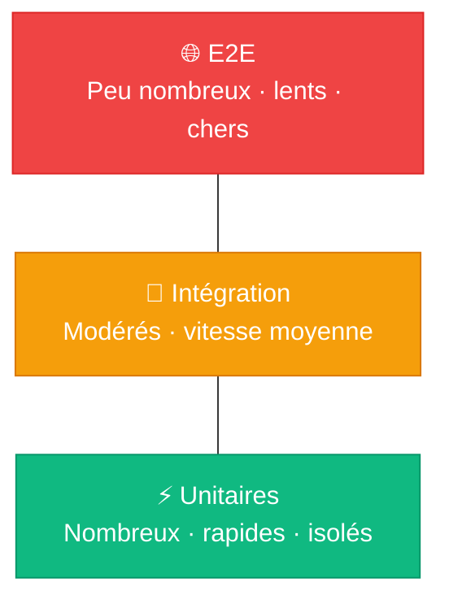
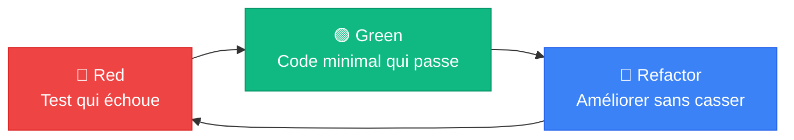
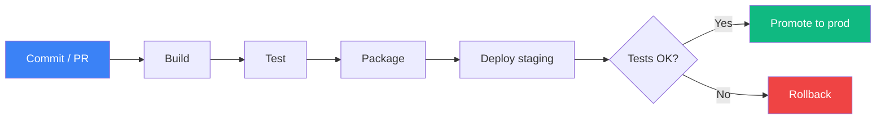
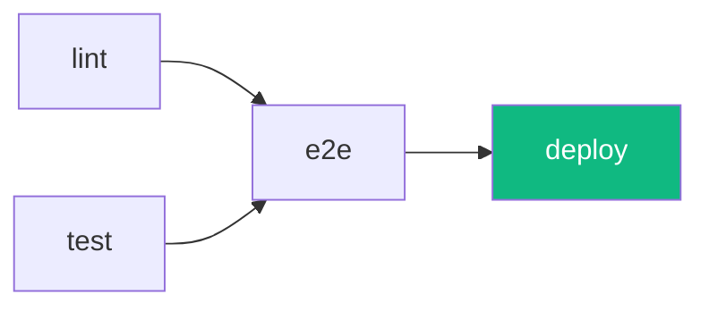
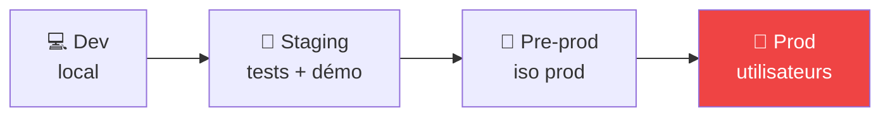
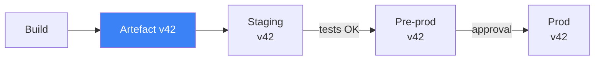
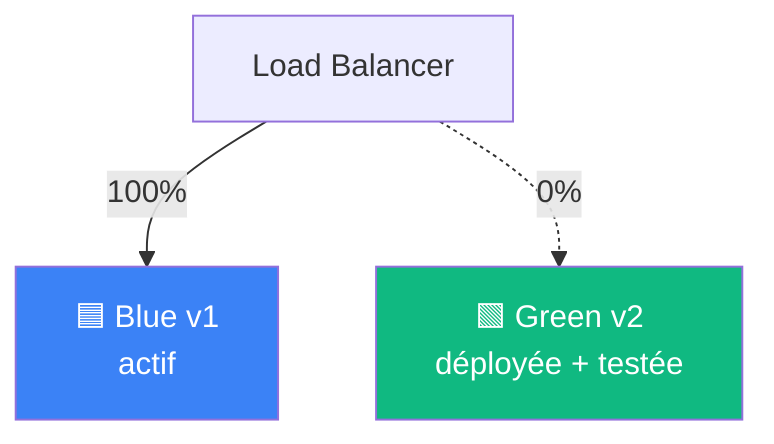
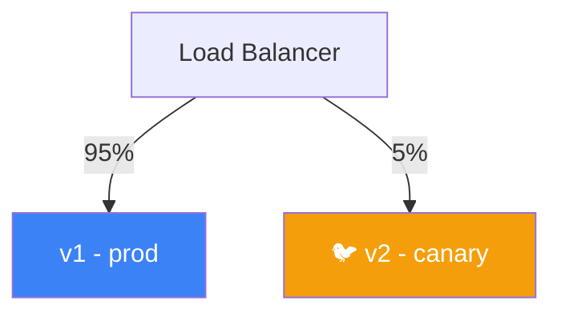
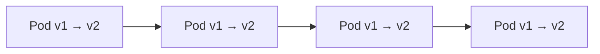
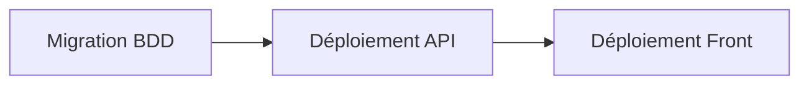

# Tests et Déploiement

<!--
Bienvenue. Cours en distanciel, 3 demi-journées de 3h30.

Se présenter rapidement : parcours dev + ops, expérience qualité logicielle, déploiement continu, incidents de prod vécus.

Format : alternance cours / démos / mini-exercices / breakouts. On ne reste pas sur une slide plus de 5 min. Posez vos questions dans le chat au fil de l'eau, je le surveille.

Caméras encouragées (pas obligatoires) - ça aide à garder le lien. Si vous décrochez ou que ça rame côté son/vidéo, ping moi sur le chat.
-->

---

# Plan des 3 demi-journées

<v-clicks>

- **1** - Stratégie de test + tests unitaires Jest
  <span class="text-sm opacity-70">Pyramide, FIRST, TDD, Jest, mocking, couverture</span>
- **2** - Tests d'intégration + end-to-end
  <span class="text-sm opacity-70">Supertest, base de test, Cypress, flaky tests</span>
- **3** - CI/CD + stratégies de déploiement
  <span class="text-sm opacity-70">GitHub Actions, blue/green, canary, feature flags, rollback</span>

</v-clicks>

<!--
3 DJ qui suivent le cycle naturel : on écrit les tests, on les fait tourner en CI, on déploie.

Évaluation : QCM en fin de DJ3, 25-30 questions, théorie + lecture de code.

Stack imposée : TypeScript, Jest, Cypress, GitHub Actions. Pas de Python ici (la fiche le mentionne mais on reste en TS).
-->

---

# Objectifs pédagogiques

<v-clicks>

- Comprendre la pyramide des tests, le coût d'un bug
- Écrire des tests unitaires TS avec Jest
- Mesurer la couverture de code et en lire les limites
- Tester une API REST avec Supertest + DB de test
- Automatiser un parcours E2E avec Cypress
- Concevoir un pipeline CI/CD GitHub Actions complet
- Comparer les stratégies de déploiement et choisir la bonne

</v-clicks>

<!--
À l'issue des 3 DJ, vous saurez écrire une suite de tests complète et la brancher dans un pipeline qui déploie tout seul.

On ne va pas faire de TP blue/green sur un vrai serveur - l'objectif sur le déploiement c'est de **savoir distinguer** les stratégies et choisir, pas implémenter.
-->

---
layout: section-cover
section: 1
---

# Pourquoi et comment tester

<!--
On démarre par le pourquoi. Beaucoup d'entre vous n'ont peut-être jamais écrit de test automatisé - l'objectif est d'abord que vous compreniez à quoi ça sert avant de regarder comment on fait.
-->

---

# Tour rapide

<KeyConcept title="Question pour vous" icon="💬">
Tu testes déjà ton code aujourd'hui ? Comment ?
</KeyConcept>

<!--
Sondage chat : faire taper une catégorie. Lire les réponses, relancer 2-3 personnes.

Objectif : prendre la température du groupe, et leur faire réaliser qu'ils testent tous, juste pas tous au même niveau.

Si quelqu'un dit "je teste à la main en lançant l'app" → parfait, c'est par là qu'on commence tous. La question c'est : combien de fois tu vas re-tester la même chose à la main avant de te dire qu'une machine ferait mieux ?
-->

---

# Pourquoi tester ?

<v-clicks>

- Détecter les bugs **avant** les utilisateurs
- Documenter le comportement attendu (tests = specs vivantes)
- Refactorer sans peur
- Accélérer les releases
- Réduire le coût des bugs

</v-clicks>

<!--
Contre-intuitif : "écrire des tests prend du temps" → vrai à court terme, faux à 3 mois.

Sans tests : on ralentit naturellement parce qu'on a peur de casser. Avec une bonne suite, on déploie 5x par jour sans transpirer.

Les tests sont aussi de la **documentation exécutable** - quand un nouveau dev arrive, lire les tests = comprendre le comportement attendu.
-->

---

# Coût d'un bug selon la phase


<Tip type="warning">
Plus la détection est tardive, plus le coût explose - technique <strong>et</strong> business.
</Tip>

<!--
Chiffres approximatifs (sources : IBM Systems Sciences Institute, NIST). L'ordre de grandeur est ce qui compte.

Bug en spec : on change un mot. Bug en prod : hotfix urgence + comm + parfois conséquences légales.

Au-delà du coût direct : surcharge équipe, dette technique, réputation. Un bug en prod c'est rarement juste un fix technique.
-->

---

# Fails célèbres

| Cas | Cause | Impact |
|---|---|---|
| **Ariane 5** (1996) | Conversion 64→16 bits non testée | Explosion · 500 M$ |
| **Knight Capital** (2012) | Déploiement incohérent · code mort réveillé | 460 M$ en 45 min |
| **CrowdStrike** (2024) | MAJ kernel non staged | Panne mondiale · M$$$ |

<!--
Ariane 5 : le software a été repris d'Ariane 4. Trajectoire plus rapide → variable de vitesse a dépassé int16. Pas de tests sur les nouvelles plages de valeurs. 39 secondes après décollage, boom.

Knight Capital : un déploiement sur 8 serveurs, oublient le 8e. Sur ce serveur, un flag réveille un vieux bout de code mort. Algo de trading part en vrille. 45 min plus tard, 460M$ envolés. Boîte dépose le bilan.

CrowdStrike : MAJ poussée en prod direct sans canary. Crash kernel sur des millions de PCs. Aéroports, hôpitaux, supermarchés. C'est récent - vous l'avez peut-être vécu.

Le point commun : aucun test automatisé qui aurait attrapé le cas en cause. Et un déploiement sans filet.
-->

---
layout: section-cover
section: 2
---

# La pyramide des tests

Le concept central de ce cours

<!--
Si vous ne retenez qu'une seule chose de la 1 : la pyramide. C'est le compas pour décider quel test écrire et combien.
-->

---

# La pyramide des tests



<Credit author="Mike Cohn" source="Succeeding with Agile (2009)" />

<!--
Pyramide popularisée par Mike Cohn en 2009.

L'idée : beaucoup de tests rapides à la base (unitaires), un peu d'intégration au milieu, et très peu de E2E au sommet.

Pourquoi cette forme ? Parce que les E2E sont **lents, chers, fragiles**. Si tu en as 500, ton CI prend 30 min et tu prends une roulette russe à chaque run.

Les unitaires sont rapides (millisecondes), isolés (pas de DB, pas de réseau) et fiables.
-->

---

# Anti-patterns de pyramide

<Comparison left="Cône glace 🍦 (à éviter)" right="Pyramide ✅" leftColor="orange" rightColor="green">
  <template #left>

  - Beaucoup de E2E
  - Peu de tests unitaires
  - CI lent, flaky
  - Bugs détectés tard
  - Refacto risqué

  </template>
  <template #right>

  - Beaucoup d'unitaires
  - Quelques intégrations
  - Quelques E2E ciblés
  - CI rapide
  - Refacto serein

  </template>
</Comparison>

<!--
L'anti-pattern le plus courant : le **cône de glace** (ice cream cone). Beaucoup d'E2E parce que "ça teste vraiment l'app", pas d'unitaires. Résultat : suite lente, flaky, et quand un test rouge tombe, tu sais pas où chercher.

Autre anti-pattern : le **sablier** - beaucoup d'unit, beaucoup d'E2E, rien au milieu. On rate les bugs d'intégration entre modules.
-->

---

# Trade-offs

| Type | Vitesse | Coût d'écriture | Confiance | Maintenance |
|---|---|---|---|---|
| Unitaire | ⚡⚡⚡ ms | Faible | Locale | Faible |
| Intégration | ⚡⚡ centaines de ms | Moyen | Inter-modules | Moyen |
| E2E | 🐢 secondes-minutes | Élevé | Bout en bout | Élevée |

<v-click>

<Tip type="info">
La bonne question n'est jamais "lequel choisir ?" mais <strong>"combien de chacun ?"</strong>.
</Tip>

</v-click>

<!--
Chaque ligne a son utilité. Tu ne remplaces pas un E2E par 100 unitaires - ils ne testent pas la même chose.

Règle de pouce : si tu peux tester un comportement par un unitaire, fais-le. Si tu ne peux pas (parce que ça implique plusieurs modules ou une vraie DB), monte d'un cran.
-->

---

# Critères FIRST

<v-clicks>

- **F**ast - millisecondes, pas secondes
- **I**solated - pas d'effet de bord entre tests
- **R**epeatable - même résultat à chaque run, n'importe où
- **S**elf-validating - pass/fail clair, pas de "regarde la console"
- **T**imely - écrits proche du code, idéalement avec

</v-clicks>

<!--
FIRST : check-list mentale à chaque test que tu écris. Si un test viole un critère, il va te coûter cher à terme.

Fast : ton test prend 5 secondes ? Multiplié par 200 tests, t'as 16 min de CI. Tu vas commencer à les skipper.

Isolated : un test qui échoue parce qu'un autre a tourné avant = cauchemar à debugger.

Repeatable : si ton test passe parfois et échoue parfois (flaky), tu n'as pas un test, tu as un générateur d'angoisse.

Self-validating : si tu dois lire les logs pour savoir si ça marche, c'est pas un test, c'est un script.

Timely : écris-les avec le code, pas "on verra plus tard" (= jamais).
-->

---

# 📊 Sondage

<KeyConcept title="Dans le chat" icon="📊">
Sur tes derniers projets, lequel de FIRST est le plus dur à respecter ?
</KeyConcept>

<v-click>

`F` · `I` · `R` · `S` · `T`

</v-click>

<!--
Sondage chat. Lire les résultats à voix haute, demander à 1-2 personnes de détailler.

En général : Repeatable (flaky tests à cause de la DB, dates, randomness) ou Isolated (state partagé).

Ces difficultés sont souvent un symptôme : architecture pas testable. On y reviendra.
-->

---

# TDD - Test-Driven Development



<v-click>

1. Écrire un test qui décrit le besoin → il échoue
2. Écrire le code **minimal** pour faire passer
3. Refactorer en gardant le test vert
4. Recommencer

</v-click>

<!--
TDD inventé par Kent Beck dans les années 90.

Le cycle force à penser comportement avant implémentation. Tu écris le test depuis le point de vue de l'utilisateur de ton code.

Effet secondaire : ton API devient plus utilisable, parce que tu l'as conçue en l'utilisant avant de l'implémenter.

Faut-il toujours faire du TDD ? Non. Sur du code exploratoire, sur des spikes, c'est trop rigide. Sur de la logique métier critique, c'est excellent.
-->

---

# TDD - quand l'utiliser

<Comparison left="Bon contexte" right="Mauvais contexte" leftColor="green" rightColor="orange">
  <template #left>

  - Logique métier complexe
  - Algorithmes
  - Bug à reproduire
  - Refactoring de code legacy
  - API publique stable

  </template>
  <template #right>

  - Spike / prototype jetable
  - UI exploratoire
  - Intégration tierce non stable
  - Premier essai d'une lib inconnue

  </template>
</Comparison>

<!--
TDD n'est pas une religion. Le test-after est OK aussi, tant que tu testes.

Cas d'usage typique du TDD : "j'ai un bug → j'écris un test qui le reproduit → il échoue → je fixe → il passe → ce bug ne reviendra jamais".

Sur du frontend exploratoire, où tu changes la maquette 5 fois, TDD = perte de temps.
-->

---

# Shift-left testing

<KeyConcept title="Shift-left" icon="⬅️">
Tester le plus tôt possible dans le cycle de développement.
</KeyConcept>

<v-clicks>

- Tests écrits **pendant** le dev (pas après)
- Linters, type-checkers en local + en CI
- Reviews de code orientées tests
- Tests dans la PR, pas après le merge

</v-clicks>

<!--
Shift-left = déplacer la qualité **vers la gauche** du cycle (vers le dev), au lieu d'attendre la fin.

L'opposé : "on dev, puis on file à la QA, puis on déploie". Approche waterfall, lente, coûteuse.

En pratique : pre-commit hooks, CI sur chaque PR, type-checking strict, revues qui exigent des tests.

Le bonus : on attrape les bugs quand ils coûtent encore x1, pas x50.
-->

---

# BDD - Given/When/Then

<KeyConcept title="BDD" icon="📖">
Behavior-Driven Development - exprimer les tests dans le langage métier.
</KeyConcept>

```gherkin
Feature: Inscription à un événement

  Scenario: Inscription réussie sur un événement avec places dispo
    Given un événement "Marathon Paris" avec 3 places disponibles
    When un participant s'inscrit
    Then l'inscription est confirmée
    And il reste 2 places disponibles
```

<!--
BDD = extension de TDD avec syntaxe lisible par les non-devs (PO, métier).

Outils : Cucumber, SpecFlow, Behave. Le test est écrit en Gherkin (Given/When/Then) puis mappé sur du code.

Mention seulement dans ce cours - vous le verrez si vous travaillez sur des projets avec une forte interaction métier/PO. Sur du dev pur, l'overhead est rarement justifié.
-->

---
layout: exercise
duration: 15 min
type: group
---

# Exercice 1 - Pyramide

## Consigne

🚪 **Breakouts groupes de 3-4** - 10 min de travail + 5 min restitution

Pour chaque scénario : **unitaire / intégration / E2E** ?

1. Vérifier qu'un mot de passe < 8 caractères est rejeté
2. Vérifier qu'un POST /login renvoie un JWT valide
3. Vérifier qu'un utilisateur peut se connecter, créer un panier, payer
4. Vérifier que `formatPrice(1234.5)` renvoie `"1 234,50 €"`
5. Vérifier que la table `users` est bien créée par les migrations
6. Vérifier qu'un email de confirmation est bien envoyé après inscription

<!--
Énoncé complet dans exercices/ex1-pyramide.md.

Breakouts via la fonction Zoom/Teams. 4 personnes par groupe.

Réponses attendues :
1. Unitaire (validation pure)
2. Intégration (route + service auth + DB éventuelle)
3. E2E (parcours complet, navigateur)
4. Unitaire
5. Intégration (DB)
6. Intégration (service mail mocké) ou E2E (vraie boîte mail de test)

Pendant le breakout : circuler dans les rooms, aider ceux qui hésitent. Restitution : un groupe au hasard présente, les autres complètent.
-->

---

# Exercice 1 - Correction

<v-clicks>

1. Mot de passe < 8 caractères → **Unitaire** · validation pure, pas de dépendance
2. `POST /login` renvoie un JWT → **Intégration** · route + service auth + signature
3. Connexion → panier → paiement → **E2E** · parcours utilisateur multi-écrans
4. `formatPrice(1234.5)` → `"1 234,50 €"` → **Unitaire** · fonction pure
5. Migration crée la table `users` → **Intégration** · vraie DB nécessaire
6. Email de confirmation après inscription → **Intégration** · service mail mocké (ou E2E avec boîte de test)

</v-clicks>

<!--
Faire défiler en v-clicks pendant la restitution. Pour chaque réponse, demander "qui avait mis ça ?" avant de cliquer.

Points sensibles :
- (2) Certains diront "unitaire" car on teste une seule route. Faux : login traverse plusieurs couches (controller → service → bcrypt → JWT lib). C'est de l'intégration.
- (5) Migration = forcément intégration, jamais unitaire. On VEUT tester contre une vraie DB.
- (6) Piège classique : "ça envoie un email donc E2E". Non - on mock le service mail et on vérifie qu'il a été appelé avec les bons args. Intégration.

Si un groupe s'est trompé sur un cas, leur faire expliquer leur raisonnement avant de donner la réponse - souvent leur logique tient debout, ils ont juste mis le curseur ailleurs.
-->

---

# Comment décider du niveau ?

<KeyConcept title="Règle de décision rapide" icon="🧭">

| Question à se poser | Niveau |
|---|---|
| Logique pure, pas d'I/O ? | **Unitaire** |
| Plusieurs composants qui collaborent (DB, HTTP, FS) ? | **Intégration** |
| Parcours utilisateur traversant plusieurs écrans ? | **E2E** |

</KeyConcept>

<v-click>

<Tip type="warning">
<b>Piège fréquent</b> : tester un composant qui appelle une API externe au niveau <b>unitaire</b> en mockant l'appel. C'est légitime, mais ça ne remplace <b>pas</b> un test d'intégration qui vérifie que le contrat HTTP fonctionne vraiment.
</Tip>

</v-click>

<!--
Insister sur la règle "logique pure → unitaire". C'est le critère le plus fiable quand un étudiant hésite.

Le piège du Tip est important : beaucoup d'équipes ont 90% d'unitaire avec mocks et croient être couvertes. Le jour où le format de réponse de l'API change → tout casse en prod sans qu'aucun test unitaire ne le voie. C'est exactement pour ça qu'on garde des tests d'intégration.

Transition : "Maintenant qu'on sait QUOI tester à QUEL niveau, voyons COMMENT bien tester" → FIRST.
-->

---
layout: pause
duration: 20 min
---

<!--
Pause de 20 min. Couper la caméra/le micro côté formateur, garder le chat ouvert.

Au retour : check rapide "tout le monde est là ?" avant de relancer.
-->

---
layout: section-cover
section: 3
---

# Tests unitaires avec Jest

<!--
Maintenant qu'on a la théorie, place à la pratique. Stack TS + Jest pendant 1h40.
-->

---

# Setup Jest + TypeScript

```bash
npm i -D jest @types/jest ts-jest typescript
npx ts-jest config:init
```

```js {monaco} jest.config.ts
import type { Config } from 'jest';

const config: Config = {
  preset: 'ts-jest',
  testEnvironment: 'node',
  testMatch: ['**/*.test.ts'],
  collectCoverageFrom: ['src/**/*.ts'],
};

export default config;
```

<!--
ts-jest = preset qui compile le TypeScript à la volée pour Jest.

Alternative : @swc/jest (plus rapide, moins de features). Sur les gros projets, swc fait gagner 30-50% du temps de test.

testEnvironment 'node' pour du back, 'jsdom' pour du front (DOM simulé).

testMatch : convention `*.test.ts` ou `*.spec.ts`. Choisir une et s'y tenir.
-->

---

# Anatomie d'un test

```ts
// src/utils/discount.ts
export function applyDiscount(price: number, percent: number): number {
  if (percent < 0 || percent > 100) throw new Error('Invalid percent');
  return price * (1 - percent / 100);
}
```

```ts
// src/utils/discount.test.ts
import { applyDiscount } from './discount';

describe('applyDiscount', () => {
  it('returns the discounted price', () => {
    expect(applyDiscount(100, 20)).toBe(80);
  });

  it('throws on invalid percent', () => {
    expect(() => applyDiscount(100, 150)).toThrow('Invalid percent');
  });
});
```

<!--
Structure : `describe` regroupe, `it` (ou `test`) déclare un cas, `expect` assert.

Convention : un describe par fonction/classe testée. Le nom du `it` décrit le comportement attendu, pas l'implémentation : "returns the discounted price", pas "calls multiplication".

Bon test : court, lisible, une seule chose vérifiée. Si tu as 3 expects qui testent 3 trucs différents, c'est 3 tests.
-->

---

# Pattern AAA

<KeyConcept title="Arrange · Act · Assert" icon="🎬">
Structurer chaque test en 3 phases lisibles.
</KeyConcept>

```ts {monaco}
it('returns total with tax', () => {
  // Arrange
  const cart = new Cart();
  cart.add({ name: 'Book', price: 20 });
  cart.add({ name: 'Pen', price: 2 });

  // Act
  const total = cart.totalWithTax(0.2);

  // Assert
  expect(total).toBe(26.40);
});
```

<!--
AAA : pattern universel.

Arrange : tout le setup (objets, fixtures, mocks).
Act : **une seule** action, celle qu'on teste.
Assert : vérifier le résultat.

Si tu as 2 "Act" dans un test, c'est 2 tests. Discipline-toi.

Les commentaires // Arrange/Act/Assert ne sont pas obligatoires - beaucoup les remplacent par des lignes vides. Le but est la lisibilité.
-->

---

# Matchers Jest courants

```ts
expect(value).toBe(42);              // Égalité stricte (===)
expect(obj).toEqual({ a: 1 });        // Égalité structurelle
expect(arr).toContain('foo');         // Présence dans tableau
expect(str).toMatch(/^https?:/);      // Regex
expect(fn).toThrow('error message');  // Lance une exception
expect(value).toBeNull();
expect(value).toBeUndefined();
expect(value).toBeTruthy();
expect(value).toBeGreaterThan(10);
expect(arr).toHaveLength(3);
```

<v-click>

<Tip type="warning">
<code>toBe</code> compare par référence (=== en JS). Pour comparer le contenu d'un objet, utiliser <code>toEqual</code>.
</Tip>

</v-click>

<!--
Catalogue : https://jestjs.io/docs/expect

Le piège classique : `expect({a:1}).toBe({a:1})` → échoue, parce que ce sont 2 objets distincts. Il faut `toEqual`.

Pour les promesses : `await expect(promise).resolves.toBe(42)` ou `.rejects.toThrow()`.
-->

---

# Exemple : tester un objet

```ts {monaco}
it('builds the user payload', () => {
  const user = buildUser('alice@example.com', 'Alice');

  expect(user).toEqual({
    id: expect.any(String),       // n'importe quelle string
    email: 'alice@example.com',
    name: 'Alice',
    createdAt: expect.any(Date),
  });
});
```

<!--
`expect.any(String)` est un *asymmetric matcher* : on ne vérifie pas la valeur exacte (qui est random ou variable), mais le type.

Autres : `expect.stringMatching(/.../)`, `expect.arrayContaining([...])`, `expect.objectContaining({...})`.

Utile pour les IDs UUID, dates, hashs - tout ce qui change entre 2 runs.
-->

---

# Mocking - pourquoi

<KeyConcept title="Mock" icon="🎭">
Remplacer une dépendance par un objet contrôlable, pour <strong>isoler</strong> le code testé.
</KeyConcept>

<v-clicks>

- Pas de vraie DB en unitaire
- Pas de vrai appel HTTP
- Pas de vrai service mail
- Reproductibilité totale

</v-clicks>

<!--
Le critère "Isolated" de FIRST → c'est le mocking qui le permet.

Si ton test unitaire fait un vrai appel HTTP, c'est pas un unitaire - c'est un test d'intégration accidentel, lent et flaky.

Mock = simulacre. Tu décides ce que la dépendance renvoie.
-->

---

# `jest.fn()` - fonction mockée

```ts {monaco}
it('calls the logger on error', () => {
  const logger = jest.fn();

  process({ invalid: true }, logger);

  expect(logger).toHaveBeenCalled();
  expect(logger).toHaveBeenCalledWith('error', 'invalid input');
  expect(logger).toHaveBeenCalledTimes(1);
});
```

<!--
`jest.fn()` crée une fonction qui enregistre ses appels.

Tu peux lui faire renvoyer ce que tu veux : `jest.fn(() => 42)` ou `jest.fn().mockReturnValue(42)` ou `jest.fn().mockResolvedValue(42)` pour une promesse.

Vérifier les appels : `toHaveBeenCalled`, `toHaveBeenCalledWith(...)`, `toHaveBeenCalledTimes(n)`.
-->

---

# `jest.mock()` - mocker un module

```ts {monaco}
import { fetchUser } from './api';
import { greetUser } from './greeter';

jest.mock('./api');
const mockedFetch = jest.mocked(fetchUser);

it('greets the fetched user', async () => {
  mockedFetch.mockResolvedValue({ name: 'Alice' });

  const result = await greetUser(1);

  expect(result).toBe('Hello, Alice');
  expect(mockedFetch).toHaveBeenCalledWith(1);
});
```

<!--
`jest.mock('./api')` remplace **tout** le module './api' par un mock. Toutes les exports deviennent des `jest.fn()` automatiquement.

`jest.mocked(...)` : helper TS pour avoir le bon type sur le mock (autocomplétion sur `mockResolvedValue`, etc.).

Très puissant : tu peux mocker des libs externes (axios, fs, dayjs...).
-->

---

# Spies - observer sans remplacer

```ts {monaco}
it('logs when service is called', () => {
  const spy = jest.spyOn(console, 'log');

  myService.doThing();

  expect(spy).toHaveBeenCalledWith('thing done');
  spy.mockRestore();
});
```

<v-click>

<Tip type="info">
<code>spyOn</code> = wrap autour d'une vraie fonction. Le code original tourne, mais on observe les appels.
</Tip>

</v-click>

<!--
Différence mock vs spy :
- mock = remplacement complet, l'original ne tourne pas
- spy = wrap, l'original tourne mais on observe

`spyOn` accepte un 3e argument pour aussi remplacer le retour : `jest.spyOn(obj, 'method').mockReturnValue(42)`.

`mockRestore()` après le test pour pas polluer les autres.
-->

---

# Exemple complet - service avec dépendance

```ts {monaco}
// payment.service.ts
export class PaymentService {
  constructor(private gateway: PaymentGateway) {}

  async charge(userId: string, amount: number) {
    const result = await this.gateway.charge(userId, amount);
    if (!result.success) throw new Error('Payment failed');
    return result.transactionId;
  }
}
```

```ts {monaco}
it('returns the transaction ID on success', async () => {
  const gateway = { charge: jest.fn().mockResolvedValue({ success: true, transactionId: 'tx_42' }) };
  const service = new PaymentService(gateway as any);

  const txId = await service.charge('u1', 100);

  expect(txId).toBe('tx_42');
  expect(gateway.charge).toHaveBeenCalledWith('u1', 100);
});
```

<!--
Le pattern : injecter les dépendances par le constructeur permet de mocker facilement.

Si tu as `import { gateway } from './gateway'` au top du fichier et que tu l'utilises directement, tu dois passer par `jest.mock()`. Plus rigide.

DI (dependency injection) : design choice qui rend le code testable. Worth it.
-->

---
layout: two-cols-header
---

# Fixtures et factories

::left::

### Fixture

```ts
const validUser = {
  id: 'u1',
  email: 'alice@test.com',
  age: 30,
};

it('accepts valid user', () => {
  expect(isValid(validUser)).toBe(true);
});
```

::right::

### Factory

```ts
function makeUser(overrides = {}) {
  return {
    id: 'u1',
    email: 'alice@test.com',
    age: 30,
    ...overrides,
  };
}

it('rejects underage', () => {
  expect(isValid(makeUser({ age: 12 }))).toBe(false);
});
```

<!--
Fixture = donnée figée. Simple mais répétitive.

Factory = fonction qui produit une donnée par défaut, surchargeable. Beaucoup plus flexible.

Pattern industriel : `faker` + factory. Ex : `makeUser({ email: faker.internet.email() })`.

À éviter : recopier l'objet à chaque test ; ça pourrit la lisibilité et tu finis avec 50 versions divergentes du même user.
-->

---

# Hooks `beforeEach` / `afterEach`

```ts {monaco}
describe('UserRepository', () => {
  let repo: UserRepository;

  beforeEach(() => {
    repo = new UserRepository();
  });

  afterEach(() => {
    repo.clear();
  });

  it('starts empty', () => {
    expect(repo.count()).toBe(0);
  });

  it('adds a user', () => {
    repo.add({ id: 'u1' });
    expect(repo.count()).toBe(1);
  });
});
```

<!--
`beforeEach` : tourne avant **chaque** test → état frais à chaque fois.
`beforeAll` : tourne **une fois** avant tous les tests du describe → setup coûteux partagé.
`afterEach` / `afterAll` : nettoyage.

Règle d'or : si `beforeEach` fait ce qu'il faut, tes tests sont isolés. Si tu factorises trop dans `beforeAll`, tu risques le couplage entre tests.
-->

---
layout: exercise
duration: 40 min
type: group
---

# TP1 - Tests unitaires

## Consigne

🚪 **Breakouts binômes** - 5 min setup / 30 min code / 5 min restitution

Cloner le repo TP, compléter **5 `it.todo`** dans `tests/unit/events.service.test.ts` :

- **A.1** - `get()` lève `EventNotFoundError` sur id inconnu
- **B.1** - `registerParticipant` appelle `charge` avec les bons args
- **B.2** - le compteur passe de 0 à 1 après succès
- **C.1** - `PaymentFailedError` quand le paiement KO
- **C.2** - le compteur **n'a pas bougé** après échec

```bash
cd tp-repo && npm install && npm run test:unit
```

<!--
TP central de la DJ1. 40 min, le plus long de la journée. Placé volontairement juste après le bloc mocking/factory/hooks pour que les binômes attaquent avec la théorie fraîche, et avant le bloc couverture qui sert de phase de récupération + transition naturelle (la Partie D du TP ouvre justement le rapport de couverture).

Important d'avoir le repo cloné AVANT le démarrage du bloc 2 - rappeler en ouverture de bloc 2.

Pendant les breakouts : circuler dans 2-3 rooms par tournante, voir où ça coince. Les binômes coincent typiquement sur :
- l'oubli de await sur les rejects.toThrow → test passe à tort
- mock pas reset entre tests (ici pas de souci, on recrée setup() à chaque fois)
- confusion entre toThrow(ClassName) et toThrow('message')

À 22 min : poll dans le chat "où vous en êtes ?" (Partie A / B / C / fini). Si majorité encore en B, prolonger 5 min.

Restitution : 1 binôme partage son écran sur C.2 (le test le plus subtil - vérifier l'absence d'effet de bord). Bien insister sur "tester l'absence de mutation après une erreur" - c'est ce qui distingue un bon test d'un test naïf.

Si reste du temps : ouvrir coverage/lcov-report/index.html en démo live, montrer les branches non couvertes - ça fait transition vers le bloc couverture qui suit.
-->

---

# TP1 - Correction · Partie A & B

```ts {all|1-7|9-12|14-23|all}
// Setup commun (déjà dans le fichier) - beforeEach garantit l'isolation
let db, charge, service;
beforeEach(() => {
  db = createDb();
  charge = jest.fn();
  service = new EventsService(db, { charge });
});

// A.1 - get() sur id inconnu
it('throws EventNotFoundError for an unknown id', () => {
  expect(() => service.get('does-not-exist')).toThrow(EventNotFoundError);
});

// B.1 - charge appelée avec les bons arguments
it('charges the payment gateway with email and amount', async () => {
  const event = seedEvent(db);                                         // factory
  charge.mockResolvedValue({ success: true, transactionId: 'tx_123' });
  const result = await service.registerParticipant(event.id, 'alice@example.com', 5000);
  expect(charge).toHaveBeenCalledWith('alice@example.com', 5000);
  expect(result.transactionId).toBe('tx_123');
});
```

<!--
Dérouler les v-clicks pendant la restitution.

Points clés à souligner :
- Le beforeEach (déjà fourni) recrée db + charge + service avant CHAQUE test → isolation garantie. Les étudiants n'ont qu'à utiliser les variables.
- A.1 : toThrow(ClassName) - on teste la classe d'erreur, pas le message. Plus robuste au refactor.
- B.1 : factory seedEvent(db) → événement frais avec un id unique. Pas besoin de connaître les ids du seed global.
- charge.mockResolvedValue : on configure le mock APRÈS sa création par beforeEach. Pattern classique.
- toHaveBeenCalledWith vérifie les ARGUMENTS. Différent de toHaveBeenCalled (juste appelé) ou toHaveBeenCalledTimes.

Demander : "qui a écrit toHaveBeenCalled tout court sans Args ?" - ça passe mais teste moins. Bon réflexe = être précis sur l'assertion.
-->

---

# TP1 - Correction · Partie B.2 & C.1

```ts {all|1-9|11-19|all}
// B.2 - compteur incrémenté
it('increments the registered count after a successful registration', async () => {
  const event = seedEvent(db, { registered: 0 });
  charge.mockResolvedValue({ success: true, transactionId: 'tx_456' });
  const before = service.get(event.id).registered;
  await service.registerParticipant(event.id, 'alice@example.com', 5000);
  const after = service.get(event.id).registered;
  expect(after).toBe(before + 1);
});

// C.1 - paiement KO → PaymentFailedError
it('throws PaymentFailedError when the gateway returns success=false', async () => {
  const event = seedEvent(db);
  charge.mockResolvedValue({ success: false, error: 'card_declined' });
  await expect(
    service.registerParticipant(event.id, 'alice@example.com', 5000)
  ).rejects.toThrow(PaymentFailedError);
});
```

<!--
B.2 : noter le pattern "before/after" - on capture l'état, on agit, on vérifie le delta. Ça marche pour tout effet de bord.

seedEvent(db, { registered: 0 }) : surcharge explicite du défaut. Montre la souplesse du factory pattern.

C.1 : LE point critique - **await expect(...).rejects.toThrow(...)**. Sans await, le test passe SILENCIEUSEMENT même si l'assertion est fausse. C'est le bug le plus fréquent en tests async. Faire une demo : retirer le await en live, montrer que le test reste vert alors qu'il ne teste plus rien.

Transition vers C.2 (la slide suivante) : "et maintenant, le test que personne n'écrit jamais en premier mais qui est le plus important..."
-->

---

# TP1 - Correction · C.2 et l'effet de bord

```ts {all|1|2-3|4-7|8|all}
it('does not increment registered count when payment fails', async () => {
  const event = seedEvent(db);
  charge.mockResolvedValue({ success: false, error: 'card_declined' });
  const before = service.get(event.id).registered;
  await expect(
    service.registerParticipant(event.id, 'alice@example.com', 5000)
  ).rejects.toThrow(PaymentFailedError);
  expect(service.get(event.id).registered).toBe(before);
});
```

<KeyConcept title="Le test que tout le monde oublie" icon="🎯">
Vérifier qu'une erreur <b>ne corrompt pas l'état</b>. C.1 dit "ça lève une erreur". C.2 dit "ET la DB n'a pas bougé". Sans C.2, on pourrait incrémenter le compteur AVANT le paiement → bug invisible.
</KeyConcept>

<!--
LE message de la slide. À marteler.

Beaucoup d'étudiants pensent : "j'ai testé l'erreur, c'est bon". Faux. Une erreur bien testée vérifie 2 choses :
1. L'erreur est bien levée (C.1)
2. Aucun effet de bord partiel n'a eu lieu (C.2)

Cas réel : un service de paiement où le compteur était incrémenté avant l'appel à la passerelle. En cas d'échec paiement, compteur déjà à +1 → événement marqué "complet" alors que personne n'a payé. Bug subtil détecté seulement en prod.

Lien avec le code source : montrer events.service.ts (méthode registerParticipant) - la transaction wrappe les 2 UPDATE/INSERT, donc rollback automatique si l'un échoue. Mais si on avait écrit le code différemment (incrément AVANT le charge), C.2 passerait et C.2 échouerait. C.2 est la vraie sécurité.

Transition vers le bloc couverture : "vous venez d'écrire 5 tests, on va voir maintenant comment mesurer ce qu'ils couvrent réellement".
-->

---

# 📊 Sondage - couverture

<KeyConcept title="Question" icon="📊">
"Mon code a 100% de couverture" - il est forcément bien testé ?
</KeyConcept>

<v-click>

`oui` · `non` · `ça dépend`

</v-click>

<!--
Sondage chat. Beaucoup vont dire "oui" intuitivement.

La bonne réponse est "non" - couverture ≠ qualité. On va voir pourquoi dans les slides suivantes.
-->

---

# Couverture de code

```bash
npx jest --coverage
```

```
File              | % Stmts | % Branch | % Funcs | % Lines |
------------------|---------|----------|---------|---------|
discount.ts       |   100   |    100   |   100   |   100   |
payment.service   |    85   |     75   |   100   |    87   |
events.service    |    60   |     40   |    50   |    62   |
```

<v-click>

<Tip type="info">
Istanbul (sous-jacent à Jest) génère le rapport. <code>--coverage</code> active la collecte.
</Tip>

</v-click>

<!--
4 dimensions :
- Statements : % des instructions exécutées
- Branches : % des chemins (if/else, switch, ternaires) couverts
- Functions : % de fonctions appelées
- Lines : % de lignes touchées

La plus instructive : **branches**. Une fonction peut être à 100% lines mais 50% branches si tu ne testes que le `if`.

Rapport HTML : `coverage/lcov-report/index.html`. Couleurs rouge/jaune/vert sur chaque ligne.
-->

---

# Lignes vs branches

```ts
function discount(price: number, isPremium: boolean): number {
  if (isPremium) return price * 0.8;
  return price;
}
```

```ts
// Test 1 seul
it('applies premium discount', () => {
  expect(discount(100, true)).toBe(80);
});
```

<v-clicks>

- ✅ **Lignes** : 100% (les 2 lignes sont touchées par le `return price * 0.8` ? Non.)
- ❌ **Branches** : 50% (la branche `else` n'est pas testée)

</v-clicks>

<!--
Cas typique : tu fais passer ton CI à 80% de couverture mais ton vrai filet est plein de trous parce que les branches non-premium ne sont jamais testées.

Toujours regarder la couverture branches, pas lignes.

Bon seuil pratique : 70-80% branches sur le code métier critique. 100% est souvent un piège (tests inutiles juste pour la métrique).
-->

---

# 100% ≠ qualité

<v-clicks>

- Une ligne **exécutée** ≠ ligne **testée**
- Tu peux avoir 100% sans **un seul `expect`** valide
- Couverture muette sur les **cas non écrits** (oubliés)
- Couverture muette sur la **qualité** des assertions

</v-clicks>

<v-click>

<Tip type="warning">
"Couverture vise une cible mobile : ce qui n'est pas couvert est bruyant, ce qui est couvert peut être muet."
</Tip>

</v-click>

<!--
Test piège qui passe et donne 100% :
```ts
it('does something', () => {
  myFunction(42);  // appelée → couverture, mais pas d'expect, donc rien testé
});
```

C'est un faux ami : la métrique est verte, le test est vide. Un linter strict (`jest/expect-expect`) attrape ce cas.

Et même avec des expects : tu peux tester juste les cas heureux et passer à 100%, et un cas limite te pète en prod.
-->

---

# SonarQube

<v-clicks>

- Analyse statique : **code smells**, complexité, duplication
- **Quality gate** : seuils auto sur PR
- Métriques : maintenabilité, fiabilité, sécurité, dette technique
- Intégration GitHub Actions native

</v-clicks>

<v-click>

<Tip type="info">
SonarCloud (gratuit pour OSS) ou SonarQube (self-hosted). Affiche le rapport directement dans la PR.
</Tip>

</v-click>

<!--
SonarQube = couteau suisse de la qualité statique.

Couvre : bugs potentiels, code smells (long methods, deep nesting), complexité cyclomatique, duplication, vulns connues.

Quality gate sur PR = passerelle qui bloque le merge si la qualité régresse.

Vous le verrez probablement en stage. Mention seulement aujourd'hui - pas de TP.
-->

---
layout: recap
section: 1 - Stratégie + Tests unitaires
---

# Ce qu'il faut retenir

- **Pyramide** - beaucoup d'unitaires, peu d'E2E
- **FIRST** - Fast, Isolated, Repeatable, Self-validating, Timely
- **TDD** = Red → Green → Refactor (pas obligatoire partout)
- **AAA** - Arrange · Act · Assert dans chaque test
- **Mocking** = isolation : `jest.fn()`, `jest.mock()`, `spyOn`
- **Couverture** = signal, pas garantie. Branches > lignes.

<!--
Quick check : poser 2-3 questions vérification dans le chat.
- "Donnez-moi une situation où TDD est inapproprié"
- "Pourquoi mocker une dépendance externe ?"
- "À quel niveau de pyramide testeriez-vous un calcul de TVA ?"

Annoncer : DJ2 commence par Supertest (intégration API) puis Cypress (E2E navigateur).
-->

---
layout: end
---

# Fin

Prochaine étape : les tests d'intégration et E2E

<!--
Rappeler : repo TP dispo sur le canal Discord/Teams, à cloner avant DJ2.

Q&A 5-10 min.
-->

---
layout: section-cover
section: 4
---

# Tests d'intégration

<!--
Bonjour à tous, retour pour la DJ2.

Tour rapide en ouverture : "depuis hier, qui a essayé d'écrire un test unitaire sur son projet ? Qu'est-ce qui a coincé ?"

Lire 2-3 réponses du chat, rebondir.
-->

---

# Retour J1

<KeyConcept title="📊 Dans le chat" icon="💬">
Une chose que tu as essayée depuis la dernière fois ? Une chose qui a coincé ?
</KeyConcept>

<!--
Sondage ouvert. Si personne n'a essayé, c'est OK - relancer "qu'est-ce qui vous a marqué d'hier ?".

Objectif : rétablir le contact, pas grand drama.
-->

---

# Intégration vs unitaire

<Comparison left="Unitaire" right="Intégration" leftColor="green" rightColor="blue">
  <template #left>

  - Une fonction / une classe
  - Toutes dépendances mockées
  - ms par test
  - Beaucoup (centaines)
  - Détecte les bugs locaux

  </template>
  <template #right>

  - Plusieurs modules ensemble
  - Vraie DB (de test), vrai HTTP local
  - 100ms - quelques s par test
  - Modérés (dizaines)
  - Détecte les bugs d'**interaction**

  </template>
</Comparison>

<!--
Frontière floue : "test d'intégration" est un terme glissant.

Définition pratique : si ton test traverse plusieurs modules **et** touche une DB ou un endpoint HTTP, c'est de l'intégration.

Sur une API REST : tester `POST /users` qui passe par le contrôleur, le service, la DB → c'est de l'intégration.

Pourquoi en faire ? Parce que les bugs d'intégration (mauvais mapping, contraintes DB violées, types qui mismatchent) ne sont **pas** détectés par les unitaires (où tout est mocké).
-->

---

# Quand basculer ?

<v-clicks>

- Tu mockes 5+ dépendances dans un unitaire → c'est un signal
- Le bug que tu cherches vit **entre** deux modules → intégration
- Tu testes une route API → intégration (Supertest)
- Tu testes une vraie requête SQL complexe → intégration

</v-clicks>

<!--
Heuristique : si tu te bats à mocker, c'est que le test devrait être plus haut dans la pyramide.

Trop d'unitaires "highly mocked" finissent par tester le mock lui-même, pas le vrai comportement.

Inversement : ne pars pas en intégration tout de suite "parce que c'est plus simple à écrire" - tu paies en CI lent ensuite.
-->

---

# Supertest - tester une API Express

```ts {monaco}
import request from 'supertest';
import { app } from '../src/app';

describe('GET /events', () => {
  it('returns 200 with events list', async () => {
    const res = await request(app).get('/events');

    expect(res.status).toBe(200);
    expect(res.body).toHaveLength(3);
    expect(res.body[0]).toHaveProperty('id');
  });
});
```

<v-click>

<Tip type="info">
Supertest démarre l'app Express en mémoire et lui envoie de vraies requêtes HTTP. Pas besoin de port libre.
</Tip>

</v-click>

<!--
Supertest = lib pour tester une app HTTP (Express, Koa, Fastify) sans démarrer un serveur sur un port.

Tu lui passes l'instance `app`, il intercepte. Très rapide.

Pattern : `request(app).METHOD(path).send(body).set(header, value).expect(status)`.

Avec await : `await request(app).get('/x')` retourne une réponse complète (status, headers, body).
-->

---

# Test POST avec body

```ts {monaco}
it('creates an event', async () => {
  const res = await request(app)
    .post('/events')
    .send({ name: 'Marathon', capacity: 100 })
    .set('Authorization', 'Bearer test-token');

  expect(res.status).toBe(201);
  expect(res.body).toMatchObject({
    id: expect.any(String),
    name: 'Marathon',
    capacity: 100,
  });
});
```

<!--
`.send(...)` pour le body JSON.
`.set(header, value)` pour les headers.
`.query({...})` pour les query params.

`toMatchObject` : assertion partielle - vérifie que les propriétés sont là, sans exiger l'égalité totale. Pratique pour les IDs générés.
-->

---

# Base de données de test

```ts {monaco}
import Database from 'better-sqlite3';

let db: Database.Database;

beforeEach(() => {
  db = new Database(':memory:');           // SQLite in-memory
  db.exec(fs.readFileSync('schema.sql', 'utf8'));
  db.exec(fs.readFileSync('seed.sql', 'utf8'));
});

afterEach(() => {
  db.close();
});
```

<v-click>

<Tip type="success">
SQLite in-memory : zéro setup, zéro pollution, ultra rapide. Parfait pour les tests d'intégration.
</Tip>

</v-click>

<!--
SQLite `:memory:` = DB éphémère, vit en RAM, disparaît à la fermeture.

Avantages :
- Pas de Postgres à installer en CI
- Reset propre entre chaque test (`beforeEach` recrée tout)
- Vitesse

Limites :
- SQL différent de Postgres/MySQL (certaines fonctions, types)
- Pour tester du SQL spécifique à Postgres, utiliser **Testcontainers** (vraie Postgres dans un conteneur jetable)

Compromis pratique : SQLite en local (rapide), Postgres real en CI (proche prod).
-->

---

# Fixtures et seeds

```ts {monaco}
// tests/fixtures/events.ts
export const seedEvents = (db: Database) => {
  const insert = db.prepare(
    'INSERT INTO events (id, name, capacity) VALUES (?, ?, ?)'
  );
  insert.run('e1', 'Marathon', 100);
  insert.run('e2', 'Yoga', 20);
  insert.run('e3', 'Trail', 50);
};
```

```ts
beforeEach(() => {
  db = new Database(':memory:');
  db.exec(schemaSQL);
  seedEvents(db);
});
```

<!--
Fixture = donnée de départ standard pour les tests.

Pattern : un module `fixtures/` qui exporte des fonctions `seedXxx(db)`.

Évite : insérer 50 lignes inline dans chaque test → illisible.

Évite aussi : seed gigantesque "complète" → tests dépendent d'un état complexe et hostile au debug.

Bon équilibre : seed minimal qui suffit aux tests, override par cas spécifique.
-->

---

# Isolation entre tests

<Comparison left="Mauvais" right="Bon" leftColor="orange" rightColor="green">
  <template #left>

  ```ts
  let db = new Database(':memory:');
  // setup une fois
  it('test A', () => { db.insert(...); });
  it('test B', () => { /* dépend de A */ });
  ```

  </template>
  <template #right>

  ```ts
  beforeEach(() => {
    db = new Database(':memory:');
    seed(db);
  });
  // chaque test part d'un état frais
  ```

  </template>
</Comparison>

<!--
Tests qui dépendent de l'ordre d'exécution = piège classique.

Symptômes :
- Le test passe seul, échoue dans la suite
- Le test passe sur ta machine, échoue en CI (parallélisation)
- Bugs intermittents

Solution : `beforeEach` qui reset complètement l'état.

Sur une vraie DB : transaction par test (BEGIN au début, ROLLBACK à la fin) - rapide et propre.
-->

---

# Parallélisation sûre

<v-clicks>

- Jest tourne les **fichiers** en parallèle (workers)
- Tests **dans un fichier** = séquentiels
- Si tu utilises une DB partagée → conflits
- Solution : 1 DB par worker, ou DB in-memory par fichier

</v-clicks>

<!--
Par défaut Jest spawn N workers (N = nb cœurs / 2). Chaque worker tourne ses fichiers en isolation.

Si tu écris dans un fichier `/tmp/test.db` partagé → 4 workers se marchent dessus.

Astuce : préfixer avec `JEST_WORKER_ID` pour avoir un namespace par worker.

`--runInBand` : force le séquentiel. Lent mais utile pour debugger.
-->

---

# Contract testing - Pact 

<KeyConcept title="Contract testing" icon="📜">
Vérifier que <strong>provider</strong> et <strong>consumer</strong> respectent un contrat partagé d'API.
</KeyConcept>

<v-clicks>

- Le **consumer** définit ses attentes (mock du provider)
- Le contrat est partagé (Pact Broker)
- Le **provider** vérifie qu'il honore le contrat
- Détecte les **breaking changes** d'API entre services

</v-clicks>

<!--
Problème typique : équipe A change un endpoint, équipe B casse en silence. On le découvre en intégration end-to-end, trop tard.

Pact = consumer-driven contract testing. Le consumer (front, autre service) écrit ses attentes. Le provider (l'API) vérifie qu'il les respecte.

Outil : Pact (https://pact.io). Mention seulement - c'est un cours niveau intermédiaire/avancé sur les microservices.
-->

---
layout: exercise
duration: 20 min
type: pair
---

# Exercice 3 - Supertest

## Consigne

Dans `tp-repo/tests/integration/events.api.test.ts`, écrire 3 tests pour `POST /events/:id/register` :

1. ✅ Inscription réussie → 201 + `{ registrationId }`
2. ❌ Événement inexistant → 404
3. ❌ Événement complet → 409

<Tip type="info">
La DB est seedée par <code>beforeEach</code> avec 3 événements (1 plein, 2 dispos).
</Tip>

<!--
Énoncé complet dans exercices/ex3-supertest.md.

Binôme aléatoire dans les breakouts. 1 personne tape, l'autre relit.

20 min : 5 min lecture du code existant + 12 min écriture + 3 min check.

Solution corrigée disponible dans instructor-solutions/.
-->

---

# Exercice 3 - Correction (1/2)

```ts {all|1-9|11-18|all}
// Helper fourni : chaque test = sa propre app + db seedée → isolation
function makeApp(payment: PaymentGateway) {
  const db = createDb();
  seed(db);
  return createApp(db, payment);
}
const okPayment: PaymentGateway = {
  charge: async () => ({ success: true, transactionId: 'tx_int' }),
};

it('returns 404 when the event does not exist', async () => {
  const app = makeApp(okPayment);
  const res = await request(app)
    .post('/api/events/does-not-exist/register')
    .send({ email: 'alice@example.com', amountCents: 5000 });
  expect(res.status).toBe(404);
  expect(res.body).toEqual({ error: 'event_not_found' });
});
```

<!--
Première partie : le setup partagé + le cas 404.

Setup / isolation (1-9) : `makeApp` recrée une app + une db seedée à chaque appel. C'est la réponse à la question de réflexion - aucun test ne dépend de l'état laissé par un autre → pas de flaky lié à l'ordre.

Cas 404 (11-18) : on poste sur un id inexistant. Point clé : on vérifie **status ET body** (`event_not_found`), pas juste le 404. Un body d'erreur typé, c'est ce que le front consomme.

Le happy path (201 + transactionId) était déjà fourni - inutile de le réécrire.
-->

---

# Exercice 3 - Correction (2/2)

```ts
it('returns 409 when the event is full', async () => {
  const app = makeApp(okPayment);          // même helper, app isolée
  const res = await request(app)
    .post('/api/events/trail-chamonix/register')
    .send({ email: 'bob@example.com', amountCents: 5000 });
  expect(res.status).toBe(409);
  expect(res.body).toEqual({ error: 'event_full' });
});
```

<Tip type="info">
Toujours vérifier <strong>status ET body</strong>. Et <code>toEqual</code> (pas <code>toBe</code>) pour comparer un objet.
</Tip>

<!--
Cas 409 : `trail-chamonix` est seedé comme complet → 409 + `event_full`. Même rigueur sur le body que le 404.

Erreurs fréquentes à relever :
- tester uniquement `res.status` sans le body
- réutiliser une app partagée entre les tests (casse l'isolation)
- `toBe` sur un objet au lieu de `toEqual` (toBe compare les références)
-->

---
layout: pause
duration: 20 min
---

<!--
Pause 20 min.
-->

---
layout: section-cover
section: 5
---

# Tests end-to-end avec Cypress

<!--
On change d'échelle : on ne teste plus du code, on teste un parcours utilisateur dans un vrai navigateur.
-->

---

# E2E - promesse et coût

<Comparison left="Promesse" right="Coût" leftColor="green" rightColor="orange">
  <template #left>

  - Test du **vrai** parcours utilisateur
  - Détecte les bugs d'UI réels
  - Confiance maximale en prod
  - Bonne démo aux POs/clients

  </template>
  <template #right>

  - Lent (secondes par test)
  - Flaky par nature
  - Maintenance élevée
  - Setup environnement complexe

  </template>
</Comparison>

<!--
E2E = sommet de la pyramide. Lents, fragiles, chers. Et indispensables pour les parcours critiques.

Combien en écrire ? **Les parcours qui rapportent du chiffre.** Login, paiement, inscription, recherche. Pas chaque écran.

Règle empirique : 5-15 E2E sur une app web moyenne. Si tu en as 200, tu as un problème.
-->

---

# Quand écrire un E2E ?

<v-clicks>

- Parcours **critique business** (paiement, inscription)
- Bug récurrent en prod difficile à reproduire en unitaire
- Smoke test avant prod
- Validation cross-navigateur

</v-clicks>

<v-click>

<Tip type="warning">
N'utilise pas Cypress pour tester ce que tu peux tester en unitaire / intégration. Les E2E coûtent <strong>10-100x</strong> plus en CI.
</Tip>

</v-click>

<!--
Anti-pattern : écrire un E2E pour vérifier qu'un bouton change de couleur au hover. C'est du JS pur, ça se teste en unitaire.

Le bon réflexe : "ce parcours fait gagner / perdre de l'argent ?" → si oui, E2E. Sinon, plus bas dans la pyramide.
-->

---

# Setup Cypress

```bash
npm i -D cypress
npx cypress open    # mode interactif (debug)
npx cypress run     # mode headless (CI)
```

```
cypress/
├── e2e/
│   ├── homepage.cy.ts
│   └── registration.cy.ts
├── fixtures/
│   └── users.json
├── support/
│   ├── commands.ts
│   └── e2e.ts
└── cypress.config.ts
```

<!--
Setup en 2 commandes. `cypress open` = GUI, idéal pour développer/debug - tu vois le navigateur, time-travel, retry.

`cypress run` = headless, pour CI.

Structure :
- `e2e/` = les tests (suffixe `.cy.ts`)
- `fixtures/` = données statiques
- `support/` = commandes custom, hooks globaux
-->

---

# Anatomie d'un test Cypress

```ts {monaco}
describe('Inscription', () => {
  beforeEach(() => {
    cy.visit('/events');
  });

  it('inscrit un utilisateur sur un événement avec places', () => {
    cy.get('[data-testid="event-marathon"]').click();
    cy.get('[data-testid="register-button"]').click();
    cy.get('[data-testid="email-input"]').type('alice@test.com');
    cy.get('[data-testid="submit"]').click();

    cy.contains('Inscription confirmée').should('be.visible');
  });
});
```

<!--
Lis le test : "visite /events, clique sur l'event Marathon, clique register, tape email, soumets, vérifie le message de succès".

C'est un script qui mime un humain. Lisible.

`cy.visit` = naviguer.
`cy.get` = sélectionner.
`cy.click`, `cy.type` = interagir.
`cy.contains` = chercher du texte.
`.should()` = assertion.
-->

---

# Sélecteurs - la règle d'or

<Comparison left="❌ Fragile" right="✅ Robuste" leftColor="orange" rightColor="green">
  <template #left>

  ```ts
  cy.get('.btn-primary')
  cy.get('#submit')
  cy.get('button:nth-child(3)')
  cy.get('div > span > a')
  ```

  </template>
  <template #right>

  ```ts
  cy.get('[data-testid="submit"]')
  cy.contains('button', 'S\'inscrire')
  cy.findByRole('button', { name: 'S\'inscrire' })
  ```

  </template>
</Comparison>

<!--
Sélecteurs CSS / XPath = casse à chaque refacto front. Le designer change une classe → 50 tests cassés.

`data-testid` = attribut dédié aux tests, ne change pas avec le style.

`cy.contains` = recherche par texte visible. Lisible mais sensible aux changements de wording (i18n).

Best practice : Testing Library queries (`findByRole`, `findByLabelText`) → sémantique + accessibilité.
-->

---

# Actions courantes

```ts
cy.visit('/login');
cy.get('[data-testid="email"]').type('alice@test.com');
cy.get('[data-testid="password"]').type('secret', { log: false });
cy.get('[data-testid="submit"]').click();
cy.get('select[name="country"]').select('France');
cy.get('[data-testid="terms"]').check();
cy.get('[data-testid="upload"]').selectFile('cypress/fixtures/cv.pdf');
cy.window().scrollTo('bottom');
```

<!--
Catalogue courant. Doc : https://docs.cypress.io/api/table-of-contents

`{ log: false }` sur les passwords pour éviter de logger en clair dans le rapport.

`cy.intercept` (qu'on verra) pour stub les appels API.
-->

---

# Assertions et retry-ability

```ts {monaco}
// Cypress retry automatiquement les assertions pendant 4s par défaut
cy.get('[data-testid="status"]').should('have.text', 'Connecté');

// Chaînage d'assertions
cy.get('[data-testid="cart-count"]')
  .should('be.visible')
  .and('contain.text', '3');

// Assertion sur un appel HTTP intercepté
cy.intercept('POST', '/api/login').as('loginCall');
cy.get('[data-testid="submit"]').click();
cy.wait('@loginCall').its('response.statusCode').should('eq', 200);
```

<v-click>

<Tip type="success">
<code>should</code> retry pendant 4s - pas besoin de <code>cy.wait(2000)</code> arbitraires.
</Tip>

</v-click>

<!--
La force de Cypress : la **retry-ability**. Tant que l'assertion échoue (et que le timeout n'est pas dépassé), il re-vérifie.

Plus de `await sleep(2000)` ! Tu décris **l'état attendu**, Cypress attend qu'il survienne.

`cy.intercept` permet de surveiller / mocker des appels réseau. Très utile pour découpler le front du back en test.
-->

---

# Anti-patterns Cypress

<v-clicks>

- ❌ `cy.wait(5000)` - utiliser `cy.intercept` + `cy.wait('@alias')`
- ❌ Sélecteurs CSS instables (`.btn-primary-2-active`)
- ❌ Tests dépendants entre eux
- ❌ E2E pour tester une validation de formulaire (→ unitaire)
- ❌ Login dans chaque test (→ `cy.session()` pour cacher)

</v-clicks>

<!--
`cy.wait(5000)` = mauvais signal. Soit ton app est lente, soit tu masques un vrai bug.

Login dans chaque test : `cy.session('user', () => { cy.login(...) })` met en cache la session entre tests → x10 plus rapide.

Dépendance entre tests : "test A crée le user, test B le supprime" → si A échoue, B échoue. Toujours indépendants.
-->

---

# Flaky tests - les causes

<v-clicks>

- ⏱️ Timing - animations, requêtes async non attendues
- 🌐 Réseau - vrais appels API en E2E
- 🎲 Données aléatoires - IDs, dates, ordre de tri
- 🧹 État partagé - DB pas resetée entre tests
- 🖥️ Environnement - fenêtre, viewport, fuseau horaire

</v-clicks>

<!--
Flaky = le test passe parfois, échoue parfois, sans changement de code.

C'est le pire : tu finis par re-run aveuglément, puis désactiver le test, puis tu rates un vrai bug.

Causes principales : async non géré, animations CSS, state qui fuit.

Approche : chaque test doit être indépendant et déterministe. Si tu en as un flaky, ne l'ignore pas - diagnose-le.
-->

---

# Mitigation flaky

<v-clicks>

- Utiliser les assertions retry-able (pas `sleep`)
- `cy.intercept` pour stub les appels lents/instables
- Reset DB entre tests
- Désactiver les animations en test (`cypress.config.ts`)
- Retry de test : `retries: { runMode: 2 }` (à manier avec prudence)
- Diagnostic : `cypress run --record` + Cypress Cloud pour stats

</v-clicks>

<v-click>

<Tip type="warning">
Le retry automatique <strong>masque</strong> le problème. À utiliser comme béquille temporaire, pas comme solution.
</Tip>

</v-click>

<!--
`retries: 2` = ressaye un test échoué 2 fois avant de le marquer rouge. Utile pour les flaky chroniques pendant que tu débogues, dangereux si tu l'oublies.

Cypress Cloud (payant) collecte les stats sur tes tests : lesquels sont flaky, lesquels sont lents, screenshots/vidéos des échecs.

Alternative gratuite : log + screenshots manuels.
-->

---

# Cypress vs Playwright

| | Cypress | Playwright |
|---|---|---|
| Multi-navigateurs | Chromium, Firefox, WebKit (récent) | Chromium, Firefox, WebKit |
| Langues | JS/TS uniquement | JS/TS, Python, Java, .NET |
| Multi-onglets | ❌ Limité | ✅ Natif |
| Multi-domaines | ⚠️ Récent | ✅ Natif |
| GUI debug | ✅ Excellente | ✅ (Codegen, Trace Viewer) |
| Vitesse | Bon | Souvent meilleur |
| Maturité | 2014, gros écosystème | 2020, très actif |

<!--
Choix souvent religieux. Pragma :

Cypress = excellent DX, GUI top, communauté énorme. Limites historiques sur multi-tab/multi-domain (qui se comblent avec les versions récentes).

Playwright = plus jeune mais robuste. Multi-langues (utile en équipe polyglotte). Trace Viewer = killer feature pour debug.

En 2026, Playwright gagne du terrain pour le nouveau code. Cypress reste massivement utilisé.

Pour ce cours : Cypress (stack imposée). Si demain vous démarrez un nouveau projet, regardez les deux.
-->

---
layout: exercise
duration: 20 min
type: pair
---

# Exercice 4 - Cypress

## Consigne

Dans `tp-repo/cypress/e2e/registration.cy.ts`, compléter le test E2E :

1. Aller sur `/events`
2. Cliquer sur l'événement "Trail des Collines"
3. Saisir email + nom dans le formulaire
4. Soumettre
5. Vérifier le message de succès

Tous les `data-testid` sont déjà placés dans la vue HTML.

<!--
Énoncé complet dans exercices/ex4-cypress.md.

20 min en binôme. Le but est qu'ils manipulent `cy.get`, `cy.type`, `cy.click`, `cy.contains`.

Bonus si certains finissent vite : utiliser `cy.intercept` pour mocker l'appel API et tester le cas erreur.
-->

---

# Exercice 4 - Correction

```ts {all|4-7|9-15|all}
// data-testid first · assertions retry-able · zéro cy.wait(ms)
cy.get('[data-testid=event-marathon-paris] [data-testid=event-capacity]')
  .invoke('text').then((before) => {
    cy.get('[data-testid=register-marathon-paris]').click();
    cy.get('[data-testid=email-input]').type('alice@example.com');
    cy.get('[data-testid=submit-btn]').click();
    cy.get('[data-testid=success-message]').should('contain', 'confirmée');

    // Bonus : le compteur d'inscrits a changé après fermeture
    cy.get('[data-testid=cancel-btn]').click();
    cy.get('[data-testid=event-marathon-paris] [data-testid=event-capacity]')
      .invoke('text')
      .should((after) => {
        expect(after).not.to.eq(before);
      });
  });
```

<!--
Dérouler les v-clicks pendant la restitution.

1) Parcours principal (4-7) : click → type → submit → assertion sur le message de succès. Que des `data-testid`, jamais de classe CSS ni de `nth-child`. Le `.should('contain', ...)` retry tout seul jusqu'à 4s → pas besoin de `cy.wait(2000)`.

2) Bonus (9-15) : on capture le compteur AVANT via `.invoke('text').then((before) => {...})`, on referme la modale, puis on vérifie que la valeur a changé. `should((after) => ...)` est lui aussi retry-able.

Pourquoi le `.then()` : les commandes Cypress sont asynchrones et chaînées - pour comparer un "avant/après", il faut capturer la valeur dans le callback, pas dans une variable synchrone.

Question de réflexion : combien d'E2E ? Peu - uniquement les parcours critiques (inscription, paiement). Le reste descend en intégration/unitaire (plus rapide, plus stable).

Anti-patterns à relever : `cy.wait(2000)`, `cy.get('.btn-primary')`, `cy.get('button').eq(2)`.
-->

---
layout: recap
section: Intégration + E2E
---

# Ce qu'il faut retenir

- **Intégration** = plusieurs modules + DB de test
- **Supertest** pour tester une API Express en mémoire
- **`beforeEach`** = isolation, reset entre tests
- **Cypress** = parcours utilisateur réel, retry-able assertions
- **`data-testid`** > sélecteurs CSS fragiles
- **Flaky** = signal de problème, à diagnostiquer (pas à retry aveuglément)

<!--
Quick check chat :
- "Pourquoi pas une vraie Postgres en intégration ?"
- "Donne-moi un cas où E2E n'est PAS le bon choix"
- "Quel est le problème avec `cy.wait(3000)` ?"

Annoncer DJ3 : on prend tous ces tests et on les met dans une CI qui déploie.
-->

---
layout: end
---

# Fin des tests

Ensuite : on automatise tout ça en CI/CD

<!--
Q&A 5-10 min. Demander à 2-3 personnes ce qui les a marqués/confusés.

Rappel : DJ3 = GitHub Actions + stratégies de déploiement. Apporter votre token GitHub si vous voulez tester sur votre fork.
-->

---
layout: section-cover
section: 6
---

# Pipeline CI/CD avec GitHub Actions

<!--
Dernière DJ. On enchaîne tests → CI → déploiement.

Tour rapide d'ouverture : "qui a déjà déclenché un pipeline ?". Lire 2-3 réponses chat.
-->

---

# Tour rapide

<KeyConcept title="📊 Dans le chat" icon="💬">
Tu as déjà déclenché un pipeline CI/CD ? Lequel ?
</KeyConcept>

<v-click>

`GitHub Actions` · `GitLab CI` · `Jenkins` · `Travis` · `aucun`

</v-click>

<!--
Sondage. La majorité aura touché GitLab CI ou GitHub Actions. Quelques-uns Jenkins (si stage en grande boîte).

Objectif : nivelage initial. Si beaucoup de "aucun", reprendre les bases (commit → push → workflow trigger).
-->

---

# Anatomie d'un pipeline



<!--
Flux classique : commit déclenche le pipeline → build → tests → package (artefact) → déploiement staging → vérification → promotion prod ou rollback.

Concepts à retenir :
- **Artefact** : produit du build (binaire, image Docker, archive). Un seul artefact promu de staging à prod.
- **Environment** : staging / prod, avec des variables et secrets propres.
- **Promote** : pas de re-build, on prend l'artefact qui a été testé.
- **Rollback** : retour à la version précédente en cas de pépin.
-->

---

# CI vs CD vs CD

<KeyConcept title="3 acronymes, 3 niveaux" icon="🎯">
</KeyConcept>

<v-clicks>

- **CI** - Continuous Integration : merge fréquent + tests auto sur chaque PR
- **CD₁** - Continuous Delivery : artefact prêt à déployer en 1 clic
- **CD₂** - Continuous Deployment : déploiement auto si tests verts (pas de clic)

</v-clicks>

<!--
Beaucoup de confusion. À l'oral on dit "CI/CD" comme un bloc, mais ce sont 3 pratiques distinctes.

CI : la base. Tu mergues souvent, les tests tournent sur chaque PR.

Continuous Delivery : tu **peux** déployer à tout moment, c'est un humain qui clique.

Continuous Deployment : la machine déploie elle-même quand le main est vert. Réservé aux équipes matures avec une vraie suite de tests.
-->

---

# GitHub Actions - workflow YAML

```yaml
# .github/workflows/ci.yml
name: CI

on:
  push:
    branches: [main]
  pull_request:

jobs:
  test:
    runs-on: ubuntu-latest
    steps:
      - uses: actions/checkout@v4
      - uses: actions/setup-node@v4
        with:
          node-version: 20
      - run: npm ci
      - run: npm test
```

<!--
Anatomie minimale :
- `on:` = quand déclencher (push, pull_request, schedule, workflow_dispatch)
- `jobs:` = unités de travail parallèles
- `runs-on:` = type de runner (ubuntu-latest, windows-latest, macos-latest, self-hosted)
- `steps:` = actions séquentielles dans un job

`uses:` = action réutilisable (depuis le marketplace).
`run:` = commande shell.
-->

---

# Concepts clés du pipeline

<v-clicks>

- **Artefact** - la version déployable, **buildée une seule fois**
- **Promotion** - le *même* artefact passe d'un environnement à l'autre
- **Gate** - un contrôle **bloquant** (qualité, sécu) avant d'avancer
- **Rollback** - le retour rapide à une version saine

</v-clicks>

<v-click>

<Tip type="info">
Un pipeline, c'est une suite de <strong>filtres de risque</strong> : chaque étape ne laisse passer que ce qui est sain.
</Tip>

</v-click>

<!--
Avant le YAML, les 4 mots à retenir - c'est ça la vraie valeur d'un pipeline, pas la syntaxe.

Artefact : le livrable (image Docker, archive, bundle). On le build UNE fois. Anti-pattern classique : rebuild entre staging et prod → tu déploies autre chose que ce que tu as testé.

Promotion : le même artefact v42 testé en staging est celui poussé en prod. Pas de re-build.

Gate : contrôle bloquant. Tests rouges → on n'avance pas. Couverture sous le seuil → on n'avance pas.

Rollback : pouvoir revenir en arrière vite. On y revient en détail cet après-midi.
-->

---

# Quelles étapes dans un pipeline ?

<div class="grid grid-cols-2 gap-6 mt-4">

<div>

**Build & qualité**
- Checkout + install
- Lint
- Build / compile
- Tests unitaires
- Tests d'intégration
- Tests E2E

</div>

<div>

**Sécurité & déploiement**
- Dependency scan (CVE)
- Secret scan
- Déploiement staging
- Smoke tests
- Approbation (si besoin)
- Déploiement prod + health check

</div>

</div>

<v-click>

<Tip type="info">
Pour chaque étape : <strong>quoi</strong> (action) · <strong>qu'est-ce qui bloque</strong> (gate) · <strong>qui</strong> (auto ou humain).
</Tip>

</v-click>

<!--
La vraie compétence : savoir QUELLES étapes mettre, dans quel ordre, et lesquelles bloquent.

Pas besoin de tout mettre dès le jour 1 - mieux vaut un pipeline simple et bien justifié qu'une usine à gaz que personne ne maintient.

Le triptyque action / gate / responsable : pour chaque étape on sait ce qu'elle fait, ce qui bloque le passage à la suite, et qui valide (machine ou humain). La colonne "responsable" est souvent celle qui manque dans la vraie vie.

Exemple : "Tests unitaires" → action: npm test → gate: échec ou couverture < 70% → responsable: auto.
-->

---

# Jobs, dépendances & parallélisme



<v-clicks>

- Un **job** = une unité qui tourne dans une VM neuve
- Les jobs sont **parallèles** par défaut
- `needs:` impose un ordre (e2e attend lint + test)
- Chaque job = un **check** sur la PR

</v-clicks>

<!--
On reste léger sur la mécanique. L'idée : un workflow se découpe en jobs, parallèles par défaut, qu'on ordonne avec `needs:`.

Ici : lint et test tournent en parallèle, e2e attend les deux, deploy attend e2e.

Chaque job apparaît comme un check sur la PR - c'est ce qui permet le gating, qu'on voit dans ce bloc.

Détail à connaître mais pas à mémoriser : chaque job = VM neuve, donc pas de partage de fichiers entre jobs (on passe par artifacts/cache si besoin).
-->

---

# Bonnes pratiques CI

<v-clicks>

- **Cache des dépendances** - `npm ci` passe de ~1-2 min à ~10-20 s
- **Secrets** - chiffrés dans GitHub, jamais en clair (`${{ secrets.X }}`)
- **Environnements protégés** - `environment: production` + approbation humaine
- **Matrix** - tester plusieurs versions/OS en parallèle (surtout pour une lib)
- **DB de test** - vraie Postgres lancée en `services:` pour l'intégration

</v-clicks>

<v-click>

<Tip type="success">
À retenir surtout : <strong>cache</strong> (vitesse) et <strong>secrets</strong> (sécurité). Le reste s'active au besoin.
</Tip>

</v-click>

<!--
On condense ici ce qui était 4 slides de YAML. L'objectif : connaître les leviers, pas les mémoriser.

Cache : facteur 5-10x sur la durée du pipeline. `actions/setup-node` a un cache npm built-in (`cache: 'npm'`).

Secrets : Settings → Secrets and variables → Actions. 3 niveaux : repo / environment / organisation. Masqués dans les logs (`***`). Jamais dans le code.

Environnement protégé : `environment: production` peut exiger une approbation humaine avant déploiement - garde-fou prod.

Matrix : produit cartésien (3 OS × 3 Node = 9 jobs parallèles). Surtout utile pour une lib publiée. Attention au quota runner.

DB en CI : `services:` lance un conteneur Postgres en parallèle du job. Alternative : Testcontainers.

Le réflexe à avoir : savoir que ça existe et où chercher. La syntaxe est dans la doc.
-->

---

# Gating & checks

<v-clicks>

- **Status checks** : chaque job = un check sur la PR
- **Required checks** : Settings → Branches → Branch protection
- **Block merge** si CI rouge
- **Test reports** : upload du résultat structuré
- **Test summary** dans la PR (action `dorny/test-reporter`)

</v-clicks>

<!--
Sans gating, le pipeline est décoratif - quelqu'un peut merger en main même si rouge.

Branch protection :
- Required status checks (lint, test, e2e)
- Required reviews (1 minimum)
- No direct push to main

Toute équipe sérieuse a ces règles.

Test summary : action qui pose un commentaire récap sur la PR (X passing, Y failing, Z duration). Améliore le DX.
-->

---

# Métriques DORA

<KeyConcept title="Mesurer la performance de livraison" icon="📊">
4 métriques issues de la recherche (Google / DORA) qui prédisent la performance d'une équipe.
</KeyConcept>

<v-clicks>

- **Deployment Frequency** — à quelle fréquence on déploie en prod
- **Lead Time for Changes** — temps entre un commit et sa mise en prod
- **Change Failure Rate** — % de déploiements qui causent un incident
- **MTTR** — temps pour rétablir le service après un incident

</v-clicks>

<v-click>

<Tip type="info">
Vitesse (1-2) <strong>et</strong> stabilité (3-4) ne s'opposent pas : les équipes « élites » sont bonnes sur les quatre.
</Tip>

</v-click>

<!--
Pont entre la CI (mesurée par les gates) et le pilotage d'équipe - pertinent pour un cursus management.

Les 2 premières mesurent la VITESSE (on livre vite et souvent), les 2 dernières la STABILITÉ (et sans casser). Le mythe "vite OU bien" est faux : les équipes élites font les deux, justement grâce à une bonne CI/CD et des déploiements progressifs.

Repères élite (étude DORA) : plusieurs déploiements/jour, lead time < 1h, change failure < 15%, MTTR < 1h. Low performers : 1 déploiement/mois, lead time en semaines, MTTR en jours.

Source : "Accelerate" (Forsgren, Humble, Kim). À citer - c'est LA référence delivery.

Côté management : ces 4 chiffres pilotent la santé delivery sans lire une ligne de code.
-->

---

# Environnements



<v-clicks>

- **Dev** : machine du dev
- **Staging** : tests, démos PO, données fake
- **Pre-prod** : miroir prod, données réelles anonymisées
- **Prod** : utilisateurs

</v-clicks>

<!--
Pas tout le monde a 4 niveaux. Sur une petite app : dev + prod. Sur une banque : 6 niveaux.

Règle : plus l'app est critique / complexe, plus de niveaux.

Pre-prod isomorphe à prod = filet pour attraper les bugs liés à la config / volume / données réelles.

Anonymisation des données : RGPD impose. Outils : `pg_anonymize`, scripts custom.
-->

---

# Promotion d'artefact

<KeyConcept title="Build once, deploy many" icon="📦">
Le <strong>même</strong> artefact passe de staging à prod, sans re-build.
</KeyConcept>



<!--
Anti-pattern : re-builder pour chaque environnement → tu déploies un truc différent en prod que ce que tu as testé.

Bonne pratique : 1 commit → 1 build → 1 artefact (image Docker, archive) → propagé partout. Reproductibilité totale.

Variables d'environnement injectées au runtime (12-factor app) → l'artefact est agnostique à l'env.
-->

---

# Conteneurisation (culture)

<v-clicks>

- **Image** = package immuable de l'app + ses dépendances
- **Conteneur** = exécution isolée d'une image
- **Registry** = stockage et versioning des images (comme npm, mais pour les images)

</v-clicks>

<v-click>

<KeyConcept title="L'artefact moderne" icon="📦">
Une <strong>image Docker</strong> est l'artefact qu'on build une fois et qu'on promeut partout.
</KeyConcept>

</v-click>

<!--
Lien direct avec le cours DevOps : l'artefact, aujourd'hui, c'est très souvent une image Docker.

Image = le package immuable (code + deps + runtime). Conteneur = l'image qui tourne, isolée. Registry = là où on stocke/versionne les images (Docker Hub, GHCR, ECR).

Le gros bénéfice : la même image tourne en local, en staging et en prod. Cohérence dev→prod, fin du "ça marche chez moi".

On ne fait pas de TP Docker ici - c'est de la culture. Vous l'avez vu (ou le verrez) côté DevOps.
-->

---
layout: section-cover
section: 7
---

# Stratégies de déploiement

<!--
On change de focus : plus de pipeline, on parle architecture de déploiement.

Survol - pas de TP. Objectif : savoir les distinguer et choisir.
-->

---

# Blue/Green deployment



<v-clicks>

1. Déployer v2 sur Green
2. Tester (smoke tests)
3. Bascule LB : Blue → Green (instantané)
4. Garder Blue prête pour rollback

</v-clicks>

<!--
Blue/Green : 2 environnements identiques. Un actif, un en standby.

Avantages :
- Bascule **instantanée** (juste le LB)
- Rollback instantané (re-bascule)
- Tests possibles sur Green avant la bascule

Inconvénients :
- Coût : 2x les ressources en parallèle
- DB partagée → migrations doivent être backward-compatible

Cas d'usage : apps critiques avec downtime intolérable.
-->

---

# Canary release



<v-clicks>

1. Déployer v2 sur 5% du trafic
2. Surveiller métriques (erreurs, latence)
3. Si OK : 5% → 25% → 50% → 100%
4. Si KO : rollback (couper le canary)

</v-clicks>

<!--
Canary = "canari dans la mine". Petite portion d'utilisateurs sur la nouvelle version pour valider en conditions réelles.

Avantages :
- Détection précoce de bugs en prod
- Impact limité si pépin
- Validation par métriques (vrais utilisateurs)

Inconvénients :
- Outillage : LB intelligent, observabilité poussée
- Plus complexe que blue/green
- Compatibilité données entre versions

Outils : AWS CodeDeploy, Argo Rollouts, Flagger, LinkerD.
-->

---

# Rolling update



<v-clicks>

- Remplace les instances **une par une**
- Standard Kubernetes
- Pas de double infra (vs blue/green)
- Bascule progressive sur quelques minutes

</v-clicks>

<!--
Rolling = stratégie par défaut sur Kubernetes (Deployment).

Tu as 4 pods en v1. K8s en démarre 1 en v2, attend qu'il soit healthy, en kill 1 en v1, etc.

Avantages : pas de coût double, simple.
Inconvénients : pendant la transition, tu sers des 2 versions en parallèle → backward compat exigée.

Compromis classique entre blue/green (rapide, cher) et canary (sophistiqué, ciblé).
-->

---

# Comparaison

| | Blue/Green | Canary | Rolling | Feature flag |
|---|---|---|---|---|
| Bascule | Instantanée | Progressive | Progressive | Instantanée |
| Coût infra | 2x | +1 instance | 0 | 0 |
| Complexité | Faible | Élevée | Faible | Moyenne |
| Rollback | Instantané | Couper canary | Lent | Toggle off |
| Idéal pour | Downtime zéro | Validation prod | K8s standard | A/B, dark launch |

<!--
Pas de "meilleure" stratégie. Choix selon contexte.

Blue/Green : apps critiques, downtime intolérable, budget pour 2x infra.
Canary : besoin de valider en conditions réelles, équipe ops mature.
Rolling : K8s, par défaut, suffisant pour 80% des cas.
Feature flag : changement contrôlé au niveau code, pas infra.

Dans la vraie vie : combinaison. Ex : déploiement rolling + feature flag pour activer la feature seulement à certains users.
-->

---
layout: pause
duration: 20 min
---

<!--
Pause 20 min, au milieu de l'après-midi. Reprise sur les aspects opérationnels du déploiement.
-->

---
layout: section-cover
section: 8
---

# Réussir la mise en production

<!--
Reprise après la pause. On passe des stratégies (théorie) aux aspects opérationnels : migrations, feature flags, rollback, et comment se déroule une vraie mise en prod.
-->

---

# Migrations BDD & ordre de déploiement



<v-clicks>

- L'**ordre** compte : BDD → backend → frontend
- Migrations **rétro-compatibles** : l'ancien code doit tourner avec la nouvelle base
- Sinon blue/green et rolling cassent (2 versions coexistent un instant)

</v-clicks>

<v-click>

<Tip type="warning">
Déployer le front avant l'API = appels vers des endpoints qui n'existent pas encore.
</Tip>

</v-click>

<!--
Point souvent oublié et pourtant central pour TOUTES les stratégies vues juste avant.

L'ordre : toujours de bas en haut. D'abord la base (migrations), puis le backend, puis le frontend. L'inverse = le front appelle des endpoints absents.

Rétro-compatibilité : c'est LE prérequis du blue/green, du canary et du rolling. Pendant la bascule, l'ancienne ET la nouvelle version tournent en même temps sur la même base. Si la migration casse l'ancien code, tout tombe.

Technique : migrations en 2 temps (expand / contract). On ajoute une colonne (compatible), on déploie le code, puis seulement après on supprime l'ancienne colonne. Mention - ils approfondiront en projet.
-->

---

# Feature flags

```ts {monaco}
import { isEnabled } from './feature-flags';

if (await isEnabled('new-checkout', { userId })) {
  return renderNewCheckout();
}
return renderOldCheckout();
```

<v-clicks>

- Activation **sélective** (par user, %, région, plan...)
- **Dark launch** : code déployé mais désactivé
- **Kill switch** : désactiver une feature buggée sans redéployer
- **A/B testing** : 2 variantes en parallèle, métriques comparées

</v-clicks>

<!--
Feature flag = condition dans le code qui active/désactive une feature à chaud.

Outils : LaunchDarkly, Unleash, Flagsmith, Split.io. Ou DIY (table en DB + cache).

Bénéfices :
- Découple "deploy" de "release" : tu déploies en off, tu actives quand prêt
- Rollback sans redéploiement
- Tests A/B production

Piège : la dette de flag. Un flag oublié pendant 2 ans = code mort qui complique la maintenance. Toujours avoir un cycle de vie pour les flags.
-->

---

# Rollback automatique

```yaml {monaco}
- name: Deploy
  run: ./deploy.sh

- name: Smoke tests
  run: ./smoke.sh
  id: smoke

- name: Rollback on failure
  if: failure() && steps.smoke.outcome == 'failure'
  run: ./rollback.sh
```

<v-clicks>

- **Smoke tests** post-déploiement (health, parcours critiques)
- Si rouge → rollback automatique
- Métriques : taux d'erreur, latence p95
- Alerting : Slack/autre sur rollback

</v-clicks>

<!--
Rollback automatique = filet ultime. Sans ça, un déploiement raté traîne en prod jusqu'à ce qu'un humain s'en rende compte.

Smoke tests : 5-10 tests qui valident "l'app est vivante" : login, requête vers DB, parcours principal.

Mécanique : SLO sur le déploiement. Si erreur > X% pendant Y minutes → rollback auto.

Outils : Argo Rollouts, Flagger, Spinnaker.
-->

---
layout: exercise
duration: 15 min
type: group
---

# Exercice 6 - Choisir une stratégie

## Consigne

Pour chaque contexte, choisir la stratégie de déploiement et **justifier** :

1. **E-commerce Black Friday** - pic de trafic, downtime = $$$ perdus
2. **SaaS B2B** - 50 clients enterprise, contrats SLA stricts, 1 release/mois
3. **App interne** - 200 collaborateurs, on déploie 5x/jour, tolérance forte

Choix possibles : blue/green · canary · rolling · feature flag · combinaison.

<!--
Énoncé complet dans exercices/ex6-strategies-deploiement.md.

Pas de "bonne" réponse unique. Discussion attendue :
1. Blue/green (downtime intolérable, on accepte le coût) + feature flags pour les fonctionnalités sensibles
2. Canary (besoin de valider en prod chez un client pilote avant le rollout) + feature flag par client
3. Rolling K8s standard suffit + feature flags pour expériences

Restitution : un groupe par contexte, échange.
-->

---

# Exercice 6 - Correction

<v-clicks>

- **E-commerce Black Friday** → 🔵🟢 **Blue/Green** - downtime intolérable, bascule et rollback instantanés. On assume le coût 2× le temps du pic.
- **SaaS B2B (SLA stricts, 1 release/mois)** → 🐦 **Canary** - valider sur un client pilote avant le rollout général, blast radius limité.
- **App interne (5×/jour, tolérance forte)** → 🔄 **Rolling** - défaut K8s, simple, zéro coût double. Largement suffisant.

</v-clicks>

<v-click>

<Tip type="info">
Pas de réponse unique. Et les <strong>feature flags</strong> complètent les trois : activer une fonctionnalité sensible indépendamment du déploiement.
</Tip>

</v-click>

<!--
Pas de "bonne" réponse unique - on note la cohérence du raisonnement, pas le mot exact.

1) Black Friday : le critère qui tranche = downtime intolérable + besoin de rollback < 2 min. Blue/green coche les deux. Canary défendable aussi mais plus complexe à orchestrer en urgence. + feature flag sur le correctif sensible.

2) SaaS B2B : peu d'utilisateurs simultanés mais risque métier élevé → on veut valider en conditions réelles sur un périmètre réduit. Canary, ou déploiement client par client (1 pilote → les 2 autres).

3) App interne : forte tolérance, déploiements fréquents → pas besoin d'artillerie. Rolling K8s standard suffit. Feature flags pour les expériences.

Erreur classique à recadrer : "blue/green partout par défaut". C'est cher (2× infra) et inutile quand la tolérance est forte.

Point transverse à rappeler : toutes ces stratégies supposent des migrations BDD rétro-compatibles (slide vue juste avant).
-->

---

# Anatomie d'une mise en prod

| Phase | Actions clés |
|---|---|
| **Avant** | Backup, vérifier le plan de rollback, prévenir les équipes, geler les merges |
| **Pendant** | Migrations BDD → déployer l'artefact → vérifier les health checks |
| **Après** | Surveiller les métriques ~30 min, valider les parcours critiques, confirmer |

<v-clicks>

- Choisir une **fenêtre** à faible impact (jamais le vendredi soir)
- Chaque étape a un **responsable** et un **critère de succès** mesurable

</v-clicks>

<!--
Une mise en prod, ce n'est pas "git push origin main". C'est un événement préparé, avec une checklist, des responsables et un plan B.

Avant : on s'assure qu'on peut revenir en arrière (backup + rollback prêt), on prévient le support / les équipes métier, on gèle les merges pour ne pas mélanger les changements.

Pendant : l'ORDRE compte (migrations BDD d'abord, cf. slide migrations). Un health check à 200 ne suffit pas - vérifier que l'app fonctionne vraiment.

Après : les 30 premières minutes sont critiques. On surveille (golden signals), on teste les parcours clés, et SEULEMENT après on déclare la MEP réussie.

La fenêtre : pour du B2B, la nuit / le week-end. Règle d'or : jamais le vendredi après-midi, sauf si on aime bosser le week-end.

Même les pilotes chevronnés utilisent une checklist - ce n'est pas un manque de compétence, c'est de la rigueur.
-->

---

# Étude de cas : quand le déploiement tourne mal

<v-clicks>

- **Knight Capital (2012)** — déploiement manuel, 1 serveur sur 8 garde l'ancien code → **440 M$ perdus en 45 min**, faillite.
- **CrowdStrike (2024)** — une mise à jour poussée à **tous** les clients d'un coup → 8,5 M de PC Windows en écran bleu, panne mondiale.
- **GitLab (2017)** — suppression accidentelle de la prod, backups non testés → 6h de données perdues, en direct.

</v-clicks>

<v-click>

<KeyConcept title="Question" icon="🔍">
Pour chacun : qu'est-ce qui a manqué dans la <strong>façon de déployer</strong> ?
</KeyConcept>

</v-click>

<!--
Capstone storytelling, juste après la checklist MEP - on raconte, on fait réagir le chat avant le debrief.

Knight Capital : déploiement manuel, un ingé oublie un serveur sur huit. L'ancien code réactive une fonction de test qui passe des ordres en boucle. 440 M$ en 45 min, la boîte coule. Le cas d'école absolu.

CrowdStrike (juillet 2024) : un fichier de config défectueux poussé à TOUT le parc d'un coup, pas de rollout progressif. 8,5 M de machines Windows down. Aéroports, hôpitaux cloués.

GitLab (2017) : un admin supprime le mauvais répertoire en prod, et découvre que 5 mécanismes de backup sur 5 étaient cassés. Incident streamé en live sur YouTube - leçon d'humilité et de transparence.

Laisser le chat proposer avant de passer au debrief.
-->

---

# Ce qui aurait changé la donne

| Incident | Cause côté déploiement | Garde-fou manquant |
|---|---|---|
| Knight Capital | Déploiement manuel incomplet | Automatisation + artefact unique + kill switch |
| CrowdStrike | Big bang sur 100 % du parc | **Canary** / rollout progressif |
| GitLab | Aucun filet | Backups testés + **rollback** + staging |

<v-click>

<Tip type="success">
Fil rouge : <strong>automatiser</strong>, <strong>déployer progressivement</strong>, <strong>savoir revenir en arrière</strong> — exactement ce qu'on vient de voir cet après-midi.
</Tip>

</v-click>

<!--
Debrief en capstone : on relie chaque incident à tout ce qu'on vient de voir aujourd'hui.

Knight Capital → un pipeline automatisé déploie le MÊME artefact partout (pas de serveur oublié), et un kill switch / feature flag coupe la fonction folle en 1 clic.

CrowdStrike → canary : 1% du parc d'abord, on observe, puis on monte. Le bug aurait touché 1% au lieu de 100%.

GitLab → un plan de rollback + des backups testés régulièrement + un vrai staging.

Conclusion : vous avez maintenant tous ces garde-fous en main. Il reste 2-3 mentions (sécu, monitoring) puis la synthèse.
-->

---

# Sécu CI/CD 

<v-clicks>

- **SAST** (Static App Security Testing) - SonarQube, Semgrep, CodeQL
- **DAST** (Dynamic) - OWASP ZAP, scan de l'app déployée
- **Dependency scanning** - Dependabot (GitHub natif), Snyk, Renovate
- **Secrets scanning** - détection de secrets commités (Gitleaks, GitHub natif)
- **OWASP Top 10** - guide de référence des vulns web

</v-clicks>

<v-click>

<Tip type="info">
GitHub Advanced Security : SAST + secrets + dependency review.
</Tip>

</v-click>

<!--
Sécu = transverse au pipeline.

SAST = analyse statique du code (avant exécution). Détecte les patterns dangereux (SQL injection, XSS, secrets hardcodés).

DAST = scanne l'app déployée. Plus lent, attrape des vulns runtime.

Dependency scanning : tu utilises lodash 4.17.10 ? CVE connue → upgrade.

OWASP Top 10 : à connaître par cœur si tu fais du web. Injection, broken auth, broken access control, etc.

Mention dans ce cours, pas TP. Important pour stage / job en sécurité-aware shop.
-->

---

# Tests de performance 

```js {monaco}
// k6 - script de charge
import http from 'k6/http';
import { check } from 'k6';

export const options = {
  vus: 100,                    // 100 users virtuels
  duration: '5m',
};

export default function () {
  const res = http.get('https://api.example.com/events');
  check(res, {
    'status 200': (r) => r.status === 200,
    'latency p95 < 500ms': (r) => r.timings.duration < 500,
  });
}
```

<v-clicks>

- **k6** (Grafana), **Artillery**, **JMeter**, **Locust**
- Métriques clés : **p50, p95, p99**, RPS, taux d'erreur
- **Stress test** vs **load test** vs **soak test**

</v-clicks>

<!--
Tests de perf = pas tester "ça marche", tester "ça tient à la charge".

Vocabulary :
- Load test : montée progressive jusqu'à charge cible (production réelle)
- Stress test : on pousse jusqu'à casser pour trouver la limite
- Soak test : charge soutenue sur longue durée, détecte fuites mémoire

p95 = 95% des requêtes finissent sous ce seuil. Plus parlant que la moyenne (qui masque les outliers).

p99 critique pour les SLA stricts.

Mention : pas dans ce cours, mais important sur projet à fort trafic.
-->

---

# Refactoring sécurisé 

<KeyConcept title="Tests de caractérisation" icon="🛡️">
Capturer le comportement <strong>actuel</strong> du code legacy avant de refactorer.
</KeyConcept>

<v-clicks>

1. Snapshot du comportement actuel (bugs inclus)
2. Refactor avec confiance
3. Si snapshot casse → comprendre pourquoi
4. Migrer progressivement vers de vrais tests

</v-clicks>

<!--
Refacto sans tests = roulette russe. Mais sur du legacy, écrire des tests "propres" demande de comprendre le code → cercle vicieux.

Solution : snapshot tests qui figent le comportement actuel. Tu changes le code, le snapshot dévie → tu sais que t'as changé un comportement.

Référence : "Working Effectively with Legacy Code" - Michael Feathers.

Outils : `jest --ci --updateSnapshot`, ApprovalTests, Touca.

Mention : pertinent pour vous quand vous attaquerez du code legacy en stage.
-->

---

# Monitoring  - 4 golden signals

<v-clicks>

- **Latency** - temps de réponse (p50, p95, p99)
- **Traffic** - RPS, requêtes/sec
- **Errors** - taux d'erreur (5xx, exceptions)
- **Saturation** - CPU, mémoire, threads, queues

</v-clicks>

<v-click>

<Credit author="Google SRE Book" source="sre.google/books" />

</v-click>

<!--
Site Reliability Engineering (Google) - référence absolue pour l'ops.

Si tu monitorent juste **ces 4 signaux**, tu attrapes 90% des incidents.

Outils : Prometheus + Grafana, Datadog, New Relic, Sentry (erreurs).

3 piliers de l'observabilité : logs, métriques, traces. Tous nécessaires.

Mention : on n'approfondit pas, mais c'est le terrain de jeu naturel après ce cours.
-->

---

# Synthèse globale

<v-clicks>

- ✅ **Pyramide des tests** : compas pour décider
- ✅ **FIRST + AAA** : critères et structure des tests
- ✅ **Jest + TS** : unitaires, mocks, couverture
- ✅ **Supertest** : intégration API + DB de test
- ✅ **Cypress** : E2E robuste avec data-testid
- ✅ **GitHub Actions** : CI complète + gating
- ✅ **Stratégies de déploiement** : choisir selon contexte
- ✅ **Mentions** : SonarQube, perf (k6), sécu (OWASP), monitoring

</v-clicks>

<!--
On a couvert beaucoup en 10h30. C'est dense.

Si vous ne retenez que 3 choses : (1) la pyramide, (2) `data-testid`, (3) un pipeline CI bien fait change la vie.

Vous savez maintenant tester et déployer une app. La maturité vient avec la pratique.
-->

---

# Pour aller plus loin

| Type | Ressource |
|---|---|
| 📖 Livre | "Testing JavaScript" - Kent C. Dodds |
| 📖 Livre | "Continuous Delivery" - Humble & Farley |
| 📖 Livre | "Site Reliability Engineering" - Google (gratuit) |
| 🌐 Web | jestjs.io · docs.cypress.io · docs.github.com/actions |
| 🌐 Article | Martin Fowler - "Test Pyramid" |
| 🌐 Web | The Twelve-Factor App (12factor.net) |
| 🎯 Practice | Codewars + tests |

<!--
Liste à mettre dans le repo aussi.

Conseil pratique : forkez un projet OSS, ajoutez un test, faites une PR. Première contribution OSS = excellent CV.

Codewars / Exercism : exercices avec tests fournis, vous gagnez le réflexe TDD.
-->

---

# QCM - modalités

<!--
Modalités à finaliser avec l'institut.

Le QCM teste la compréhension, pas la mémorisation parfaite. Si vous avez compris la pyramide, FIRST, le pattern AAA, comment on mock, ce qu'est un pipeline → vous gérez.

Pas de piège stylistique : on cherche à valider que vous avez les concepts.
-->

---
layout: end
---

# Merci !

Des questions ?

<!--
10-15 min Q&A.

Demander un retour rapide :
- Ce qui a marché
- Ce qui a manqué
- Une chose à appliquer demain au boulot/projet

Rappeler : repo TP + slides accessibles après le cours.

Mot de fin : "vous savez maintenant tester. À vous de jouer - la première suite de tests sur votre projet, c'est ce week-end."
-->
