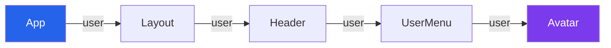
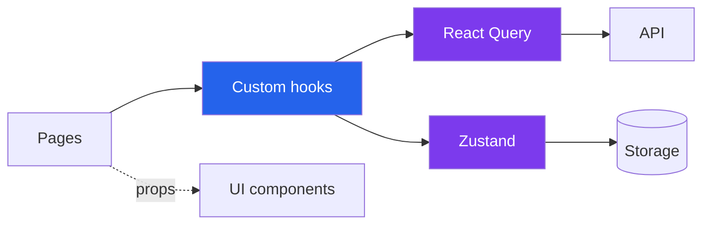

# React - Journée 2

<!--
Notes pour le présentateur :
- Durée : 3 min
- Accueillir, vérifier que tout le monde entend / voit l'écran partagé
- Rappeler le format distanciel : caméras encouragées, micro coupé sauf prise de parole, questions dans le chat à tout moment
- Annoncer la journée : 8h30-11h45 (pause 20 min) + 13h30-17h00 (pause 20 min) + QCM en fin de journée
- Pas de TP à rendre cette fois, mais QCM individuel évalué
-->

---

# Plan de la journée

<div class="grid grid-cols-2 gap-x-8 gap-y-2 mt-6 text-lg">

**Matin**
- Retour sur le J1
- Stores avec Zustand
- Revue collective des TPs

**Après-midi**
- React Query
- Clean architecture
- QCM et clôture

</div>

<!--
Notes pour le présentateur :
- Durée : 3 min
- Présenter chaque grand bloc en 1 phrase
- Insister sur "on revient sur les stores parce que c'était difficile en J1"
- Annoncer les 2 pauses (10h15, 14h45) + QCM en fin de journée
- Demander dans le chat : "tout le monde a un éditeur de code ouvert ?"
-->

---

# Retour sur le J1 - mini-quiz

Petit échauffement avant de plonger.

<v-clicks>

- C'est quoi un **composant** React, en une phrase ?
- Quelle est la différence entre `useState` et `useEffect` ?
- À quoi sert un **store** dans une application React ?
- Pourquoi parler de **clean architecture** sur le front ?

</v-clicks>

<Tip type="info">
Prenez la parole dans le chat.
</Tip>

<!--
Notes pour le présentateur :
- Durée : 7 min
- Laisser 1-2 min de réflexion entre chaque question
- Récolter quelques réponses dans le chat à voix haute
- Profiter pour repérer les confusions à corriger plus tard
- Transition : "On va justement reprendre tout ça, en commençant par un récap éclair du J1"

Réponses attendues :

1. **Composant React** : une fonction (ou classe) qui retourne du JSX et représente un morceau d'UI réutilisable et composable. Reçoit des props en entrée, peut gérer son propre état. Les composants se combinent pour former l'arbre de l'application.

2. **`useState` vs `useEffect`** :
   - `useState` = mémoriser une valeur entre les re-renders (état local du composant) ; déclenche un re-render quand on appelle son setter.
   - `useEffect` = exécuter du code "à côté" du rendu (synchroniser avec quelque chose d'externe : DOM, fetch, abonnement, timer). Se déclenche après le render, en fonction du tableau de dépendances.
   - Bref : `useState` stocke, `useEffect` réagit.

3. **À quoi sert un store** : centraliser des données partagées par plusieurs composants pour éviter le prop drilling, garder les actions de modification au même endroit, et permettre à des composants éloignés de l'arbre de lire/écrire la même donnée. Typiquement : utilisateur connecté, thème, panier, préférences.

4. **Pourquoi clean archi sur le front** : un projet React grossit vite (composants, stores, fetchs, hooks). Sans découpage clair, on se retrouve avec des composants géants qui mélangent UI, logique métier et accès données → code illisible, intestable, impossible à faire évoluer à plusieurs. La clean archi front = découpage par feature + séparation présentation/logique pour garder le code maintenable dans la durée.
-->

---
layout: section-cover
section: 1
---

# Retour sur le J1

Récap des fondamentaux

<!--
Notes pour le présentateur :
- Durée totale section : ~10 min
- 6 slides très courtes, on enchaîne vite
- Objectif : remettre tout le monde au même niveau pour attaquer les stores
-->

---

# React, en deux mots

<KeyConcept title="React" icon="⚛️">
Une <strong>librairie JavaScript</strong> pour construire des interfaces utilisateur, créée par Facebook en 2013, organisée autour de <strong>composants composables</strong>.
</KeyConcept>

- 230k+ stars sur GitHub, 20M+ téléchargements npm/semaine
- Utilisée par Meta, Netflix, Airbnb, Shopify, Vercel...
- Ce qu'on retient : **composants**, **état**, **réactivité**

<!--
Notes pour le présentateur :
- Durée : 2 min
- Ne pas refaire le J1 en détail, juste contextualiser
- Insister : React = lib, pas framework (≠ Angular)
-->

---

# React vs Angular vs Vue

| Critère | React | Angular | Vue |
|---------|:-----:|:-------:|:---:|
| Année | 2013 | 2010 | 2014 |
| Type | Lib | Framework | Framework |
| Apprentissage | 🟠 Moyen | 🔴 Difficile | 🟢 Simple |
| Performances | 🟢 | 🟠 | 🟢 |
| Scalabilité | 🟢 | 🟢 | 🟠 |
| Communauté | 🟢 Énorme | 🟢 Solide | 🟢 Active |

<Credit source="État du JS 2024 + GitHub stats" />

<!--
Notes pour le présentateur :
- Durée : 2 min
- C'est un rappel, pas un débat
- Si question sur Svelte / Solid / Qwik : "intéressant mais hors scope, on reste sur React"
-->

---

# Composants & JSX

```tsx
// A component is a function that returns JSX
function Greeting({ name }: { name: string }) {
  return <h1>Hello, {name} 👋</h1>;
}

// Used like an HTML tag
<Greeting name="Alice" />
```

<v-clicks>

- Un composant = une fonction qui retourne du JSX
- Les **props** sont les arguments du composant
- Chaque composant gère son **état local** s'il en a besoin

</v-clicks>

<!--
Notes pour le présentateur :
- Durée : 2 min
- Demander dans le chat : "qui se sent à l'aise avec ça ?"
- Si beaucoup de doutes, ralentir un peu
-->

---

# Hooks de base

```tsx
import { useState, useEffect } from "react";

function Counter() {
  const [count, setCount] = useState(0);

  useEffect(() => {
    document.title = `Count: ${count}`;
  }, [count]);

  return <button onClick={() => setCount(count + 1)}>{count}</button>;
}
```

- `useState` → mémoriser une valeur entre les re-renders
- `useEffect` → réagir à un changement (DOM, fetch, abonnement…)

<!--
Notes pour le présentateur :
- Durée : 2 min
- Insister sur le tableau de dépendances `[count]`
- "Si vous oubliez le tableau de deps, l'effect tourne à chaque render → bug classique"
-->

---

# Et les stores

> Les stores permettent de **regrouper des données partagées** au même endroit, accessibles par les composants qui en ont besoin, sans les passer en props de niveau en niveau.

<v-clicks>

- ✅ Données accessibles partout
- ✅ Actions de modification regroupées
- ✅ Les composants se concentrent sur l'**affichage**

</v-clicks>

<!--
Notes pour le présentateur :
- Durée : 1 min
- Citer textuellement le retour qu'on a eu : "stores difficiles à comprendre"
- Annoncer qu'on va prendre le temps avec un exemple concret
-->

---

# Le TP CineTrack - rappel barème

| Critère | Points |
|---|:---:|
| Consultation / ajout / édition / suppression | 20 |
| Fondamentaux React | 20 |
| Utilisation d'un store | 15 |
| Architecture et séparation des responsabilités | 15 |
| Propreté du code | 15 |
| Style de l'app | 5 |
| Bonus | 10 |

<Tip type="info">
On va revoir <strong>3 rendus</strong> ensemble ce matin, dans une logique d'apprentissage collectif.
</Tip>

<!--
Notes pour le présentateur :
- Durée : 1 min
- Préciser : revue anonymisée et bienveillante
- Transition : "Avant la revue, on attaque les stores"
-->

---
layout: section-cover
section: 2
---

# Stores avec Zustand

Du state local au state global

<!--
Notes pour le présentateur :
- Durée totale section : ~1h30
- Sous-blocs : fondamentaux (10') + quand store global (10') + Zustand (15') + live coding (25') + sélecteurs (10') + anti-patterns (10') + Q&R (5')
- Annoncer le live coding qui arrive vers 9h30
-->

---

# State local avec `useState`

```tsx
function Counter() {
  const [count, setCount] = useState(0);
  return <button onClick={() => setCount(count + 1)}>{count}</button>;
}
```

<v-clicks>

- État **isolé** dans le composant qui l'utilise
- Disparaît quand le composant est démonté
- ✅ Parfait pour : input contrôlé, toggle, hover, étape locale d'un wizard…

</v-clicks>

<!--
Notes pour le présentateur :
- Durée : 3 min
- Bien insister : si une seule slide voit la donnée → state local, point.
État localisé d'un composant (ou plusieurs) - parcours pas tout l'arbre
- "Avant de penser store, demandez-vous toujours : est-ce que le state local suffit ?"
-->

---

# Lifted state - remonter l'état au parent

```tsx
function Parent() {
  const [filter, setFilter] = useState("");
  return (
    <>
      <SearchInput value={filter} onChange={setFilter} />
      <FilmsList filter={filter} />
    </>
  );
}
```

- Quand **deux composants frères** doivent partager une donnée
- On la remonte au **plus petit ancêtre commun**
- Toujours pas besoin de store

<!--
Notes pour le présentateur :
- Durée : 3 min
- Faire un schéma rapide à main levée si besoin (Parent qui passe à 2 enfants)
- "C'est la première solution à essayer avant un store"
-->

---

# Le piège : prop drilling



Une donnée qui traverse **4-5 niveaux** juste pour atteindre la feuille → tous les composants intermédiaires reçoivent une prop dont ils n'ont pas besoin.

<!--
Notes pour le présentateur :
- Durée : 4 min
- Demander : "qui a vécu ça sur son TP CineTrack ?"
- Souvent oui pour le user courant ou le thème → bonne transition
- C'est lourd, fragile, casse au moindre refactor : c'est ce qu'un store résout
-->

---

# Quand a-t-on vraiment besoin d'un store ?

<KeyConcept title="3 critères" icon="🧭">
Un store global se justifie quand la donnée coche <strong>au moins 2 des 3</strong> critères ci-dessous.
</KeyConcept>

<v-clicks>

- 🌍 **Scope large** : utilisée à plusieurs endroits non-voisins de l'arbre
- ⏳ **Durée de vie longue** : doit survivre à la navigation entre pages
- 🔁 **Lecture/écriture multiples** : modifiée par plusieurs composants distincts

</v-clicks>

<!--
Notes pour le présentateur :
- Durée : 4 min
- Donner des exemples : utilisateur connecté ✅, modal ouverte ❌ (local), thème ✅, formulaire en cours ❌ (lifted)
- Insister : un store n'est PAS une base de données globale
-->

---

# State local vs State global

<Comparison left="State local (useState)" right="State global (store)" leftColor="green" rightColor="purple">
  <template #left>

  - Vit dans **un seul composant**
  - Disparaît au démontage
  - ✅ Inputs, toggles, hover
  - ✅ Étapes d'un wizard
  - ✅ État UI éphémère
  - 🟢 Choix par défaut

  </template>
  <template #right>

  - Accessible depuis **n'importe où**
  - Persiste à la navigation
  - ✅ Utilisateur connecté
  - ✅ Thème, langue, préférences
  - ✅ Panier, favoris
  - ⚠️ À justifier

  </template>
</Comparison>

<!--
Notes pour le présentateur :
- Durée : 3 min
- Arrêter sur chaque ligne, demander "vous mettriez ça où, vous ?"
- Le but : qu'ils interrogent leur réflexe "mettre dans le store"
-->

---

# Attention au store fourre-tout

```tsx
// 🚨 À ne pas reproduire
const useGlobalStore = create((set) => ({
  user: null,
  theme: "light",
  isModalOpen: false,
  formStep: 1,
  hoveredCard: null,
  searchInput: "",
  // ... 30 autres champs
}));
```

<Tip type="danger">
Quand tout est dans le store, <strong>plus rien n'est local</strong>. Les composants se réabonnent à des données qu'ils n'utilisent pas → re-renders inutiles, tests difficiles, code couplé.
</Tip>

<!--
Notes pour le présentateur :
- Durée : 3 min
- Le piège classique. Les TPs en sont souvent victimes
- Question chat : "qui s'est retrouvé à mettre `isModalOpen` dans le store ?"
-->

---

# Zustand - pourquoi celui-là

<Comparison left="Context API" right="Zustand" leftColor="orange" rightColor="blue">
  <template #left>

  - Built-in React
  - Verbeux (Provider, Consumer)
  - **Re-render tout l'arbre** à chaque changement
  - OK pour un thème, KO pour un panier

  </template>
  <template #right>

  - Lib externe (~1KB)
  - API minimaliste (un seul `create`)
  - Re-render **ciblé** par sélecteur
  - Pas de Provider à brancher

  </template>
</Comparison>

<v-click>

<Tip type="info">
On mentionnera Redux Toolkit, Jotai, Valtio en fin de section. Aujourd'hui : <strong>Zustand</strong>, parce que c'est le meilleur compromis en 2026.
</Tip>

</v-click>

<!--
Notes pour le présentateur :
- Durée : 4 min
- Si question Redux : "très bien aussi, mais 3x plus de code pour la même chose à notre échelle"
- Mention rapide : Jotai = atomes, Valtio = proxy, RTK = Redux moderne
-->

---

# Zustand - premier store

```ts {all|1|3-6|8}
import { create } from "zustand";

const useCounterStore = create<{
  count: number;
  increment: () => void;
}>((set) => ({
  count: 0,
  increment: () => set((state) => ({ count: state.count + 1 })),
}));
```

<v-clicks>

- `create` retourne un **hook** comme `useState`
- L'objet contient **state + actions** côte à côte
- `set` met à jour partiellement le state (merge automatique)

</v-clicks>

<!--
Notes pour le présentateur :
- Durée : 4 min
- Insister : "le hook, c'est tout. Pas de Provider, pas de Context, pas de reducer."
- "C'est volontairement simple - c'est ce qui en fait sa force"
-->

---

# Utiliser le store dans un composant

```tsx
function CounterDisplay() {
  const count = useCounterStore((s) => s.count);
  return <span>{count}</span>;
}

function CounterButton() {
  const increment = useCounterStore((s) => s.increment);
  return <button onClick={increment}>+1</button>;
}
```

<v-clicks>

- Le **sélecteur** `(s) => s.count` ne renvoie que ce qui est utilisé
- Re-render uniquement quand **cette valeur précise** change
- Deux composants partagent le même store, sans Provider

</v-clicks>

<!--
Notes pour le présentateur :
- Durée : 4 min
- LE point clé : sélecteur ciblé = re-render minimal
- "Si vous prenez tout le store d'un coup, vous perdez ce bénéfice"
-->

---
layout: exercise
duration: 25 min
type: demo
---

# Live coding - `UserPrefs + ThemeSwitcher`

## Objectif

Construire un mini-projet qui partage **une même valeur** (préférences utilisateur) entre **3 composants** distincts via un store Zustand.

1. **Setup** : créer `useUserPrefsStore` (theme, language, fontSize)
2. **`<Header />`** : affiche la langue + bouton de switch
3. **`<Settings />`** : panneau de réglages qui modifie les 3 valeurs
4. **`<Content />`** : applique le theme et la fontSize sur l'affichage

<Tip type="success">
Vous devez observer qu'un changement dans <code>&lt;Settings /&gt;</code> se répercute instantanément sur les autres composants, <strong>sans aucune prop</strong>.
</Tip>

<!--
Notes pour le présentateur :
- Durée : 25 min
- À faire en LIVE dans l'IDE, pas sur slide
- Étape 1 : créer le store (5 min) - montrer create + types + actions
- Étape 2 : 3 composants minimaux (10 min) - chacun consomme le store avec son sélecteur
- Étape 3 : ajouter persist middleware en bonus (5 min)
- Garder 5 min pour les questions
- Si quelqu'un n'a pas un projet React qui tourne, partager un repo de démarrage en lien
-->

---

# Sélecteurs - précision = performance

```tsx {all|1-2|4-5}
// ❌ Re-render à chaque changement du store, même non pertinent
const { count, increment } = useCounterStore();

// ✅ Re-render uniquement si `count` change
const count = useCounterStore((s) => s.count);
const increment = useCounterStore((s) => s.increment);
```

<Tip type="warning">
Prendre tout le store en une fois = re-render à chaque modification de n'importe quel champ.
</Tip>

<!--
Notes pour le présentateur :
- Durée : 4 min
- Démontrer dans React DevTools (Profiler) si le live tourne encore
- "Un sélecteur par valeur, c'est la règle"
-->

---

# Sélecteurs multiples - `useShallow`

```tsx
import { useShallow } from "zustand/react/shallow";

// When you really need multiple values at once
const { count, step } = useCounterStore(
  useShallow((s) => ({ count: s.count, step: s.step }))
);
```

- Comparaison **superficielle** des valeurs retournées
- Évite le re-render quand les références changent mais pas les valeurs
- À utiliser avec parcimonie - préférer plusieurs sélecteurs simples

<!--
Notes pour le présentateur :
- Durée : 3 min
- Mentionner que ça remplace le `shallow` pré-v5
- Insister : 90% du temps, plusieurs sélecteurs simples > 1 sélecteur d'objet
-->

---

# Persist - sauvegarder le store

```ts {all|1|5-8}
import { persist } from "zustand/middleware";

const useUserPrefsStore = create(
  persist(
    (set) => ({
      theme: "light",
      setTheme: (theme) => set({ theme }),
    }),
    { name: "user-prefs" } // localStorage key
  )
);
```

<Tip type="info">
Idéal pour <strong>thème, langue, préférences UI, panier</strong>. Pas pour des données sensibles.
</Tip>

<!--
Notes pour le présentateur :
- Durée : 3 min
- "C'est gratuit, ça prend 3 lignes, et ça résout 80% des cas"
- Mention rapide : version `sessionStorage` aussi possible via `storage: createJSONStorage(() => sessionStorage)`
-->

---

# 5 anti-patterns à retenir

<v-clicks>

- 🚨 **Store fourre-tout** : tout y mettre par réflexe
- 🚨 **Logique métier dans le composant** : `if (cart.items.length > 5 && user.tier === 'free') {...}` → ça doit vivre dans une action du store
- 🚨 **Sélecteur trop large** : `useStore()` ou `useStore(s => s)` → re-renders inutiles
- 🚨 **Mutations directes** : `state.items.push(x)` sans `set` → React ne voit pas le changement
- 🚨 **Multi-stores qui s'appellent** : 3 stores qui se lisent l'un l'autre → revoir le découpage

</v-clicks>

<!--
Notes pour le présentateur :
- Durée : 5 min
- Lire chaque point, demander "qui s'est reconnu ?"
- Le 4e mérite une attention particulière (très fréquent en TS)
-->

---
layout: recap
section: Section 2 - Stores avec Zustand
---

# Ce qu'il faut retenir

- **Local d'abord**, lifted ensuite, store en dernier recours
- Un store = **state + actions** au même endroit
- **Sélecteur ciblé** = re-render minimal, c'est la règle
- `persist` pour les préférences, pas pour les secrets
- Le store ne remplace pas un fetch - c'est ce qu'on voit après la pause

<Tip type="info">
Pour aller plus loin : <strong>zustand.docs.pmnd.rs</strong> - la doc est courte et très bien faite.
</Tip>

<!--
Notes pour le présentateur :
- Durée : 3 min
- Demander : "une question avant la pause ?"
- Si rien, on enchaîne sur la revue de TPs
-->

---
layout: section-cover
section: 3
---

# Revue collective des TPs

Lecture, critique constructive, amélioration

<!--
Notes pour le présentateur :
- Durée totale : ~1h10
- Cadre + grille (10 min) + 3 TPs × 15 min + synthèse (15 min)
- Préparer les 3 repos ouverts dans VSCode avant la séance
- Anonymiser scrupuleusement (renommer dossiers, retirer noms des README)
-->

---

# Cadre de la revue

<KeyConcept title="L'objectif" icon="🎓">
Apprendre à <strong>lire du code React</strong>, à identifier ce qui marche et ce qui peut évoluer. Pas de jugement sur le travail des personnes.
</KeyConcept>

<v-clicks>

- On commente le **code**
- Chaque TP a des **bonnes idées** à piquer et des **points d'amélioration**
- Vous êtes encouragés à intervenir

</v-clicks>

<!--
Notes pour le présentateur :
- Durée : 5 min
- Bien poser le cadre, surtout en distanciel
- Dire explicitement : "si vous reconnaissez votre code, ne le dites pas en public, on en parle en privé"
-->

---

# Grille de lecture

| Axe | Question à se poser |
|---|---|
| **Fonctionnalités** | CRUD complet ? cas limites gérés ? |
| **Composition React** | Composants bien découpés ? props lisibles ? |
| **Store** | Utilisation justifiée ? actions claires ? sélecteurs ciblés ? |
| **Architecture** | Découpage cohérent ? séparation logique/présentation ? |
| **Lisibilité** | Nommage ? taille des fichiers ? typage ? |

<Tip type="info">
On utilise cette même grille pour les 3 TPs.
</Tip>

<!--
Notes pour le présentateur :
- Durée : 5 min
- Projeter cette grille en split screen si possible pendant la revue
-->

---

# TP n°1

## Ce qu'on regarde

- `src/store/movieStore.ts` - **33 lignes**
- `src/app/page.tsx` - ~50 lignes, purement orchestrateur
- Composants : `MovieList`, `MovieForm`, `MovieCard`, `DeleteDialog`
- Types : `Movie` vs `MovieInput`
- UI : shadcn/ui

<!--
Notes pour le présentateur :
- Durée : 15 min
- Switch vers VSCode, projet ouvert sur le rendu (anonymisé)
- 5 min lecture rapide, 10 min commentaire à voix haute

Points "✅ bon" à faire ressortir :
- Store Zustand minimal : 5 actions seulement (addMovie, updateMovie, deleteMovie, getMovieById), zéro logique UI dedans
- Page 50 lignes - délègue à 3-4 enfants, aucune logique métier
- Tous les composants < 100 lignes (hors lib UI)
- Types stricts : `Movie` (entité) ≠ `MovieInput` (création) → bonne pratique pro
- crypto.randomUUID() pour les IDs (vs Date.now() ailleurs)
- shadcn/ui intégré → composants accessibles, réutilisables

Points "⚠️ à discuter" :
- Découpage par type (components/, store/, types/) → fonctionne ici car app petite, mais ça scale mal. Bonne accroche pour le "par feature" qu'on verra l'après-midi
- Données initiales en dur dans le store → "ce qu'on va remplacer par React Query après la pause"
- Pas de custom hook : pas obligatoire d'en avoir pour avoir une bonne archi (bon réflexe, ne pas sur-abstraire)

Question à lancer au chat : "qu'est-ce qui vous frappe en lisant ce store ?" → laisser émerger "il est court", "il fait juste ce qu'il faut"
-->

---

# TP n°2

## Ce qu'on regarde

- `src/app/hooks/use-cine-store.ts` - **98 lignes**, store Zustand bien typé
- `src/app/page.tsx` - 109 lignes
- Le store mélange `items` ET `isAdding`, `filterBy`, `filterValue`, `isFilterOpen`...
- `constants/labels.ts` - mapping enum → label
<!--
Notes pour le présentateur :
- Durée : 15 min
- Switch IDE sur le rendu (anonymisé)
- Cadrage : "très bon point de départ, on cherche les zones grises"

Points "✅ bon" :
- Zustand bien typé avec interface CineStore complète
- Découpage modulaire visible : components/, hooks/, models/, types/, constants/, data/
- constants/labels.ts → bonne séparation enum/affichage (i18n-ready)
- Types unions : FilterType, FilterValue, Status → typage solide
- Distinction items / visibleItems (computed state pour les filtres)
- Page 109 lignes : dans la cible

Points "⚠️ à débattre" (cœur de la slide) :
- 🟠 Le store mélange data ET UI state : isAdding, isFilterOpen, filterBy, filterValue cohabitent avec items
- C'est PILE l'anti-pattern n°1 vu ce matin (store fourre-tout)
- Question à lancer : "est-ce que `isAdding` (modal ouverte ou pas) doit être dans le store global ?"
- Réponse attendue : non, c'est du state UI éphémère → doit vivre dans le composant
- Sondage chat : "qui a fait pareil dans son TP ?" → main levée probable

Points "🔍 autre" :
- Nommage trompeur : le fichier s'appelle use-cine-store.ts mais c'est un store, pas un hook (ambiguïté à clarifier)
- Sélecteurs inline dans la page : useCineStore((s) => s.items) répété → opportunité d'extraire un useCineItems()

Conclusion à formuler : "ce TP est très bien parti, il manque juste le tri local/global qu'on vient de voir"
-->

---

# TP n°3

## Ce qu'on regarde

- `src/app/page.tsx` - **458 lignes** 
- 15+ `useState` empilés en haut de la page
- `lib/posters-store.ts` → wrapper localStorage, **pas un Zustand**
- Bonus produit notables : export/import JSON, roulette random, Framer Motion

<!--
Notes pour le présentateur :
- Durée : 15 min
- Le plus délicat - INSISTER sur l'aspect formateur, jamais sur la personne
- Cadre : "ce code marche, l'élève a beaucoup donné - terrain idéal pour pratiquer le refactor"

Points "✅ bon" à valoriser EN PREMIER :
- Effort produit réel : export/import JSON, roulette "pick random movie", animations Framer Motion
- TypeScript propre : MoviePoster, WatchStatus bien définis
- Naming clair : filteredPosters, sortedPosters, loadPosters
- Composants `Button`/`Modal` extraits dans ui/ → début de séparation
- Découpage components/posters/ vs components/ui/ → intention de domaine

Points "❌ pas bon" (cœur de la revue) :
- 🚨 page.tsx = 458 lignes : tout dedans (filtres, tri, modal, CRUD, toast, layout)
- 🚨 PAS de Zustand (alors qu'attendu) - le "store" du dossier lib/ est un wrapper localStorage, ce n'est PAS un state manager
- 🚨 15+ useState empilés (lignes 35-50) = signal qu'un store devient nécessaire
- 🚨 Prop drilling : onEdit, onDelete, onStatusChange créés dans la page, passés à 3-4 niveaux
- 🚨 Logique métier dans le composant : filteredPosters et sortedPosters (40 lignes de useMemo) → devrait vivre dans des sélecteurs

Live refactor mental à proposer (5 min) :
1. Sortir les 15 useState dans un Zustand usePostersStore
2. Extraire filteredPosters / sortedPosters en sélecteurs computed
3. Créer usePosterFilters() custom hook pour la logique
4. Réduire page.tsx de 458 → ~80 lignes

Sondage chat : "qui a une page.tsx qui ressemble à ça ?" → mains levées probables → "OK, voici comment on en sort"
-->

---

# Synthèse - ce qu'on a appris

<v-clicks>

- 🟢 **Ce qui marche** : store ≤ 5 actions, page ≤ 100 lignes, types entité ≠ input
- 🟠 **Zones grises** : UI state (`isOpen`, `filterBy`) dans le store global
- 🔴 **À éviter** : page de 400+ lignes, 15 `useState` empilés, prop drilling sur 4 niveaux

</v-clicks>

<Recap title="Top 3 actions à appliquer dès aujourd'hui">

1. **Couper** chaque composant > 150 lignes en sous-composants
2. **Sortir** UI state du store (modal, filtres ouverts, hover…) → ça reste local
3. **Cibler** chaque sélecteur Zustand sur une valeur précise

</Recap>

<!--
Notes pour le présentateur :
- Durée : 10 min
- Synthèse à voix haute + chat
- Récapituler les 3 TPs : "TP1 = la cible, TP2 = bon départ avec une zone grise, TP3 = terrain de refactor"
- Stat globale : sur les 13 rendus, 5 ont utilisé Zustand, 1 Context+Reducer, 7 sont restés sur du useState local → "vous voyez, vous n'êtes pas seuls"
- Aucun rendu n'a utilisé React Query → "ça tombe bien, on l'attaque juste après la pause"
- Annoncer la pause juste après
-->

---
layout: pause
duration: 20 min
---

<!--
Notes pour le présentateur :
- 20 min de pause
- En distanciel : annoncer une heure de retour précise dans le chat
- Vérifier le compteur quand on revient (ex: "on reprend à 10h35 pile")
-->

---
layout: section-cover
section: 4
---

# React Query

Data fetching qui ne fait plus mal

<!--
Notes pour le présentateur :
- Durée totale : ~1h15
- Sous-blocs : problème (10') + concepts (15') + live coding (20') + mutations (15') + récap (5')
- Ouvrir CineTrack dans l'IDE avant
-->

---

# Le problème : fetch à la main

```tsx {all|3-5|7-15|17-19}
function FilmsList() {
  const [films, setFilms] = useState([]);
  const [loading, setLoading] = useState(true);
  const [error, setError] = useState(null);

  useEffect(() => {
    let cancelled = false;
    fetch("/api/films")
      .then((r) => r.json())
      .then((data) => { if (!cancelled) setFilms(data); })
      .catch((err) => { if (!cancelled) setError(err); })
      .finally(() => { if (!cancelled) setLoading(false); });
    return () => { cancelled = true; };
  }, []);

  if (loading) return <Spinner />;
  if (error) return <ErrorView />;
  return <List items={films} />;
}
```

<!--
Notes pour le présentateur :
- Durée : 4 min
- Lire le code à voix haute, surligner la complexité
- "Et encore, ce code n'a ni cache, ni dédup, ni refetch sur focus..."
-->

---

# Tout ce qu'on n'a pas géré

<v-clicks>

- 🔁 **Cache** : on refetch à chaque montage
- 🔀 **Dédup** : 3 composants demandent `/api/films` → 3 appels réseau
- 🏎️ **Race conditions** : si on filtre rapidement, l'ancienne réponse écrase la nouvelle
- 🪟 **Refetch on focus** : revenir sur l'onglet → données fraîches ?
- ⏰ **Stale data** : combien de temps une donnée reste-t-elle valable ?
- 🔄 **Retry** : que faire en cas d'erreur réseau ?

</v-clicks>

<Tip type="danger">
Tout ça à la main = des centaines de lignes similaires dans chaque composant.
</Tip>

<!--
Notes pour le présentateur :
- Durée : 5 min
- Bien laisser le suspense monter
- "Imaginez maintenir ce code sur 30 endpoints..."
-->

---

# La promesse

<KeyConcept title="React Query (TanStack Query)" icon="⚡">
Une lib qui <strong>gère le serveur state</strong> à votre place : cache, dédup, refetch, retry, invalidation. Vous décrivez <strong>ce que vous voulez</strong>, elle gère le <strong>comment</strong>.
</KeyConcept>

<v-clicks>

- Côté client : un `QueryClient` qui orchestre tout
- Dans les composants : `useQuery` (lecture) et `useMutation` (écriture)
- Le serveur state est **différent** du client state - Zustand ne le remplace pas

</v-clicks>

<Credit author="TanStack" source="tanstack.com/query" />

<!--
Notes pour le présentateur :
- Durée : 3 min
- Insister sur "serveur state ≠ client state" - clé pour éviter la confusion avec Zustand
-->

---

# Setup : `QueryClientProvider`

```tsx {all|3-5|7-12}
// app/layout.tsx
"use client";
import { QueryClient, QueryClientProvider } from "@tanstack/react-query";
import { useState } from "react";

export default function Providers({ children }: { children: React.ReactNode }) {
  const [client] = useState(() => new QueryClient());
  return (
    <QueryClientProvider client={client}>
      {children}
    </QueryClientProvider>
  );
}
```

- Un seul `QueryClient` pour toute l'app
- À brancher haut dans l'arbre, sous le layout racine

<!--
Notes pour le présentateur :
- Durée : 3 min
- Préciser : `useState` pour ne pas recréer le client à chaque render
- Pour Next App Router : penser au "use client"
-->

---

# `useQuery` - lecture de données

```tsx {all|3-6|8-10}
function FilmsList() {
  const { data, isPending, error } = useQuery({
    queryKey: ["films"],
    queryFn: () => fetch("/api/films").then((r) => r.json()),
  });

  if (isPending) return <Spinner />;
  if (error) return <ErrorView />;
  return <List items={data} />;
}
```

<v-clicks>

- `queryKey` : identifiant unique du cache (tableau)
- `queryFn` : la fonction qui fait l'appel
- `data`, `isPending`, `error` : tout ce qu'il faut pour l'affichage

</v-clicks>

<!--
Notes pour le présentateur :
- Durée : 4 min
- Comparer à voix haute avec le code "fetch à la main" précédent
- "On est passé de 18 lignes à 4"
-->

---

# `queryKey` - la clé du cache

```ts
useQuery({ queryKey: ["films"] });               // all films
useQuery({ queryKey: ["films", filmId] });       // one film
useQuery({ queryKey: ["films", { genre, year }] });  // filtered
```

<Tip type="info">
Deux composants avec le même <code>queryKey</code> partagent le <strong>même cache</strong> et déclenchent <strong>une seule requête</strong>.
</Tip>

<v-click>

<Tip type="warning">
Un changement dans le tableau = nouvelle entrée de cache, nouvelle requête. C'est ce qu'on veut quand un filtre change.
</Tip>

</v-click>

<!--
Notes pour le présentateur :
- Durée : 4 min
- Important : la queryKey est une "URL" pour le cache
- Si vous changez de filtre, React Query refetch automatiquement
-->

---

# `staleTime` vs `gcTime`

| Concept | Question | Défaut |
|---|---|:---:|
| **`staleTime`** | Combien de temps la donnée est-elle considérée fraîche ? | `0` |
| **`gcTime`** | Combien de temps la garde-t-on en cache après plus aucun consommateur ? | `5 min` |

```ts
useQuery({
  queryKey: ["films"],
  queryFn: getFilms,
  staleTime: 30_000,   // 30s sans refetch automatique
  gcTime: 5 * 60_000,  // 5 min en mémoire après le dernier unmount
});
```

<!--
Notes pour le présentateur :
- Durée : 4 min
- Le piège du `staleTime: 0` par défaut : refetch très souvent
- Pour de la donnée stable (catalogue, config), augmenter franchement
-->

---

# États d'une query

```tsx
const { data, isPending, isFetching, isError, error, status } = useQuery(...);
```

<v-clicks>

- `isPending` : pas encore de donnée du tout (1er chargement)
- `isFetching` : appel en cours, **même si on a déjà** des données en cache
- `isError` / `error` : la dernière requête a échoué
- `status` : `'pending' | 'success' | 'error'`

</v-clicks>

<Tip type="info">
<code>isPending</code> = squelette / spinner plein écran. <code>isFetching</code> = petit indicateur discret pendant un refetch.
</Tip>

<!--
Notes pour le présentateur :
- Durée : 3 min
- Faire la distinction est essentiel pour une bonne UX
- "Si vous mettez un spinner sur isFetching, vos users vont halluciner"
-->

---
layout: exercise
duration: 20 min
type: demo
---

# Live coding - React Query sur CineTrack

## Objectif

Migrer **un fetch à la main** de CineTrack vers React Query, et observer les bénéfices.

1. **Setup** : ajouter `@tanstack/react-query` et le `QueryClientProvider`
2. **Migrer** `FilmsList` vers `useQuery`
3. **Ouvrir les DevTools** : observer cache, statuses, refetches
4. **Bonus** : ajouter une seconde page qui réutilise la même `queryKey`

<Tip type="success">
Comparez le diff lignes ajoutées / supprimées : vous devriez en supprimer plus que vous n'en ajoutez.
</Tip>

<!--
Notes pour le présentateur :
- Durée : 20 min
- Étape 1 : install + provider (5')
- Étape 2 : refactor du composant (10')
- Étape 3 : DevTools, montrer le cache vivant (5')
- Garder une fenêtre Network ouverte pour montrer la dédup
-->

---

# `useMutation` - modifier des données

```tsx {all|3-7|9-12}
function AddFilmButton() {
  const queryClient = useQueryClient();
  const mutation = useMutation({
    mutationFn: (newFilm: Film) =>
      fetch("/api/films", { method: "POST", body: JSON.stringify(newFilm) }),
    onSuccess: () => queryClient.invalidateQueries({ queryKey: ["films"] }),
  });

  return (
    <button onClick={() => mutation.mutate({ title: "Inception" })}>
      Add film
    </button>
  );
}
```

- `mutationFn` : la fonction qui modifie côté serveur
- `onSuccess` : ce qu'on fait après - typiquement, **invalider le cache**

<!--
Notes pour le présentateur :
- Durée : 5 min
- Lire ligne par ligne
- "L'invalidation déclenche un refetch automatique des queries concernées"
-->

---

# Invalidation - la clé du frais

```ts
// Invalidate exactly films
queryClient.invalidateQueries({ queryKey: ["films"] });

// Invalidate films AND films/:id
queryClient.invalidateQueries({ queryKey: ["films"], exact: false });

// Invalidate everything
queryClient.invalidateQueries();
```

<Tip type="info">
Après une mutation, posez-vous toujours la question : <strong>quelles queries deviennent obsolètes ?</strong> Invalidation ciblée &gt; invalidation globale.
</Tip>

<!--
Notes pour le présentateur :
- Durée : 4 min
- Le réflexe à acquérir : "qu'est-ce qui n'est plus à jour ?"
- "Invalider tout = jeter le cache, on perd tout l'intérêt"
-->

---

# Optimistic updates - pour info

```ts {all|3-8|9-13}
useMutation({
  mutationFn: addFilm,
  onMutate: async (newFilm) => {
    await queryClient.cancelQueries({ queryKey: ["films"] });
    const previous = queryClient.getQueryData(["films"]);
    queryClient.setQueryData(["films"], (old) => [...old, newFilm]);
    return { previous };
  },
  onError: (_err, _new, ctx) => {
    queryClient.setQueryData(["films"], ctx.previous);
  },
});
```

<Tip type="info">
Affiche le résultat <strong>avant</strong> que le serveur ne réponde. Excellent pour les UX réactives (likes, ajouts au panier). À utiliser quand le succès est très probable.
</Tip>

<!--
Notes pour le présentateur :
- Durée : 4 min
- Mention rapide, pas obligatoire à maîtriser aujourd'hui
- "Pour info, c'est ce que vous verrez sur les apps modernes (Linear, Notion...)"
-->

---

# DevTools React Query

<Tip type="success">
À installer : <code>@tanstack/react-query-devtools</code>. À intégrer en dev. Vue du cache en temps réel : queries actives, stale, fetching, mutations en cours.
</Tip>

```tsx
import { ReactQueryDevtools } from "@tanstack/react-query-devtools";

<QueryClientProvider client={client}>
  {children}
  <ReactQueryDevtools initialIsOpen={false} />
</QueryClientProvider>
```

<!--
Notes pour le présentateur :
- Durée : 3 min
- À montrer en live sur l'app CineTrack
- "C'est l'outil qui rend le système lisible, prenez l'habitude"
-->

---
layout: recap
section: Section 4 - React Query
---

# Ce qu'il faut retenir

- **Server state ≠ client state** - React Query gère le serveur, Zustand le client
- `useQuery` pour lire, `useMutation` pour écrire
- La `queryKey` est l'**URL du cache**
- `staleTime` contrôle la **fraîcheur**, `gcTime` la **mémoire**
- Après une mutation : **invalider** les queries concernées
- Les DevTools sont indispensables

<Credit author="TkDodo" source="tkdodo.eu/blog/practical-react-query" />

<!--
Notes pour le présentateur :
- Durée : 3 min
- Citer TkDodo : "ses articles sont la meilleure ressource gratuite sur le sujet"
- Annoncer la pause après-midi
-->

---
layout: pause
duration: 20 min
---

<!--
Notes pour le présentateur :
- 20 min de pause après-midi
- Annoncer l'heure de reprise précise
- Si questions individuelles : OK pendant la pause
-->

---
layout: section-cover
section: 5
---

# Clean architecture

Découpage par feature, séparation logique/présentation

<!--
Notes pour le présentateur :
- Durée totale : ~1h15
- Sous-blocs : le piège (10') + par feature (15') + séparation (20') + bonnes pratiques (15') + perspective stores/query (10') + récap (5')
- Insister : pragmatique, pas dogmatique
-->

---

# Le piège du "tout dans `app/`"

```text
src/
├── app/
│   ├── page.tsx              ← 350 lignes, fetch + state + UI
│   ├── films/page.tsx        ← 280 lignes, idem
│   └── layout.tsx
└── components/
    ├── Button.tsx
    ├── FilmCard.tsx
    ├── FilmForm.tsx
    ├── FilmList.tsx
    ├── FilmDetail.tsx
    ├── ... 25 autres fichiers en vrac
```

<Tip type="warning">
Au début ça va. À 50 composants, on ne sait plus où chercher.
</Tip>

<!--
Notes pour le présentateur :
- Durée : 4 min
- Demander : "qui a une arbo qui ressemble à ça ?"
- Beaucoup de mains se lèvent → bonne accroche
-->

---

# Pourquoi c'est problématique

<v-clicks>

- 🔍 **Recherche pénible** : "où est défini ce composant ?" → 3 dossiers possibles
- 🧩 **Couplage caché** : 5 composants partagent un store qu'on ne voit pas
- 🚚 **Déménagement difficile** : extraire la feature "films" demande de chasser dans tout le projet
- 👥 **Onboarding lent** : un nouveau dev met 2 jours à comprendre la structure

</v-clicks>

<!--
Notes pour le présentateur :
- Durée : 4 min
- Le 3e point parle aux pros : "imaginez devoir extraire 'films' dans une autre app..."
-->

---

# Par type vs par feature

<Comparison left="Par type" right="Par feature" leftColor="orange" rightColor="green">
  <template #left>

  ```text
  src/
  ├── components/
  ├── hooks/
  ├── stores/
  ├── services/
  └── types/
  ```

  - Réflexe débuinitialtant
  - 1 feature = fichiers dans 5 dossiers
  - Couplage caché

  </template>
  <template #right>

  ```text
  src/features/
  ├── films/
  │   ├── components/
  │   ├── hooks/
  │   ├── store.ts
  │   └── api.ts
  └── auth/
      └── ...
  ```

  - Cohésion par domaine
  - 1 feature = 1 dossier
  - Couplage explicite

  </template>
</Comparison>

<!--
Notes pour le présentateur :
- Durée : 5 min
- Insister : c'est UNE option, pas LA seule
- "Mais c'est celle qui scale le mieux pour des apps de taille moyenne"
-->

---

# Exemple concret - CineTrack refactorisé

```text
src/
├── app/                          # routes Next.js (fines)
│   ├── page.tsx
│   └── films/[id]/page.tsx
├── features/
│   ├── films/
│   │   ├── components/           # FilmCard, FilmList, FilmForm
│   │   ├── hooks/                # useFilms, useFilm
│   │   ├── api.ts                # endpoints
│   │   └── store.ts              # Zustand local à la feature
│   └── auth/
│       └── ...
└── shared/
    ├── ui/                       # Button, Modal, Input
    └── lib/                      # utils, fetcher
```

<!--
Notes pour le présentateur :
- Durée : 5 min
- C'est une cible, pas un dogme
- "L'idée : un dossier par grand sujet, plus un dossier 'shared' pour le réutilisable"
-->

---

# Règles de localisation simples

| La chose est utilisée par... | Elle vit dans... |
|---|---|
| **Une seule feature** | `features/<feature>/` |
| **Plusieurs features** | `shared/` |
| **Toute l'app, transverse** (auth, theme...) | `features/<transverse>/` ou `shared/` |
| **Une seule page** | À côté de la page (collocation) |

<Tip type="info">
On ne déplace dans <code>shared/</code> que <strong>quand on a la preuve</strong> qu'au moins 2 features l'utilisent.
</Tip>

<!--
Notes pour le présentateur :
- Durée : 4 min
- "Premature sharing is the root of all evil"
- Mieux dupliquer que mal abstraire - au moins au début
-->

---

# Composant fourre-tout - avant

```tsx {all|2-9|11-13|15-23}
function FilmsPage() {
  const [films, setFilms] = useState([]);
  const [filter, setFilter] = useState("");
  const [loading, setLoading] = useState(true);

  useEffect(() => {
    fetch("/api/films").then(r => r.json()).then(setFilms).finally(() => setLoading(false));
  }, []);

  const filtered = films.filter(f => f.title.includes(filter));
  if (loading) return <Spinner />;

  return (
    <div>
      <input value={filter} onChange={e => setFilter(e.target.value)} />
      <ul>
        {filtered.map(f => (
          <li key={f.id}>{f.title} ({f.year})</li>
        ))}
      </ul>
    </div>
  );
}
```

<!--
Notes pour le présentateur :
- Durée : 4 min
- Faire lire le code, pointer ce qui mélange 3 préoccupations différentes
-->

---

# Refactor - custom hook + composant

```tsx
// features/films/hooks/useFilms.ts
export function useFilms(filter: string) {
  const { data, isPending } = useQuery({
    queryKey: ["films"],
    queryFn: getFilms,
  });
  const filtered = data?.filter((f) => f.title.includes(filter)) ?? [];
  return { films: filtered, isPending };
}

// app/films/page.tsx
export default function FilmsPage() {
  const [filter, setFilter] = useState("");
  const { films, isPending } = useFilms(filter);
  if (isPending) return <Spinner />;
  return <FilmsView filter={filter} onFilter={setFilter} films={films} />;
}
```

<!--
Notes pour le présentateur :
- Durée : 5 min
- "La logique vit dans le hook, l'affichage dans le composant"
- Le composant Page devient un orchestrateur fin
- `<FilmsView />` est purement présentationnel, testable sans network
-->

---
layout: exercise
duration: 15 min
type: demo
---

# Live coding - séparation présentation/logique

## Objectif

Refactoriser **un composant fourre-tout** existant en :
- 1 **custom hook** qui contient la logique (state, fetch, transformations)
- 1 **composant présentationnel** qui ne fait qu'afficher des props

1. Identifier les 3 préoccupations dans le composant initial
2. Extraire la logique dans `useXxx()`
3. Couper le rendu en composant pur
4. Vérifier : le composant pur doit pouvoir s'utiliser dans Storybook **sans network**

<Tip type="success">
Test mental : si le composant ne peut pas s'afficher sans backend, c'est qu'il porte trop de logique.
</Tip>

<!--
Notes pour le présentateur :
- Durée : 15 min
- Faire le live sur un cas tiré d'un TP (anonymisé) ou de l'exemple précédent
- Penser à montrer le diff git
-->

---

# Bonnes pratiques - composants

<v-clicks>

- ✂️ **Taille** : > 150 lignes
- 🏷️ **Nommage** : verbe pour les hooks (`useFilms`), nom pour les composants (`FilmsList`)
- 🎯 **Props minimales** : pas plus de 5-7 props ; au-delà, regrouper en objet
- 🚫 **Pas de logique métier inline** : extraire dans le store ou le hook
- 🧼 **Pas de fetch dans un composant présentationnel** : il doit pouvoir vivre dans une storybook

</v-clicks>

<!--
Notes pour le présentateur :
- Durée : 5 min
- Lire chaque point, chaque règle pèse
- "Ces 5 règles éliminent 80% des problèmes qu'on a vus dans la revue"
-->

---

# Ce qu'un composant ne devrait pas faire

<Tip type="danger">
<strong>Faire un fetch direct</strong> sans passer par un hook ou React Query<br/>
🚨 <strong>Contenir des règles métier complexes</strong> (calculs de prix, validations métier)<br/>
🚨 <strong>Mélanger UI et navigation</strong> (un composant de carte qui sait <code>router.push</code>)<br/>
🚨 <strong>Modifier le store global</strong> dans son rendu (toujours via une action / un effet)<br/>
🚨 <strong>Avoir un nom flou</strong> : <code>&lt;Container /&gt;</code>, <code>&lt;Wrapper /&gt;</code>, <code>&lt;Helper /&gt;</code>
</Tip>

<!--
Notes pour le présentateur :
- Durée : 4 min
- Le 3e est subtil et fréquent : un composant qui sait naviguer perd sa pureté
- Préférer un callback `onSelect` qu'on connecte au router au niveau page
-->

---

# Où placer stores et React Query ?



<v-click>

- **React Query** : données serveur (films, profil user…)
- **Zustand** : état client pur (theme, modal, panier volatile)
- **Custom hooks** : couche de composition entre data et UI

</v-click>

<!--
Notes pour le présentateur :
- Durée : 5 min
- Le schéma à retenir
- "React Query = source de vérité serveur ; Zustand = source de vérité client"
-->

---
layout: recap
section: Section 5 - Clean architecture
---

# Ce qu'il faut retenir

- **Par feature**, pas par type - un dossier = un domaine
- Un composant **présentationnel** ne devrait pas savoir d'où vient sa donnée
- Un **custom hook** porte la logique, le composant porte le rendu
- 5 règles : taille, nommage, props, logique métier, fetch
- Stores et queries vivent dans les hooks, jamais directement dans les composants UI

<Credit source="Bulletproof React (github.com/alan2207/bulletproof-react)" />

<!--
Notes pour le présentateur :
- Durée : 3 min
- Citer Bulletproof React comme référence open source
- Préparer la transition vers le QCM
-->

---
layout: section-cover
section: 6
---

# QCM et clôture

12 questions, 15 minutes

<!--
Notes pour le présentateur :
- Durée totale : ~40 min
- Annonce + QCM (20') + correction collective (15') + clôture (5')
-->

---

# Récap global - J1 + J2

<v-clicks>

- **React** : composants, JSX, hooks (`useState`, `useEffect`)
- **Stores** : local → lifted → global (Zustand)
- **React Query** : server state, cache, mutations, invalidation
- **Clean architecture** : par feature, séparation logique / présentation
- **Bonnes pratiques** : composants courts, hooks dédiés, sélecteurs ciblés

</v-clicks>

<Recap title="3 réflexes à emporter">

1. **Avant un store** : est-ce que `useState` ou un lifted state ne suffirait pas ?
2. **Avant un fetch manuel** : pourquoi pas React Query ?
3. **Avant un gros composant** : où est-ce que je peux séparer logique et rendu ?

</Recap>

<!--
Notes pour le présentateur :
- Durée : 5 min
- Faire répéter à voix haute les 3 réflexes
- C'est la slide de prise de hauteur
-->

---

# Pour aller plus loin

**Documentation officielle**
- [react.dev/learn](https://react.dev/learn) - la nouvelle doc React
- [zustand.docs.pmnd.rs](https://zustand.docs.pmnd.rs)
- [tanstack.com/query](https://tanstack.com/query/latest/docs)

**Articles & blogs**
- TkDodo - *Practical React Query* (la bible non officielle)
- Kent C. Dodds - *Application State Management with React*
- Bulletproof React - repo GitHub de référence pour l'architecture

**Pour pratiquer**
- Continuer CineTrack : ajouter React Query, refactoriser par feature
- Cloner Bulletproof React et explorer sa structure

<Credit source="Sélection 2026" />

<!--
Notes pour le présentateur :
- Durée : 3 min
- Insister : la doc officielle React est devenue très bonne, à vraiment lire
- Encourager à continuer CineTrack pour mettre en pratique
-->

---
layout: end
---

# Merci !

Des questions ?

📧 yoann.bohssain@gmail.com

<!--
Notes pour le présentateur :
- Durée : 5 min
- Rester disponible pour les dernières questions
- Recueillir un feedback rapide ("emoji 1 mot dans le chat")
- Rappeler que les slides resteront accessibles
-->
