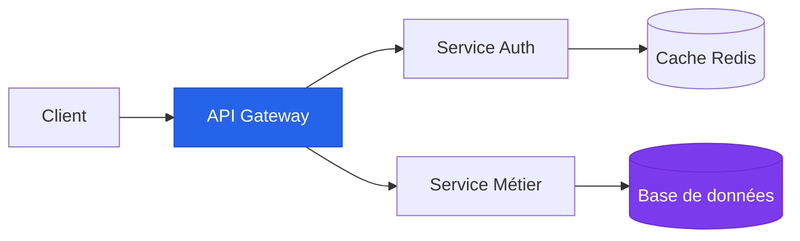

# Nom du cours

<!--
Notes pour le présentateur :
- Durée : 2 min
- Se présenter brièvement (parcours, expertise)
- Annoncer le programme de la séance
- Rappeler les modalités pratiques (pauses, questions, etc.)
-->

---

# Plan de la séance

<Toc columns="2" maxDepth="1" />

<!--
Notes pour le présentateur :
- Durée : 3 min
- Parcourir le plan rapidement
- Indiquer les moments de pause
- Préciser les exercices prévus
-->

---
layout: section-cover
section: 1
---

# Introduction au sujet

Contextualisation et enjeux

<!--
Notes pour le présentateur :
- Transition vers le premier bloc théorique
- Durée de cette section : ~40 min
-->

---

# Titre de la slide

Texte explicatif pour introduire le concept principal de cette slide.

- **Point clé 1** — explication courte et précise
- **Point clé 2** — avec un exemple concret
- **Point clé 3** — lien avec le monde professionnel

<v-click>

> "Une citation pertinente pour illustrer le propos."

</v-click>

<!--
Notes pour le présentateur :
- Durée : 3 min
- Le v-click révèle la citation au clic — l'utiliser pour ponctuer l'explication
- Exemple concret : [raconter une anecdote professionnelle]
- Transition : "Voyons maintenant comment cela se traduit concrètement..."
-->

---

# Concept clé avec composant

<KeyConcept title="Nom du concept" icon="🧠">
  Explication concise du concept fondamental. Ce composant est idéal pour mettre en valeur
  les définitions et notions essentielles que les étudiants doivent retenir.
</KeyConcept>

<v-click>

<Tip type="info">
  Astuce ou information complémentaire qui enrichit la compréhension du concept.
</Tip>

</v-click>

<v-click>

<Tip type="warning">
  Attention à ne pas confondre avec [autre concept] — piège fréquent en entreprise.
</Tip>

</v-click>

<!--
Notes pour le présentateur :
- Durée : 3 min
- Insister sur la distinction avec [concept similaire]
- Demander aux étudiants s'ils ont déjà rencontré ce concept en stage/alternance
-->

---

# Comparaison de deux approches

<Comparison left="Approche A" right="Approche B" leftColor="blue" rightColor="purple">
  <template #left>

  - Avantage 1
  - Avantage 2
  - Plus simple à mettre en place
  - ⚠️ Moins scalable

  </template>
  <template #right>

  - Plus complexe
  - Meilleure scalabilité
  - Standard industrie
  - ✅ Recommandé en production

  </template>
</Comparison>

<!--
Notes pour le présentateur :
- Durée : 4 min
- Faire réfléchir les étudiants : "Dans quel contexte choisiriez-vous l'une ou l'autre ?"
- Lien management : impact sur les coûts, les délais et la dette technique
-->

---

# Diagramme d'architecture



<Tip type="info">
  L'API Gateway centralise les requêtes et gère l'authentification, le rate limiting et le routage.
</Tip>

<!--
Notes pour le présentateur :
- Durée : 5 min
- Décrire chaque composant en partant du client
- Expliquer le rôle de l'API Gateway (pattern courant en microservices)
- Question : "Quels sont les risques si l'API Gateway tombe ?"
-->

---

# Exemple de code

```python {all|2-4|6-8|all}
# Architecture d'un endpoint REST
@app.route('/api/users', methods=['GET'])
def get_users():
    """Retrieve all active users."""

    users = User.query.filter_by(active=True).all()
    return jsonify([u.to_dict() for u in users])
    # Response: [{"id": 1, "name": "Alice"}, ...]
```

<v-clicks>

- Ligne 2-4 : Déclaration de la route et de la méthode HTTP
- Ligne 6-8 : Requête ORM avec filtrage et sérialisation
- Le pattern `to_dict()` permet de contrôler les données exposées

</v-clicks>

<!--
Notes pour le présentateur :
- Durée : 5 min
- Les highlights progressifs permettent d'expliquer le code étape par étape
- Montrer une démo live si possible
- Parler des bonnes pratiques : validation, pagination, gestion d'erreurs
-->

---
layout: two-cols-header
---

# Deux colonnes avec en-tête

Description du contenu présenté en deux colonnes ci-dessous.

::left::

### Théorie

- Principe fondamental 1
- Principe fondamental 2
- Principe fondamental 3

::right::

### Pratique

```javascript
// Implementation
const result = principles
  .map(apply)
  .filter(validate);
```

<!--
Notes pour le présentateur :
- Durée : 3 min
- Le layout deux colonnes est idéal pour théorie vs. pratique
- Faire le lien entre les principes à gauche et le code à droite
-->

---

# Déroulé de la séance

<Timeline :steps="[
  { time: '09:00', title: 'Accueil et rappels', desc: 'Retour sur la séance précédente', active: true },
  { time: '09:15', title: 'Bloc théorique 1', desc: 'Concepts fondamentaux et définitions', active: true },
  { time: '10:00', title: 'Exercice pratique', desc: 'Mise en application individuelle' },
  { time: '10:30', title: 'Pause', desc: '15 minutes' },
  { time: '10:45', title: 'Bloc théorique 2', desc: 'Approfondissement et cas avancés' },
  { time: '11:30', title: 'Atelier en groupe', desc: 'Étude de cas collaborative' },
  { time: '11:50', title: 'Synthèse et questions', desc: 'Récapitulatif et préparation séance suivante' },
]" />

<!--
Notes pour le présentateur :
- Durée : 2 min
- Présenter le déroulé en début de séance
- Les éléments "active" sont ceux déjà couverts (mettre à jour selon l'avancement)
-->

---
layout: exercise
duration: 20 min
type: solo
---

# Exercice — Titre de l'exercice

## Consignes

1. **Étape 1** — Description de la première étape
2. **Étape 2** — Description de la deuxième étape
3. **Étape 3** — Livrable attendu

<Tip type="success">
  Indice : pensez à utiliser [concept vu précédemment] pour résoudre le point 2.
</Tip>

<!--
Notes pour le présentateur :
- Durée : 20 min
- Circuler dans la salle pour aider les étudiants en difficulté
- Erreurs fréquentes : [lister les pièges courants]
- Correction prévue dans la slide suivante
-->

---
layout: exercise
duration: 30 min
type: group
---

# Atelier — Étude de cas

## Contexte

Vous êtes consultant·e pour une entreprise qui souhaite moderniser son SI.

## Mission

En groupes de 3-4, proposez une architecture technique en justifiant vos choix.

| Critère | Pondération |
|---------|-------------|
| Pertinence technique | 40% |
| Justification business | 30% |
| Présentation | 30% |

<!--
Notes pour le présentateur :
- Durée : 30 min (20 min travail + 10 min restitution)
- Former les groupes de manière hétérogène
- Chaque groupe présente en 3 min max
- Évaluer la capacité à articuler technique et business
-->

---
layout: pause
duration: 15 min
---

<!--
Notes pour le présentateur :
- Vérifier que tout le monde est de retour avant de reprendre
- Possibilité de répondre aux questions individuelles pendant la pause
-->

---
layout: section-cover
section: 2
---

# Section suivante

Approfondissement et cas avancés

<!--
Notes pour le présentateur :
- Transition vers la deuxième partie
- Durée de cette section : ~45 min
-->

---

# Tableau de synthèse

| Critère | Option A | Option B | Option C |
|---------|----------|----------|----------|
| Performance | ⭐⭐⭐ | ⭐⭐ | ⭐⭐⭐⭐ |
| Coût | €€ | € | €€€ |
| Complexité | Moyenne | Faible | Élevée |
| Maintenabilité | Bonne | Excellente | Moyenne |

<Credit source="Analyse comparative — Gartner 2025" />

<!--
Notes pour le présentateur :
- Durée : 4 min
- Faire voter les étudiants sur leur option préférée avant de discuter
- Il n'y a pas de "bonne" réponse — ça dépend du contexte
- Lien management : arbitrage coût/qualité/délai
-->

---
layout: recap
section: Section 1 — Introduction au sujet
---

# Ce qu'il faut retenir

- **Concept 1** — définition en une phrase
- **Concept 2** — pourquoi c'est important en entreprise
- **Concept 3** — lien avec la séance suivante

<Tip type="info">
  Pour aller plus loin : [ressource recommandée]
</Tip>

<!--
Notes pour le présentateur :
- Durée : 3 min
- Vérifier la compréhension avec 2-3 questions rapides
- Annoncer ce qui sera couvert dans la prochaine séance
-->

---
layout: end
---

# Merci !

Des questions ?

<!--
Notes pour le présentateur :
- Durée : 10-15 min pour les questions
- Si pas de questions, proposer un récap interactif
- Rappeler les ressources disponibles et le travail à préparer
-->
