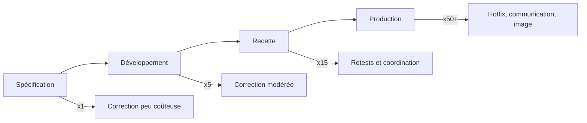
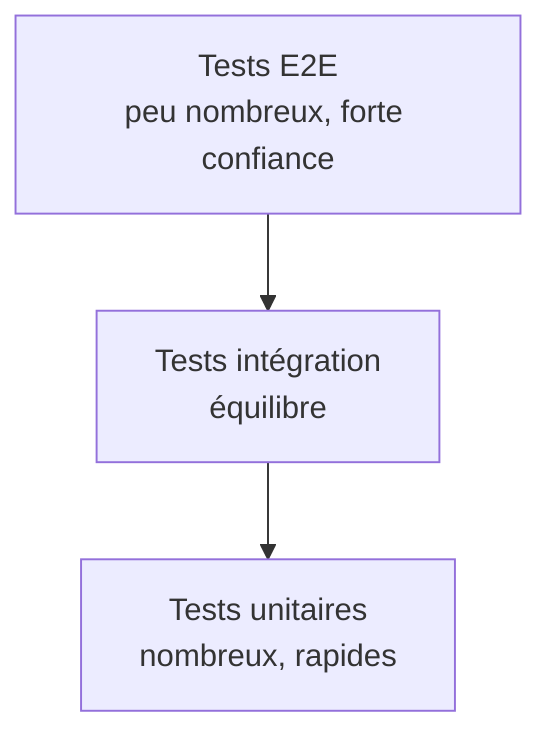
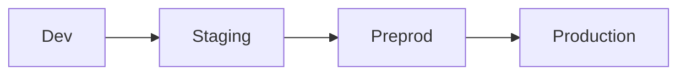
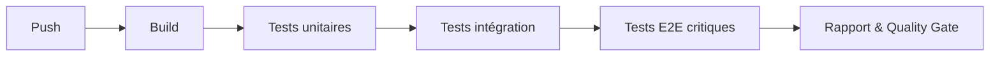
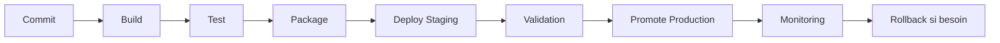
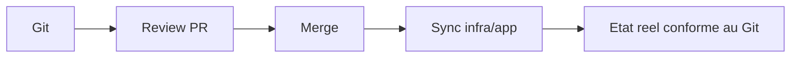
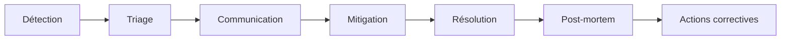
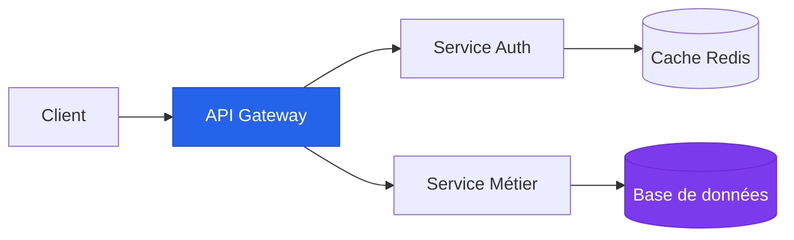

# Recette et Mise en Production

<!--
Se présenter rapidement : expérience QA, CI/CD, incidents de prod vécus.

L'objectif central de ces 2 jours : comment livrer vite, sans casser la production.

Format du cours : on alterne entre théorie, exercices en groupe, TPs et retours d'expérience — c'est participatif, hésitez pas à intervenir.
-->

---

# Plan du cours
## torework

<Toc columns="2" maxDepth="1" />

<!--
Voici le plan des 2 jours. Jour 1 on se concentre sur la recette, jour 2 sur la mise en prod — le fil rouge c'est qualité → livraison → exploitation.

On va alterner blocs courts et pratique, avec des pauses régulières. Notez vos questions au fil de l'eau, on prendra le temps d'y répondre.
-->

---

# Objectifs pédagogiques

<v-clicks>

- Concevoir une stratégie de test adaptée à un projet
- Rédiger un plan de recette exploitable par l'équipe
- Automatiser des tests unitaires, intégration et E2E
- Analyser et renforcer un pipeline CI/CD
- Choisir une stratégie de déploiement selon le contexte
- Définir des indicateurs SLI/SLO/SLA et diagnostiquer un incident

</v-clicks>

<!--
Objectif du cours, globalement, être de concevoir stratégie test adaptée projet, incluant notamment plan de test

Réussir à automatiser maximum de tests : tests automatisés, CI/CD, etc..

Ensuite côté déploiement, voir différentes stratégies de déploiement, finalement faire vivre et maintenir une app en production.

Le but : découvrir la culture du test, et ensuite s'assurer de la meilleure qualité possible pour celles-ci et le projet en général
-->

---
layout: section-cover
section: Session 1
---

# Stratégie et culture de la qualité

Tout ce qu'il faut avant la mise en place

<!--
Avant de parler de comment mettre en place tests, d'abord voir ce que c'est, comment on teste, et comment on installe ça au coeur de la stratégie d'une entreprise
-->

---

# C'est quoi la recette ?

- En 1 phrase : votre définition
- Un exemple de bug déjà vécu
- Un impact concret (temps, argent, image)

<!--
Pour commencer, j'aimerais savoir ce qu'est la recette pour certains d'entre vous ?

Exemples de bugs qui auraient pu être évités en améliorant recette, impact concret ?

Est-ce que vous pensez que la recette peut tout couvrir, et doit tout couvrir ?
-->

---

# Pourquoi la recette est critique

<v-clicks>

- Un bug détecté tard coûte beaucoup plus cher
- La confiance métier se gagne par la fiabilité
- La recette réduit l'incertitude avant production
- Une bonne recette accélère les releases

</v-clicks>

<!--
Exemple : bug détecté dans la CI/CD coûte moins cher qu'un souci de connexion en production, évite problèmes clients, etc..

Savoir que produit bien recetté = + tranquille lors des releases, et aussi possibilité de releaser + souvent

Globalement, combien de temps prend la recette chez vous ? 
-->

---

# Fails célèbres et leçons

| Cas | Cause dominante | Impact |
|---|---|---|
| Ariane 5 (1996) | Défaut de conversion numérique | Explosion au décollage |
| Knight Capital (2012) | Déploiement incohérent | ~460 M$ perdus en 45 min |
| CrowdStrike (2024) | MaJ défectueuse à grande échelle | Interruption mondiale de services |

<!--
Rapidement parler cas concrets de problèmes de recette et déploiement qui ont eu impact mondial.

Les plus vieux d'entre vous (pas encore né) - problème de calcul lancement ariane 5 a fait exploser la fusée au décollage -> savent pourquoi ?
- simplement car même logiciel que celui fusée précédente, sauf que fusée + puissante, et les données récoltées ont dépassé la mémoire prévue pour celles-ci -> 500M de perdu

Autre exemple vieux, logiciel de trading qui avait déployé version dans la nuit avec un pb dans algorithme. Sans rentrer détails, logiciel de trading, code avait été testé, validé par la QA, etc..
Message d'erreur s'était affiché le matin car une ancienne fonction avait été déterrée sur un ancien serveur, et des ordres automatiques ont été passés avec de mauvais paramètres. En moins de 45 min, quasi 500 M de dégâts ici aussi

Pour finir + récent, MaJ de Crowdstrike (antivirus) défectueuse, qui a interrompu nombreux services niveau mondial : aéroports, hôpitaux - semant panique et impactant nombreuses activités vie réelle.

Tous ces pbs ne sont pas forcémetn des erreurs "faciles" à détecter, mais défauts + larges échelle d'un système, nécessitent toujours de mieux se préparer sur les phases critiques de recette et MEP
-->

---

# Coût d'un bug selon la phase



<Tip type="warning">
  Plus la détection est tardive, plus le coût technique et business explose.
</Tip>

<!--
Les chiffres exacts varient selon les études, mais la tendance est toujours la même : plus c'est tard, plus c'est cher.

Et au-delà du coût direct, y'a les coûts invisibles : surcharge de l'équipe, dette technique accumulée, réputation abîmée auprès des clients.

Un bug en prod c'est pas juste un fix technique — c'est du hotfix en urgence, de la communication de crise, parfois de l'image de marque perdue.
-->

---

# Qualité logicielle

<KeyConcept title="Qualité logicielle">
  Capacité d'un logiciel à répondre aux besoins explicites et implicites, de façon fiable, maintenable et sécurisée.
</KeyConcept>

<v-clicks>

- Qualité fonctionnelle : "est-ce que ça fait ce qui est attendu ?"
- Qualité technique : "est-ce robuste, testable, maintenable ?"
- Qualité opérationnelle : "est-ce observable et déployable sereinement ?"

</v-clicks>

<!--
Distinction importante : qualité fonctionnelle c'est "est-ce que le produit fait ce qu'on attend", qualité technique c'est "est-ce que c'est robuste et maintenable", et qualité opérationnelle c'est "est-ce qu'on peut le déployer et le surveiller sereinement".

Exemple concret : une feature peut marcher parfaitement côté utilisateur, mais si on peut pas la monitorer en prod, on est aveugles quand ça plante.
-->

---

# ISO 25010 en bref

| Dimension | Question pratique |
|---|---|
| Functional suitability | Le besoin utilisateur est-il couvert ? |
| Reliability | Le système tient-il en charge et dans le temps ? |
| Performance efficiency | Latence et consommation sont-elles acceptables ? |
| Security | Les données sont-elles protégées ? |
| Maintainability | Peut-on changer vite sans tout casser ? |

<!--
Pas entrer détails, mais certaines normes permettent de qualifier, évaluer et améliorer qualité logicielle projet

ISO 25010 permet de couvrir plusieurs dimensions de qualité logicielle, avec axes suivants...

Globalement, à chaque nouvelle feature ou projet, important de se poser les questions suivantes pour déterminer qualité de ce qu'on produit.
-->

---

# Definition of Done (DoD)

<Comparison left="DoD faible" right="DoD solide" leftColor="orange" rightColor="green">
  <template #left>

  - "Le dev marche sur ma machine"
  - Pas de tests systématiques
  - Validation PO tardive
  - Risque fort en release

  </template>
  <template #right>

  - Critères d'acceptation vérifiés
  - Tests auto exécutés et OK
  - Revue de code effectuée
  - Monitoring/rollback préparés

  </template>
</Comparison>

<!--

Déjà parlé DoD contexte, s'applique + à l'Agile - permet globalement savoir quand une feature est ok.
Contrat à définir au sein de l'équipe, pour savoir quand est-ce que quelque chose est prêt à être déployé.

Parmi vous en entreprise, qui se rapproche du DoD faible, et qui du solide ?

Noter impacts sur management : prédictabilité, planning, etc..
-->

---

# La pyramide des tests



<!--
Un des points aujourd'hui les + importants en ce qui concerne qualité, au delà tests fonctionnels, sont tests automatisés.

Existe plusieurs types de tests, chacun ayant ses avantages et inconvénients. -> demander à des élèves comment ça se passe et matérialise chez eux

Bilan : couvrir le max en unitaire, quelqeus chemins en intégration et garder E2E sur chemins critiques
-->

---

# Types de tests

| Type | Vérifie | Vitesse | Coût de maintenance |
|---|---|---|---|
| Unitaire | Une fonction/composant isolé | Très rapide | Faible |
| Intégration | Interaction entre modules | Moyen | Moyen |
| E2E | Parcours utilisateur complet | Lent | Élevé |
| Exploratoire | Cas inattendus | Variable | Dépendant du contexte |

<!--

Présenter les types de test ligne par ligne.

Demander si personnes pas d'accord, personnes qui n'ont pas une certaine partie, avantages / inconvénients.

Globalement besoin de tous les tests, à leur juste degré pour chacuns.
-->

---
layout: exercise
duration: 15 min
type: group
---

# Exercice 1 - Classer des scénarios de test

## Consigne

1. Classez 10 scénarios de test en unitaire / intégration / E2E / exploratoire.
2. Identifiez les zones non couvertes dans la stratégie proposée.
3. Proposez 2 ajustements prioritaires.

<Tip type="success">
  Livrable : un tableau de classification + 3 minutes de restitution par groupe.
</Tip>

<!--
Former des groupes de 4. Passer dans les groupes pour challenger les choix.

Attention : confusion très fréquente entre intégration et E2E — les aider à distinguer si besoin.

Correction rapide en plénière après, avant de passer au shift-left.
-->

---

# Débrief exercice 1

<v-clicks>

- Erreur fréquente : trop de tests E2E pour des cas simples
- Trou typique : pas de tests d'échec (cas nominaux uniquement)
- Bonne pratique : ajouter des tests de contrat API
- Prioriser les chemins critiques métier

</v-clicks>

<!--
Faire parler 2 groupes qui ont fait des choix différents. Y'a pas une seule bonne réponse, on cherche une classification raisonnable.

Erreur qu'on voit souvent : tout mettre en E2E pour des cas simples qu'un test unitaire couvrirait mieux. Autre oubli classique : tester uniquement le cas nominal, jamais les cas d'erreur.

Question de transition : comment on pourrait détecter ces problèmes plus tôt dans le cycle ?
-->

---

# Shift-left testing

<KeyConcept title="Shift-left">
  Intégrer la qualité le plus tôt possible : spécification, dev, revue, CI.
</KeyConcept>

<v-clicks>

- Tests dès la conception des user stories
- Critères d'acceptation vérifiables avant implémentation
- Feedback rapide via pipeline CI
- Moins de rework en fin de sprint

</v-clicks>

<!--
Un des points essentiels est intégrer qualité le + tôt possible dans les processus - ce qu'on appelle shift-left testing

Objectif ici est d'avoir, avant même de commencer à travailler sur quelque chose, le maximum de cas de tests évoqués dès la conception, avec critères d'acceptation clairement définis, cas d'erreurs, etc..

Typiquement sur sauvegarde d'un formulaire, anticiper toutes erreurs possibles (format formulaire, doublons, concurrence, etc) et les lister avec une réponse à chaque chemin présenté.

Cela vaut aussi dire que le domaine du test n'est pas du tout que du ressort de la QA, concerne toute l'équipe : PO, dev, etc..
-->

---

# RACI simplifié de la recette

| Activité | Dev | QA | PO | Ops |
|---|---|---|---|---|
| Écrire tests unitaires | R | C | I | I |
| Définir cas de recette | C | R | A | I |
| Valider acceptance | C | C | A/R | I |
| Décision go/no-go | C | C | A | R |

<Tip type="info">
  R = Responsible, A = Accountable, C = Consulted, I = Informed.
</Tip>

<!--
- Si on simplifie responsabilités de chacun, évidemment dev va écrire tests unitaires et peut consulter QA pour certains cas
- La QA va définir cas de recette, en synchro avec le PO qui connaît parfaitement l'attendu métier et produit
- C'est le PO qui a la main finale pour valider ou non des features, en accord avec la QA et devs si "conflits" apparaissent
- Et finalement, partie opérationnelle qui va valider le déploiement d'une feature en fonction tous les points précédents

Demander si clair pour tout le monde
-->

---
layout: pause
duration: 20 min
---

<!--
Pause 20 min. Profiter pour répondre aux questions individuelles. Vérifier que tout le monde est revenu avant de reprendre.
-->

---

# Plan de recette - structure minimale

<v-clicks>

- Périmètre fonctionnel et hors-périmètre
- Environnements et jeux de données
- Cas de test et résultats attendus
- Criticité, priorités, critères d'arrêt
- Rôles, calendrier, livrables

</v-clicks>

<!--
Demander: pour vous, de quoi a-t-on besoin pour correctement recetter ?

- Savoir ce que concerne notre plan de recette (et ce qu'il ne concerne pas)
- Savoir où tester, et avec quelles données : meilleure reproduisibilité
- Lister évidemment cas de tests et résultats attendus
- Définir la criticité des différents cas, leur priorité et les potentiels critères d'arrêt de test (si trop critique)
- Et enfin définir rôles, planning et livrables associés aux tests

Final, un plan de recette regroupe énormément de choses et ressemble + à un outil de pilotage qu'à quelque chose seulement relié au test du produit.
Important à garder en tête, car on parle ici de réel "plan" où tout doit être bien défini et planifié.
-->

---

# Exemple de cas de test

| Champ | Valeur |
|---|---|
| ID | REC-INS-012 |
| User story | En tant qu'étudiant, je m'inscris à un événement |
| Précondition | Utilisateur authentifié, événement ouvert |
| Étapes | Saisir infos -> valider -> confirmer |
| Résultat attendu | Confirmation + email envoyé |
| Statut | OK / KO / Bloqué |

<!--
Ce qui est important ici c'est la traçabilité : on doit pouvoir remonter de la user story au cas de test, et du cas de test à la preuve d'exécution.

C'est pas juste de la rigueur pour le plaisir — en cas d'audit ou de litige contractuel, c'est ce qui vous sauve.

Question : et une fois qu'on a exécuté tous ces tests, comment on formalise la décision ? C'est là qu'intervient le PV de recette.
-->

---

# Procès-verbal (PV) de recette

<Comparison left="Sans PV" right="Avec PV" leftColor="red" rightColor="green">
  <template #left>

  - Validation orale floue
  - Pas de preuve de décision
  - Conflits en cas d'incident
  - Responsabilités confuses

  </template>
  <template #right>

  - Décision go/no-go explicite
  - Liste des réserves connue
  - Signataires identifiés
  - Historique exploitable

  </template>
</Comparison>

<!--
Sans PV, tout repose sur des validations orales. Quand y'a un incident en prod, personne sait qui a dit "go".

Exemple de réserve typique : "export PDF partiellement KO sur les tableaux complexes — accepté en réserve mineure, correctif prévu sprint suivant."

Le PV c'est pas de la bureaucratie, c'est une protection pour tout le monde — côté client comme côté équipe.
-->

---
layout: exercise
duration: 20 min
type: solo
---

# Exercice 2 — Mini plan de recette

## Contexte

Fonctionnalité : inscription à un événement sportif.

## À produire

1. 5 cas de test prioritaires
2. 3 critères d'acceptation
3. 2 risques et plan de mitigation
4. Une décision go/no-go argumentée

<!--
10 min solo puis 10 min mise en commun. Passer dans les rangs pour voir comment ils structurent.

Challenger surtout la qualité des résultats attendus — ils doivent être observables et vérifiables, pas vagues genre "ça marche".

Transition : pour exécuter cette recette correctement, encore faut-il avoir les bons environnements. On va voir ça maintenant.
-->

---

# Environnements de test et recette



<v-clicks>

- Dev : feedback rapide équipe
- Staging : intégration transverse
- Preprod : validation proche prod
- Prod : exploitation réelle avec garde-fous

</v-clicks>

<!--
L'idée c'est que le code passe par ces environnements successivement, et qu'on promeut le même artefact d'un env à l'autre — on rebuild pas à chaque fois.

La phrase qu'on entend partout : "ça marchait en staging". Justement, l'enjeu c'est que la preprod soit la plus proche possible de la prod pour éviter les surprises.

Question : et les données dans ces environnements, on met quoi ? On va voir que c'est pas anodin, surtout avec le RGPD.
-->

---

# Données de test et RGPD

<v-clicks>

- Ne jamais utiliser des données personnelles brutes en recette
- Anonymisation/pseudonymisation obligatoires
- Jeux de données représentatifs des cas limites
- Rotation et nettoyage réguliers
- Journaliser les accès aux données sensibles

</v-clicks>

<Tip type="warning">
  La conformité est une exigence légale, pas un bonus qualité.
</Tip>

<!--
Exemple concret : un dev qui met un screenshot d'un bug tracker dans un ticket Jira, sauf que le screenshot contient des données perso de vrais clients. Ça arrive plus souvent qu'on croit.

La conformité RGPD c'est pas un bonus, c'est une obligation légale — les sanctions peuvent aller jusqu'à 4% du CA.

Qui parmi vous utilise des données réelles en environnement de test ?
-->

---

# Discussion projet annuel

- Comment testez-vous aujourd'hui ?
- Où perdez-vous le plus de temps ?
- Quel est le risque principal avant mise en prod ?

<Tip type="info">
  Objectif : identifier 2 quick wins à appliquer dès cette semaine.
</Tip>

<!--
Discussion ouverte, mode facilitation. Laisser parler, noter les thèmes qui reviennent.

L'objectif c'est pas juste des constats mais des actions concrètes : qu'est-ce que vous pourriez changer dès cette semaine sur votre projet ?

Identifier ensemble 2 quick wins réalistes.
-->

---
layout: récap
section: Jour 1 matin — Stratégie et culture qualité
---

# Ce qu'il faut retenir

- La qualité se pilote dès la conception
- La pyramide des tests guide l'investissement
- Le plan de recette formalise périmètre et preuves
- Les environnements et données conditionnent la fiabilité
- La recette est une responsabilité collective

<!--
2 questions flash pour vérifier : "C'est quoi le shift-left ?" et "À quoi sert un PV de recette ?"

Cet après-midi on passe à la pratique : comment automatiser tout ça concrètement.
-->

---
layout: section-cover
section: Session 2
---

# Tests automatisés en pratique

De la stratégie à l'implémentation

<!--
Cette après-midi on passe de la stratégie à l'implémentation. On va coder des tests, voir les outils, et mettre les mains dedans.
-->

---

# Pourquoi automatiser

<v-clicks>

- Rejouer les vérifications sans coût marginal élevé
- Réduire le risque de régression à chaque release
- Accélérer le feedback dans la CI
- Libérer du temps humain pour l'exploratoire

</v-clicks>

<!--
Le principe : on automatise ce qui est répétitif et stable. À chaque release, relancer 200 tests à la main c'est pas tenable.

Attention, automatiser ne veut pas dire supprimer le test manuel — le test exploratoire reste essentiel pour trouver ce que l'automate ne cherche pas.

On va commencer par les tests unitaires et d'intégration.
-->

---

# Tests unitaires — bonnes pratiques

- Un test = un comportement attendu
- Isolation : mocks/fakes seulement quand nécessaire
- Noms explicites orientés intention métier
- Déterminisme : pas de date/réseau aléatoires
- Vitesse : exécution en quelques secondes

<!--
Un bon test unitaire, c'est un test qui vérifie un seul comportement. Un mauvais test, c'est celui qui vérifie 10 trucs d'un coup et quand il casse, on sait pas pourquoi.

Pas besoin de mocker tout — si c'est une pure fonction de calcul, testez-la directement. Le mock c'est pour isoler les dépendances externes.

Lisibilité avant tout : un collègue doit comprendre le test sans lire le code source.
-->

---

# Tests d'intégration — zone de vérité

| Cible | Exemple |
|---|---|
| API + base | Création d'inscription + persistance |
| Service + queue | Publication d'un événement |
| Front + backend | Validation formulaire complète |

<Tip type="info">
  Les tests d'intégration détectent les erreurs d'assemblage, souvent invisibles en unitaire.
</Tip>

<!--
La différence avec le E2E : un test d'intégration reste ciblé sur une interaction entre 2-3 composants. Le E2E simule un parcours utilisateur complet.

Les tests d'intégration détectent les bugs d'assemblage : chaque pièce marche seule, mais ensemble ça casse. C'est souvent là que se cachent les vrais problèmes.

Question : dans votre projet, vous testez les interactions entre modules ou uniquement les composants isolés ?
-->

---

# Couverture de code : utile, mais pas suffisante

<Comparison left="Mauvaise lecture" right="Bonne lecture" leftColor="orange" rightColor="blue">
  <template #left>

  - "90% donc c'est bon"
  - Ignore la qualité des assertions
  - Oublie les cas d'erreur
  - Crée un faux sentiment de sécurité

  </template>
  <template #right>

  - Indicateur de tendance
  - À croiser avec bug rate
  - Focus sur zones critiques
  - Complété par revues et exploratoire

  </template>
</Comparison>

<!--
Piège classique : un test qui passe mais qui vérifie rien. Genre un test sans assertion, ou qui vérifie juste que ça ne plante pas sans regarder le résultat.

90% de couverture ça veut rien dire si les assertions sont faibles. La couverture c'est un indicateur de tendance, pas un objectif en soi.

Le vrai signal c'est : est-ce que mes tests détectent les vrais bugs ? La couverture dit juste quelles lignes sont exécutées, pas si elles sont bien testées.
-->

---

# TDD et BDD en pratique

| Approche | Idée centrale | Quand l'utiliser |
|---|---|---|
| TDD | Red -> Green -> Refactor | Logique métier dense, API |
| BDD | Given / When / Then | Alignement métier-technique |

<!--
TDD et BDD c'est des outils, pas des religions. Y'a des contextes où c'est très utile, d'autres où c'est overkill.

TDD fonctionne très bien sur de la logique métier dense : algorithmes de calcul, règles de gestion. Ça force à clarifier ce qu'on attend avant de coder.

BDD c'est le pont entre technique et métier : le format Given/When/Then est lisible par un PO. Utile quand les specs sont floues et qu'on a besoin de les formaliser ensemble.
-->

---

# Tests E2E — valeur et limites

<v-clicks>

- Simulent un parcours utilisateur complet
- Détectent les ruptures inter-couches
- Plus lents et fragiles que les autres tests
- Nécessitent maintenance et stabilisation continues

</v-clicks>

<!--
Les tests E2E c'est puissant mais coûteux : lents à exécuter, fragiles à maintenir, et quand ça casse on met du temps à comprendre pourquoi.

La règle : peu de tests E2E, mais sur les chemins critiques. Le parcours d'inscription, le paiement, l'authentification — les trucs qui font perdre de l'argent si ça marche pas.

On va voir quels outils existent pour ça.
-->

---

# Outils E2E — choix rapide

| Outil | Points forts | Vigilance |
|---|---|---|
| Playwright | Stable, multi-browser, tracing | Courbe d'apprentissage |
| Cypress | DX rapide, écosystème front | Limites d'architecture |
| Selenium | Historique, large couverture | Maintenance plus lourde |

<!--
Si vous démarrez aujourd'hui, Playwright est le choix le plus solide : multi-navigateur, bon tracing, communauté active.

Cypress est très populaire aussi, excellente DX mais quelques limites d'archi (un seul onglet, pas de vrai multi-domaine).

Selenium c'est l'historique, encore très présent dans les grandes entreprises mais maintenance plus lourde.

L'important c'est que toute l'équipe utilise le même outil — pas 3 frameworks de test différents.
-->

---

# Lutter contre les flaky tests

<v-clicks>

- Stabiliser les données et l'environnement
- Éviter les waits fixes, préférer les attentes explicites
- Isoler les dépendances externes instables
- Tracer les runs (screenshots, vidéos, logs)
- Mesurer le taux de flakiness

</v-clicks>

<!--
Un test flaky c'est un test qui passe une fois sur deux sans qu'on ait rien changé. Ça détruit la confiance dans la CI : au bout d'un moment, les devs ignorent les échecs parce que "c'est encore le flaky".

Règle simple : un test flaky est un incident qualité. Soit on le stabilise, soit on le supprime, mais on le laisse pas pourrir.

Cause principale : dépendances sur le temps, l'ordre d'exécution, ou des services externes instables.
-->

---
layout: exercise
duration: 10 min
type: demo
---

# Démo live — exécution d'un test E2E

## Plan de démo

1. Lancer le test sur un parcours "inscription"
2. Montrer un échec volontaire (sélecteur cassé)
3. Corriger puis relancer
4. Lire le rapport de test

<!--
Démo sur le repo pré-préparé. Commenter chaque étape à voix haute : ce qu'on fait, pourquoi, ce qu'on observe.

Montrer un test qui passe, puis casser volontairement un sélecteur pour montrer un échec, corriger et relancer.

Si souci technique, basculer sur captures d'écran préparées en backup.

Avant le TP, on va voir un point important : la gestion des données de test.
-->

---

# Gestion des données de test

- Fixtures : jeu fixe pour scénarios connus
- Factories : génération flexible de données
- Seeders : initialisation reproductible de la base
- Nettoyage : reset entre tests pour éviter les effets de bord

<!--
L'enjeu c'est la reproductibilité : quand un test plante, on doit pouvoir le relancer et obtenir le même résultat.

Fixtures = jeu de données fixe et connu. Factories = génération flexible, on décrit ce qu'on veut et ça crée les données. Seeders = initialisation de la base pour partir d'un état propre.

Le nettoyage entre tests c'est la cause n°1 des flaky : si un test dépend des données laissées par un autre, c'est la catastrophe.
-->

---

# Isolation et état entre tests

<v-clicks>

- Un test ne dépend jamais d'un autre test
- Setup minimal, teardown automatique
- Exécuter les tests en parallèle en confiance
- Prioriser la lisibilité du scénario

</v-clicks>

<!--
Anti-pattern classique : test A crée un utilisateur, test B suppose que cet utilisateur existe. Si on exécute B sans A, ça casse.

Chaque test doit être autonome : il crée ce dont il a besoin et nettoie après. C'est la condition pour pouvoir exécuter les tests en parallèle.

Après la pause, on attaque le TP.
-->

---
layout: pause
duration: 20 min
---

<!--
Pause 20 min. Reprise directement sur le TP — préparer les postes si besoin.
-->

---
layout: exercise
duration: 45 min
type: group
---

# TP — Unitaire + E2E sur repo préparé

## Objectifs

1. Compléter un test unitaire manquant
2. Écrire un test E2E simple de bout en bout
3. Faire passer la pipeline locale

## Livrable

- Pull request avec tests verts + courte explication des choix

<!--
Former des binômes pour l'entraide. Distribuer l'URL du repo et les instructions.

Checkpoint à 20 min : tout le monde devrait avoir le test unitaire. Checkpoint à 35 min : le E2E devrait être en cours.

Passer dans les groupes pour débloquer, surtout sur la config de l'environnement E2E qui peut poser problème.
-->

---

# Revue collective du TP

- Quelle stratégie de mocking avez-vous choisie ?
- Qu'est-ce qui a cassé en premier dans le test E2E ?
- Quel compromis rapidité/confiance avez-vous fait ?

<Tip type="info">
  L'objectif est de comparer les choix, pas de désigner un "unique bon code".
</Tip>

<!--
Faire présenter 2 binômes qui ont fait des choix différents. Ce qui compte c'est pas la "bonne réponse" mais la justification : pourquoi vous avez mocké ici ? Pourquoi ce sélecteur ?

Qu'est-ce qui a cassé en premier dans le E2E ? C'est souvent les sélecteurs ou les attentes de timing — c'est normal.

Maintenant qu'on a des tests, comment on les intègre dans la CI pour que ça tourne automatiquement ?
-->

---

# Non-regression dans la CI



<!--
L'idée c'est le fail fast : les tests les plus rapides tournent en premier. Si les unitaires cassent, on bloque tout de suite sans perdre de temps sur les E2E.

Pas besoin de tout exécuter à chaque commit — les unitaires oui, les E2E plutôt sur les PRs ou avant le deploy.

L'ordre compte : build → unitaires → intégration → E2E. Chaque étape filtre un peu plus de risque.
-->

---

# Reporting et quality gates

<v-clicks>

- Rapport de couverture par module critique
- Taux de succès pipeline sur 7 jours
- Temps moyen d'exécution des tests
- Règles de blocage explicites avant merge/déploiement

</v-clicks>

<!--
Un quality gate c'est simple : si les tests sont rouges, le merge est bloqué. Point. Pas de "je merge quand même parce que c'est urgent".

Côté management, ces métriques sont utiles pour piloter : taux de succès pipeline sur 7 jours, temps moyen d'exécution — ça donne une vue de la santé du projet sans regarder le code.

Ça veut aussi dire que les règles doivent être explicites et connues de toute l'équipe.
-->

---

# Métriques de test à suivre

| Métrique | Pourquoi |
|---|---|
| Defect leakage | Bugs qui passent en prod |
| Flakiness rate | Fiabilité de la suite auto |
| Mean time to fix test | Réponse équipe aux casses |
| Temps pipeline | Expérience développeur |

<!--
Le defect leakage c'est le nombre de bugs qui arrivent en prod — c'est LA métrique qui dit si votre recette fonctionne.

Le flakiness rate mesure la fiabilité de votre suite de tests elle-même. Si c'est au-dessus de 5%, vous avez un problème.

Pour aller plus loin : le mutation testing modifie votre code automatiquement et vérifie si vos tests détectent les mutations. Si un test passe alors que le code a été cassé, c'est que le test est faible.

Message clé : couvrir mieux, pas juste couvrir plus.
-->

---

# Transition vers le Jour 2

- Observez vos déploiements sur le projet d'ici la prochaine session
- Notez 3 points : ce qui marche, ce qui casse, ce qui manque
- Venez avec un exemple concret de friction en mise en production

<!--
D'ici la prochaine session dans un mois, observez comment se passent les déploiements sur votre projet.

Notez ce qui marche bien, ce qui casse régulièrement, et ce qui manque. Collectez des captures ou des logs (anonymisés) si possible.

On en reparlera en ouverture du jour 2 — venez avec des exemples concrets de frictions.
-->

---
layout: récap
section: Jour 1 après-midi — Tests automatisés
---

# Ce qu'il faut retenir

- Automatiser prioritairement les chemins critiques
- Unitaire + intégration + E2E = couverture complémentaire
- Flakiness et couverture se pilotent activement
- La CI transforme les tests en garde-fou quotidien

<!--
Mini quiz oral : "C'est quoi un flaky test ?", "Pourquoi on évite 100% de couverture comme objectif ?", "Quel est l'ordre des tests dans une CI ?"

Merci pour cette première journée. La prochaine fois on attaque la mise en production : pipelines, déploiement, monitoring.
-->

---
layout: section-cover
section: 3
---

# Jour 2 matin

Stratégies de déploiement

<!--
Bienvenue pour cette deuxième journée. La dernière fois on a vu la recette et les tests — aujourd'hui on passe à la mise en production.

Le fil rouge : comment déployer souvent sans dégrader la fiabilité.
-->

---

# Retour d'expérience depuis J1

- Quels incidents ou frictions avez-vous observés ?
- Quelle étape du pipeline vous ralentit le plus ?
- Avez-vous un rollback documenté ?

<!--
Tour de table : qu'est-ce que vous avez observé sur votre projet depuis la dernière fois ? Des incidents ? Des déploiements qui ont coincé ?

Laisser parler 3-4 personnes. Noter les thèmes récurrents sur un coin pour les réutiliser pendant la journée.

Qui a un rollback documenté sur son projet ? Qui sait comment revenir en arrière si ça casse ?
-->

---

# Anatomie d'un pipeline CI/CD



<!--
Chaque étape du pipeline est un filtre de risque. Le commit déclenche le build, si le build passe on lance les tests, si les tests passent on package, etc.

Point crucial : l'artefact doit être immutable. On build une seule fois et on déploie le même binaire partout. Si on rebuild entre staging et prod, on ne déploie plus la même chose.

Le monitoring à la fin c'est pas optionnel — c'est ce qui confirme que le déploiement s'est bien passé.
-->

---

# Concepts clés du pipeline

<v-clicks>

- Artefact : version déployable unique
- Promotion : même artefact entre environnements
- Gate : vérification bloquante (qualité/sécurité)
- Rollback : retour rapide à un état sain

</v-clicks>

<!--
Anti-pattern qu'on voit souvent : rebuild en prod avec des variables d'env différentes qui changent le comportement. Résultat : ça marchait en staging, ça casse en prod.

Un artefact c'est un livrable versionné et immuable. La promotion c'est le fait de dire "cet artefact qui a passé la recette en staging, on le déploie en prod tel quel".

Le gate c'est un contrôle bloquant : si la qualité ou la sécurité sont pas OK, on avance pas.
-->

---
layout: exercise
duration: 20 min
type: group
---

# Exercice 3 — Dessiner le pipeline idéal

## Mission

1. Compléter un pipeline volontairement incomplet
2. Ajouter 2 quality gates indispensables
3. Définir une stratégie de rollback simple

<Tip type="success">
  Restitution attendue : schéma + justification technique et business.
</Tip>

<!--
Par groupes. Les faire expliciter leurs hypothèses : c'est quoi l'équipe, c'est quoi l'app, quel niveau de criticité ?

Recadrer si le pipeline devient usine à gaz — un pipeline trop complexe, personne ne le maintient.

Faire justifier chaque quality gate : pourquoi celui-là, à cet endroit, et pas ailleurs ?
-->

---

# Sécurité dans le pipeline

| Contrôle | Quand | Cible |
|---|---|---|
| SAST | Build/test | Vulns code source |
| Dependency scanning | Build | CVE des bibliothèques |
| DAST | Staging/preprod | Vulns runtime |
| Secret scanning | Commit/PR | Fuites de credentials |

<!--
Même logique que le shift-left pour les tests : on intègre la sécurité le plus tôt possible dans le pipeline.

SAST analyse le code source, dependency scanning vérifie que vos bibliothèques ont pas de failles connues, DAST teste l'app en cours d'exécution, et le secret scanning empêche de commiter des mots de passe.

Les attaques supply chain c'est le sujet du moment : une dépendance compromise et c'est tout votre système qui est exposé.
-->

---

# Pragmatique sécurité 2026

<v-clicks>

- Commencer par les contrôles à fort impact/faible friction
- Bloquer uniquement sur sévérité critique au départ
- Traiter la dette sécurité avec un SLA interne
- Rendre visibles les risques au PO et au management

</v-clicks>

<!--
En pratique, on peut pas tout bloquer dès le jour 1. Commencez par bloquer sur les failles critiques uniquement, et traitez le reste en SLA interne : "les failles hautes sont corrigées sous 30 jours".

La maturité sécurité c'est progressif. L'important c'est de commencer quelque part et de rendre les risques visibles au PO et au management.

Après la pause, on attaque les stratégies de déploiement.
-->

---
layout: pause
duration: 20 min
---

<!--
Pause 20 min. Reprise sur les stratégies de déploiement : comment mettre en prod sans tout casser.
-->

---

# Stratégies de déploiement — panorama

| Stratégie | Risque release | Coût infra | Complexité |
|---|---|---|---|
| Rolling update | Moyen | Faible | Faible |
| Blue/Green | Faible | Moyen/Élevé | Moyen |
| Canary | Très faible | Moyen | Élevé |
| Feature flags | Contrôle fin | Faible/Moyen | Moyen |

<!--
Y'a pas de stratégie universelle — le choix dépend du contexte : taille de l'équipe, criticité de l'app, volume de trafic, budget infra.

Un rolling update c'est le plus simple à mettre en place. Blue/green et canary demandent plus d'infra mais offrent plus de sécurité.

On va comparer les deux approches les plus populaires.
-->

---

# Blue/Green vs Canary

<Comparison left="Blue/Green" right="Canary" leftColor="blue" rightColor="purple">
  <template #left>

  - Bascule quasi instantanée
  - Rollback très rapide
  - Double environnement complet
  - Bien adapté aux releases nettes

  </template>
  <template #right>

  - Exposition progressive (1%, 5%, 20%...)
  - Détection précoce des régressions
  - Besoin de bon monitoring
  - Plus fin pour produits à fort trafic

  </template>
</Comparison>

<!--
Blue/green c'est le plus simple à comprendre : on a deux environnements identiques, on bascule le trafic d'un coup. Rollback ultra rapide, on repointe sur l'ancien.

Canary c'est plus fin : on envoie 1% du trafic sur la nouvelle version, on observe, puis on monte progressivement. Ça nécessite un bon monitoring sinon on voit rien.

Exemple : une app bancaire va plutôt choisir blue/green pour le rollback instantané. Un réseau social à fort trafic va préférer canary pour détecter les régressions sur un petit échantillon.
-->

---

# Rolling update et feature flags

<v-clicks>

- Rolling : remplace progressivement les instances
- Feature flag : déploiement technique découplé de l'activation métier
- Combinez-les pour réduire le blast radius
- Toujours préparer un rollback opérationnel

</v-clicks>

<!--
Le rolling update remplace les instances progressivement — c'est ce que font la plupart des orchestrateurs par défaut.

Les feature flags c'est un concept puissant : le code est déployé mais la feature est désactivée. On l'active quand on veut, pour qui on veut. Ça découple le déploiement technique de l'activation métier.

Attention : les flags non nettoyés deviennent de la dette technique. Si vous avez 200 flags dont personne sait lesquels sont encore utiles, c'est le bazar.
-->

---

# Conteneurisation express

- Image = package immuable de l'application
- Conteneur = exécution isolée de l'image
- Registry = distribution et versioning des images
- Bénéfice principal : cohérences dev -> prod

<!--
Docker en résumé : une image c'est le package immuable de votre app avec toutes ses dépendances. Un conteneur c'est l'exécution de cette image, isolée du reste.

Le gros bénéfice : ce qui tourne sur votre machine tourne aussi en prod, parce que c'est la même image. Fini le "ça marche chez moi".

Le registry c'est là où on stocke et versionne les images — comme un npm ou un Maven mais pour les conteneurs. On va pas faire de TP Docker, c'est de la culture ici.
-->

---

# IaC et GitOps



<Tip type="info">
  "Cliquer dans la console" ne scale pas : il faut versionner l'infrastructure.
</Tip>

<!--
IaC = Infrastructure as Code. L'idée : votre infrastructure est décrite dans des fichiers versionnés dans Git. Plus de "j'ai cliqué dans la console AWS et j'ai oublié ce que j'ai changé".

Terraform pour provisionner l'infra, Ansible pour configurer les serveurs, ArgoCD pour synchroniser automatiquement ce qui est dans Git avec ce qui tourne en production.

Le bénéfice c'est l'auditabilité : on sait exactement qui a changé quoi, quand, et on peut revenir en arrière. On va voir une démo de d��ploiement maintenant.
-->

---
layout: exercise
duration: 10 min
type: demo
---

# Démo live — déploiement blue/green simulé

## Étapes

1. Déployer version green
2. Vérifier les health checks
3. Basculer le trafic
4. Simuler rollback

<!--
Démo : déployer la version green, vérifier les health checks, basculer le trafic, puis simuler un rollback.

Le focus c'est le raisonnement, pas l'outil : qu'est-ce qu'on vérifie avant de basculer ? Qu'est-ce qui déclenche un rollback ?

L'important c'est la séquence : deploy → vérification → bascule → monitoring. Jamais on bascule sans avoir vérifié que la nouvelle version répond correctement.
-->

---

# SLI, SLO, SLA — définitions

| Terme | Définition courte | Exemple |
|---|---|---|
| SLI | Indicateur mesuré | taux de succès requêtes |
| SLO | Objectif interne cible | 99.9% sur 30 jours |
| SLA | Engagement contractuel | pénalité si < 99.5% |

<!--
Le SLI c'est ce qu'on mesure : par exemple le pourcentage de requêtes qui répondent en moins de 200ms.

Le SLO c'est l'objectif qu'on se fixe en interne : on veut que ce SLI soit au-dessus de 99.9% sur 30 jours.

Le SLA c'est l'engagement contractuel envers le client : si on descend en dessous de 99.5%, il y a des pénalités.

Distinction importante : le SLO est toujours plus exigeant que le SLA, sinon on n'a pas de marge.
-->

---

# Error budget

<KeyConcept title="Error budget">
  Budget d'erreur autorisé = 100% - SLO. Il arbitre vitesse de livraison vs stabilisation.
</KeyConcept>

<v-clicks>

- SLO 99.9% -> budget 0.1%
- Budget consommé trop vite -> freiner les releases
- Budget sain -> autoriser l'expérimentation contrôlée

</v-clicks>

<!--
L'error budget c'est le concept qui relie vitesse de livraison et stabilité. Si votre SLO est 99.9%, vous avez 0.1% de marge d'erreur sur 30 jours — soit environ 43 minutes de downtime autorisé.

Si vous consommez votre budget trop vite, on freine les releases pendant 48h le temps de stabiliser. Si le budget est sain, on peut se permettre d'expérimenter.

C'est un outil de dialogue entre le produit et la technique : "on a le budget pour prendre ce risque ou pas ?"
-->

---
layout: exercise
duration: 15 min
type: group
---

# Exercice 4 — Définir des SLO réalistes

## Mission

1. Choisir 2 SLI pour une application d'événements
2. Proposer 2 SLO cibles sur 30 jours
3. Calculer l'error budget associé
4. Indiquer la réaction si budget dépassé

<!--
Par groupes. Contexte : une app d'événements sportifs (comme la leur).

Vérifier que les SLI proposés sont mesurables techniquement — "la satisfaction utilisateur" c'est pas un SLI, "le taux de requêtes HTTP 200" oui.

Challenger les chiffres : 99.99% sur une app d'événements sportifs c'est probablement overkill. 99% c'est peut-être trop laxiste. Les faire justifier.
-->

---
layout: récap
section: Jour 2 matin — Déploiement et fiabilité
---

# Ce qu'il faut retenir

- Un pipeline est une chaîne de réduction de risque
- La sécurité doit être intégrée dès le build
- Le choix de stratégie de déploiement est contextuel
- SLO et error budgets alignent technique et business

<!--
Question flash : "Vous déployez une app bancaire critique, canary ou blue/green ? Pourquoi ?"

Cet après-midi on ferme la boucle : une fois qu'on a déployé, comment on surveille, comment on gère les incidents, et comment on s'organise.
-->

---
layout: section-cover
section: 4
---

# Jour 2 après-midi

Monitoring, incidents et gouvernance

<!--
Dernière partie du cours. On a vu comment tester, comment déployer — maintenant : comment exploiter et apprendre de ce qui se passe en production.
-->

---

# Observabilité — les 3 piliers

<v-clicks>

- Logs : ce qui s'est passé
- Métriques : à quelle intensité
- Traces : où ça s'est dégradé dans la chaîne

</v-clicks>

<Tip type="info">
  L'observabilité sert à expliquer un comportement, pas seulement à afficher des graphes.
</Tip>

<!--
Les logs disent ce qui s'est passé, les métriques disent à quelle intensité, et les traces montrent où exactement ça s'est dégradé dans la chaîne d'appels.

Exemple : un utilisateur signale que c'est lent. Les métriques montrent un pic de latence, les traces pointent vers le service de paiement, et les logs révèlent un timeout sur l'API bancaire. Sans les trois ensemble, on cherche dans le noir.

L'observabilité c'est pas juste des dashboards jolis — c'est la capacité à expliquer un comportement inattendu.
-->

---

# Les 4 golden signals

| Signal | Question |
|---|---|
| Latence | Le service répond-il assez vite ? |
| Trafic | Quel volume traite-t-on ? |
| Erreurs | Quel taux d'échec observe-t-on ? |
| Saturation | Sommes-nous proches des limites ? |

<!--
Les 4 golden signals viennent du livre SRE de Google. Si vous surveillez ces 4 choses, vous couvrez la grande majorité des problèmes.

Latence : le service répond-il assez vite ? Trafic : est-ce qu'on est en pic ou en creux ? Erreurs : quel pourcentage de requêtes échouent ? Saturation : est-ce qu'on approche des limites (CPU, mémoire, connexions) ?

Question : sur votre projet, vous surveillez lesquels de ces signaux aujourd'hui ?
-->

---

# Panorama outils (survol)

- Métriques : Prometheus, Grafana, Datadog
- Logs : ELK / OpenSearch
- Traces/APM : Datadog, OpenTelemetry, Jaeger
- Erreurs applicatives : Sentry

<!--
Survol rapide des outils, pas un comparatif. Prometheus + Grafana c'est l'open source de référence pour les métriques. ELK pour les logs. Datadog c'est le tout-en-un payant. Sentry pour les erreurs applicatives.

L'important c'est pas l'outil, c'est ce que vous en faites. Un Grafana mal configuré c'est aussi utile qu'un tableau blanc vide.

Maintenant : comment on transforme ces données en alertes intelligentes ?
-->

---

# Alerting utile vs bruit

<Comparison left="Mauvais alerting" right="Bon alerting" leftColor="red" rightColor="green">
  <template #left>

  - Alertes sur tout
  - Seuils statiques arbitraires
  - Pas de runbook
  - Fatigue d'alerte

  </template>
  <template #right>

  - Alertes sur impact utilisateur
  - Seuils et fenêtres adaptés
  - Ownership clair
  - Actionnable en moins de 5 min

  </template>
</Comparison>

<!--
Le piège classique c'est d'alerter sur tout. Résultat : 200 alertes par jour, personne les regarde, et le jour où y'a un vrai problème on le rate parce qu'on est noyé.

Règle d'or : chaque alerte doit déclencher une action claire. Si en recevant l'alerte vous savez pas quoi faire, c'est que l'alerte est mal conçue.

La fatigue d'alerte c'est un vrai problème en entreprise — ça peut mener à des incidents graves parce que les gens ignorent les notifications.
-->

---
layout: exercise
duration: 15 min
type: group
---

# Exercice 5 — Analyser un dashboard

## Consignes

1. Identifier les anomalies majeures
2. Déterminer quoi alerter en priorité
3. Rédiger une règle d'alerte complète (condition + fenêtre + sévérité)

<!--
Distribuer le screenshot du dashboard. Par groupes, 10 min d'analyse puis 5 min de restitution.

Challenger les faux positifs : "cette métrique est haute, mais est-ce que c'est vraiment un problème ?" Un pic de trafic c'est pas forcément une anomalie si c'est un jour de match.

Les pousser à rédiger une vraie règle d'alerte : quelle condition, quelle fenêtre de temps, quelle sévérité.
-->

---
layout: pause
duration: 20 min
---

<!--
Pause 20 min. Reprise sur la gestion des incidents et les post-mortems.
-->

---

# Cycle de gestion d'incident



<!--
Un incident c'est pas juste un problème technique — c'est un processus complet. Détection : comment on sait que ça casse. Triage : c'est grave ou pas. Communication : prévenir les bonnes personnes, tant en interne que les clients.

La communication pendant un incident c'est souvent ce qui fait la différence entre "bien géré" et "catastrophe". Mieux vaut dire "on a un problème, on investigue" que de laisser les clients découvrir par eux-mêmes.

Après la résolution, le post-mortem — c'est là qu'on apprend vraiment.
-->

---

# Post-mortem blameless

<v-clicks>

- Objectif : apprendre, pas désigner un coupable
- Documenter timeline, facteurs contributifs, impact
- Identifier cause racine et mesures préventives
- Assigner owners et échéances de suivi

</v-clicks>

<!--
Le blameless c'est fondamental : on dit "le système a permis cette erreur", pas "Pierre a fait une bêtise". Si les gens ont peur d'être punis, ils cachent les problèmes et on n'apprend rien.

Le post-mortem documente la timeline (qu'est-ce qui s'est passé, quand), les facteurs contributifs (pas juste LA cause mais tout ce qui a permis l'incident), l'impact, et surtout les actions préventives.

Chaque action doit avoir un owner et une échéance, sinon ça reste des bonnes intentions.
-->

---
layout: exercise
duration: 20 min
type: group
---

# Exercice 6 — Analyse de post-mortem

## Mission

1. Reconstituer la timeline de l'incident
2. Distinguer cause racine et facteurs aggravants
3. Proposer 3 actions correctives priorisées

<Tip type="success">
  Restitution courte : 3 minutes par groupe, orientée décisions.
</Tip>

<!--
Distribuer le post-mortem public. Par groupes, 12 min d'analyse puis 8 min de restitution (3 min par groupe max).

Les pousser à distinguer cause racine et facteurs aggravants. "Le développeur a fait une erreur" c'est pas une cause racine — pourquoi le système a permis cette erreur, pourquoi y'avait pas de garde-fou ?

Les actions correctives doivent être mesurables : pas "améliorer les tests" mais "ajouter un test E2E sur le parcours de paiement avant le 15 du mois".
-->

---

# Gouvernance et change management

| Pratique | Bénéfice |
|---|---|
| RFC/Change request | Clarifier risques et impacts |
| CAB léger (si nécessaire) | Décision partagée sur changements critiques |
| Séparation des rôles | Limiter les conflits d'intérêt |
| Traçabilité des changements | Faciliter audit et conformité |

<!--
La gouvernance c'est pas de la bureaucratie pour le plaisir — c'est proportionné à la criticité. Une startup de 5 personnes n'a pas besoin d'un CAB formel, une banque si.

Le Change Advisory Board c'est un comité qui valide les changements critiques. En pratique dans les boîtes modernes, c'est souvent remplacé par des peer reviews et des quality gates automatisés.

L'important c'est la traçabilité : qui a décidé quoi, quand, et sur quelle base. ITIL donne un cadre pour ça, même si en pratique on n'applique qu'une partie.
-->

---
layout: exercise
duration: 30 min
type: group
---

# TP final — Pipeline GitHub Actions

## Objectif

Compléter un pipeline avec :

1. Build
2. Tests automatiques
3. Déploiement simulé
4. Vérification post-déploiement

## Livrable

- Workflow fonctionnel + justification des quality gates

<!--
TP final. Le fichier GitHub Actions est pré-rempli avec des trous à compléter. Les groupes doivent faire : build, tests, deploy simulé, vérification.

Avoir une trame minimale prête pour les groupes en difficulté — ils doivent pouvoir avancer même s'ils galèrent.

Vérifier que les étapes s'enchaînent dans le bon ordre et que les quality gates sont au bon endroit. Le workflow doit être vert à la fin.
-->

---

# Retour sur votre projet

- Quelles pratiques allez-vous appliquer dès cette semaine ?
- Quel quick win qualité/déploiement est le plus réaliste ?
- Quel indicateur allez-vous suivre en priorité ?

<!--
Tour de table ouvert. Qu'est-ce que vous changeriez sur votre projet dès maintenant, avec ce que vous avez appris ?

Faire verbaliser un engagement concret par groupe : pas "on va améliorer les tests" mais "on va ajouter un quality gate sur la PR avant merge".

Quel est le quick win le plus réaliste à mettre en place cette semaine ?
-->

---

# Synthèse des 2 jours

<Timeline :steps="[
  { time: 'J1-M', title: 'Culture qualité', desc: 'Pyramide, plan de recette, environnements', active: true },
  { time: 'J1-AM', title: 'Automatisation', desc: 'Unitaire, intégration, E2E, CI', active: true },
  { time: 'J2-M', title: 'Déploiement', desc: 'Pipeline, sécurité, stratégies, SLO', active: true },
  { time: 'J2-AM', title: 'Run', desc: 'Observabilité, incidents, gouvernance', active: true }
]" />

<!--
On a fait le chemin complet : de la stratégie de test à la gestion d'incidents en prod, en passant par l'automatisation et le déploiement.

Le fil rouge c'est la maturité progressive : on commence par tester, puis on automatise, puis on déploie intelligemment, puis on surveille et on apprend.

C'est pas un truc qu'on met en place en un jour — c'est une culture d'équipe qui se construit avec le temps.
-->

---

# Ressources recommandées

- *Continuous Delivery* — Jez Humble, David Farley
- *Accelerate* — Forsgren, Humble, Kim
- *Site Reliability Engineering* — Google (gratuit en ligne)
- ISTQB Syllabus (fondamentaux du test logiciel)
- Blogs d'incidents publics (GitHub, Cloudflare, GitLab)

<Credit source="Sélection orientée pratique terrain" />

<!--
Pour les profils dev : commencez par "Continuous Delivery", c'est la bible du sujet. Pour les profils management : "Accelerate" fait le lien entre pratiques techniques et performance business.

Le livre SRE de Google est gratuit en ligne et c'est une mine d'or sur le monitoring et la gestion d'incidents.

Et les post-mortems publics des grandes boîtes (GitHub, Cloudflare, GitLab) — c'est de l'apprentissage gratuit sur des incidents réels.
-->

---
layout: récap
section: Bilan global du cours
---

# Points clefs à emporter

- Tester tôt pour corriger moins cher
- Automatiser intelligemment pour sécuriser la vitesse
- Déployer progressivement avec rollback prêt
- Mesurer la fiabilité via SLI/SLO
- Apprendre systématiquement des incidents

<!--
Dernier tour de table : chacun donne 1 truc qu'il a appris et 1 action concrète qu'il va mettre en place.

Les 5 points à emporter : tester tôt, automatiser intelligemment, déployer progressivement, mesurer la fiabilité, apprendre des incidents.
-->

---
layout: end
---

# Merci !

Questions ?

<!--
Questions ouvertes. Si personne ne se lance, proposer une mini étude de cas : "Vous êtes de garde un vendredi soir, vous recevez une alerte critique — que faites-vous ?"

Merci à tous pour ces 2 journées.
- Rappeler l'évaluation QCM à venir.
-->
---
theme: seriph
title: "Nom du cours"
info: |
  ## Nom du cours
  Master Ingénierie Informatique et Management — G4
transition: slide-left
mdc: true
fonts:
  sans: Inter
  mono: Fira Code
drawings:
  persist: false
layout: course-cover
subtitle: Sous-titre ou accroche du cours
session: Séance 1 / 7
instructor: Prénom Nom — Formateur
---

# Nom du cours

<!--
Notes pour le présentateur :
- Durée : 2 min
- Se présenter brièvement (parcours, expertise)
- Annoncer le programme de la séance
- Rappeler les modalités pratiques (pauses, questions, etc.)
-->

---

# Plan de la séance

<Toc columns="2" maxDepth="1" />

<!--
Notes pour le présentateur :
- Durée : 3 min
- Parcourir le plan rapidement
- Indiquer les moments de pause
- Préciser les exercices prévus
-->

---
layout: section-cover
section: 1
---

# Introduction au sujet

Contextualisation et enjeux

<!--
Notes pour le présentateur :
- Transition vers le premier bloc théorique
- Durée de cette section : ~40 min
-->

---

# Titre de la slide

Texte explicatif pour introduire le concept principal de cette slide.

- **Point clé 1** — explication courte et précise
- **Point clé 2** — avec un exemple concret
- **Point clé 3** — lien avec le monde professionnel

<v-click>

> "Une citation pertinente pour illustrer le propos."

</v-click>

<!--
Notes pour le présentateur :
- Durée : 3 min
- Le v-click révèle la citation au clic — l'utiliser pour ponctuer l'explication
- Exemple concret : [raconter une anecdote professionnelle]
- Transition : "Voyons maintenant comment cela se traduit concrètement..."
-->

---

# Concept clé avec composant

<KeyConcept title="Nom du concept" icon="🧠">
  Explication concise du concept fondamental. Ce composant est idéal pour mettre en valeur
  les définitions et notions essentielles que les étudiants doivent retenir.
</KeyConcept>

<v-click>

<Tip type="info">
  Astuce ou information complémentaire qui enrichit la compréhension du concept.
</Tip>

</v-click>

<v-click>

<Tip type="warning">
  Attention à ne pas confondre avec [autre concept] — piège fréquent en entreprise.
</Tip>

</v-click>

<!--
Notes pour le présentateur :
- Durée : 3 min
- Insister sur la distinction avec [concept similaire]
- Demander aux étudiants s'ils ont déjà rencontré ce concept en stage/alternance
-->

---

# Comparaison de deux approches

<Comparison left="Approche A" right="Approche B" leftColor="blue" rightColor="purple">
  <template #left>

  - Avantage 1
  - Avantage 2
  - Plus simple à mettre en place
  - ⚠️ Moins scalable

  </template>
  <template #right>

  - Plus complexe
  - Meilleure scalabilité
  - Standard industrie
  - ✅ Recommandé en production

  </template>
</Comparison>

<!--
Notes pour le présentateur :
- Durée : 4 min
- Faire réfléchir les étudiants : "Dans quel contexte choisiriez-vous l'une ou l'autre ?"
- Lien management : impact sur les coûts, les délais et la dette technique
-->

---

# Diagramme d'architecture



<Tip type="info">
  L'API Gateway centralise les requêtes et gère l'authentification, le rate limiting et le routage.
</Tip>

<!--
Notes pour le présentateur :
- Durée : 5 min
- Décrire chaque composant en partant du client
- Expliquer le rôle de l'API Gateway (pattern courant en microservices)
- Question : "Quels sont les risques si l'API Gateway tombe ?"
-->

---

# Exemple de code

```python {all|2-4|6-8|all}
# Architecture d'un endpoint REST
@app.route('/api/users', methods=['GET'])
def get_users():
    """Retrieve all active users."""

    users = User.query.filter_by(active=True).all()
    return jsonify([u.to_dict() for u in users])
    # Response: [{"id": 1, "name": "Alice"}, ...]
```

<v-clicks>

- Ligne 2-4 : Déclaration de la route et de la méthode HTTP
- Ligne 6-8 : Requête ORM avec filtrage et sérialisation
- Le pattern `to_dict()` permet de contrôler les données exposées

</v-clicks>

<!--
Notes pour le présentateur :
- Durée : 5 min
- Les highlights progressifs permettent d'expliquer le code étape par étape
- Montrer une démo live si possible
- Parler des bonnes pratiques : validation, pagination, gestion d'erreurs
-->

---
layout: two-cols-header
---

# Deux colonnes avec en-tête

Description du contenu présenté en deux colonnes ci-dessous.

::left::

### Théorie

- Principe fondamental 1
- Principe fondamental 2
- Principe fondamental 3

::right::

### Pratique

```javascript
// Implementation
const result = principles
  .map(apply)
  .filter(validate);
```

<!--
Notes pour le présentateur :
- Durée : 3 min
- Le layout deux colonnes est idéal pour théorie vs. pratique
- Faire le lien entre les principes à gauche et le code à droite
-->

---

# Déroulé de la séance

<Timeline :steps="[
  { time: '09:00', title: 'Accueil et rappels', desc: 'Retour sur la séance précédente', active: true },
  { time: '09:15', title: 'Bloc théorique 1', desc: 'Concepts fondamentaux et définitions', active: true },
  { time: '10:00', title: 'Exercice pratique', desc: 'Mise en application individuelle' },
  { time: '10:30', title: 'Pause', desc: '15 minutes' },
  { time: '10:45', title: 'Bloc théorique 2', desc: 'Approfondissement et cas avancés' },
  { time: '11:30', title: 'Atelier en groupe', desc: 'Étude de cas collaborative' },
  { time: '11:50', title: 'Synthèse et questions', desc: 'Récapitulatif et préparation séance suivante' },
]" />

<!--
Notes pour le présentateur :
- Durée : 2 min
- Présenter le déroulé en début de séance
- Les éléments "active" sont ceux déjà couverts (mettre à jour selon l'avancement)
-->

---
layout: exercise
duration: 20 min
type: solo
---

# Exercice — Titre de l'exercice

## Consignes

1. **Étape 1** — Description de la première étape
2. **Étape 2** — Description de la deuxième étape
3. **Étape 3** — Livrable attendu

<Tip type="success">
  Indice : pensez à utiliser [concept vu précédemment] pour résoudre le point 2.
</Tip>

<!--
Notes pour le présentateur :
- Durée : 20 min
- Circuler dans la salle pour aider les étudiants en difficulté
- Erreurs fréquentes : [lister les pièges courants]
- Correction prévue dans la slide suivante
-->

---
layout: exercise
duration: 30 min
type: group
---

# Atelier — Étude de cas

## Contexte

Vous êtes consultant·e pour une entreprise qui souhaite moderniser son SI.

## Mission

En groupes de 3-4, proposez une architecture technique en justifiant vos choix.

| Critère | Pondération |
|---------|-------------|
| Pertinence technique | 40% |
| Justification business | 30% |
| Présentation | 30% |

<!--
Notes pour le présentateur :
- Durée : 30 min (20 min travail + 10 min restitution)
- Former les groupes de manière hétérogène
- Chaque groupe présente en 3 min max
- Évaluer la capacité à articuler technique et business
-->

---
layout: pause
duration: 15 min
---

<!--
Notes pour le présentateur :
- Vérifier que tout le monde est de retour avant de reprendre
- Possibilité de répondre aux questions individuelles pendant la pause
-->

---
layout: section-cover
section: 2
---

# Section suivante

Approfondissement et cas avancés

<!--
Notes pour le présentateur :
- Transition vers la deuxième partie
- Durée de cette section : ~45 min
-->

---

# Tableau de synthèse

| Critère | Option A | Option B | Option C |
|---------|----------|----------|----------|
| Performance | ⭐⭐⭐ | ⭐⭐ | ⭐⭐⭐⭐ |
| Coût | €€ | € | €€€ |
| Complexité | Moyenne | Faible | Élevée |
| Maintenabilité | Bonne | Excellente | Moyenne |

<Credit source="Analyse comparative — Gartner 2025" />

<!--
Notes pour le présentateur :
- Durée : 4 min
- Faire voter les étudiants sur leur option préférée avant de discuter
- Il n'y a pas de "bonne" réponse — ça dépend du contexte
- Lien management : arbitrage coût/qualité/délai
-->

---
layout: récap
section: Section 1 — Introduction au sujet
---

# Ce qu'il faut retenir

- **Concept 1** — définition en une phrase
- **Concept 2** — pourquoi c'est important en entreprise
- **Concept 3** — lien avec la séance suivante

<Tip type="info">
  Pour aller plus loin : [ressource recommandée]
</Tip>

<!--
Notes pour le présentateur :
- Durée : 3 min
- Vérifier la compréhension avec 2-3 questions rapides
- Annoncer ce qui sera couvert dans la prochaine séance
-->

---
layout: end
---

# Merci !

Des questions ?

<!--
Notes pour le présentateur :
- Durée : 10-15 min pour les questions
- Si pas de questions, proposer un récap interactif
- Rappeler les ressources disponibles et le travail à préparer
-->
